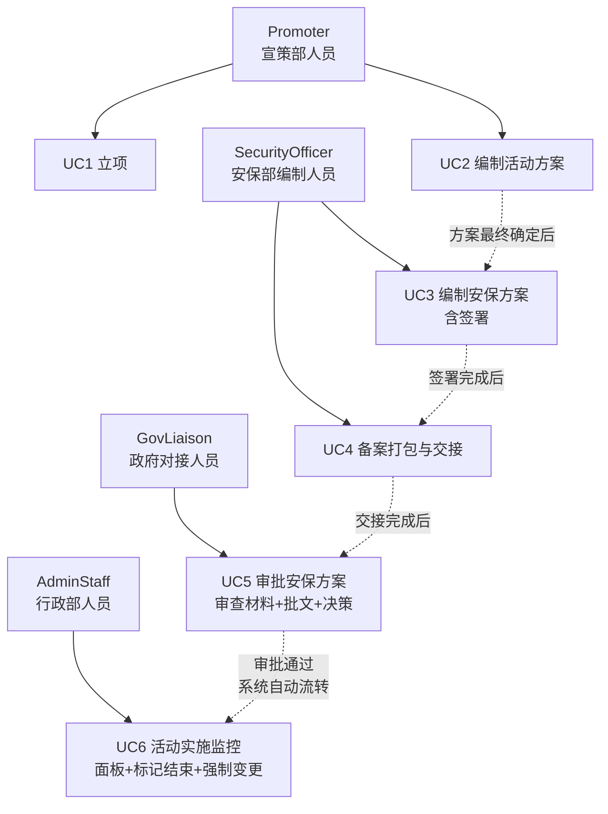
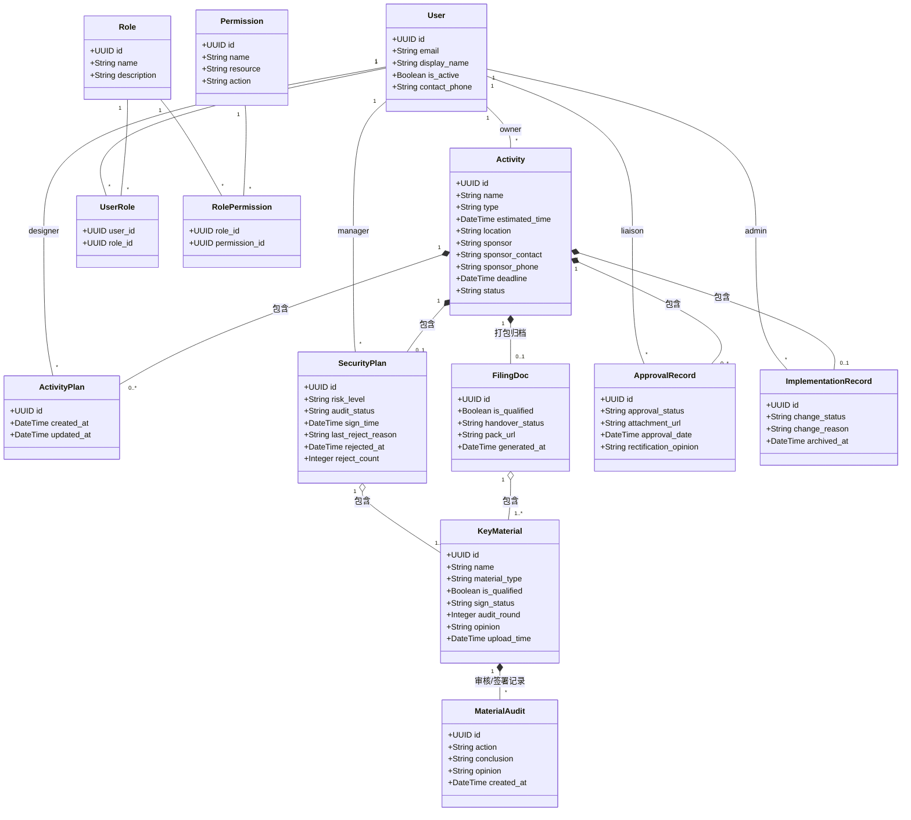
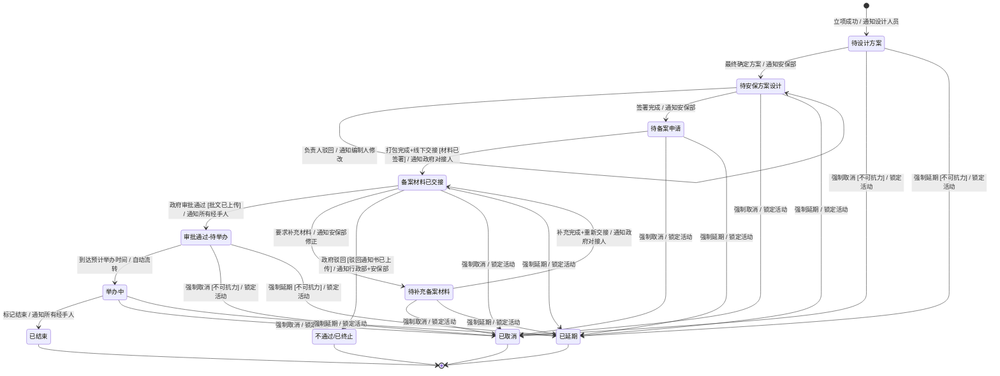
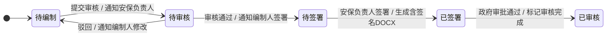
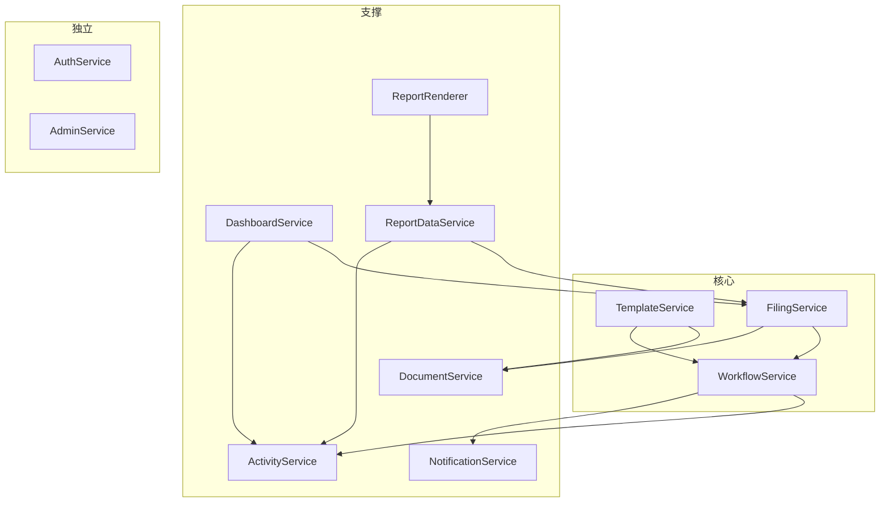
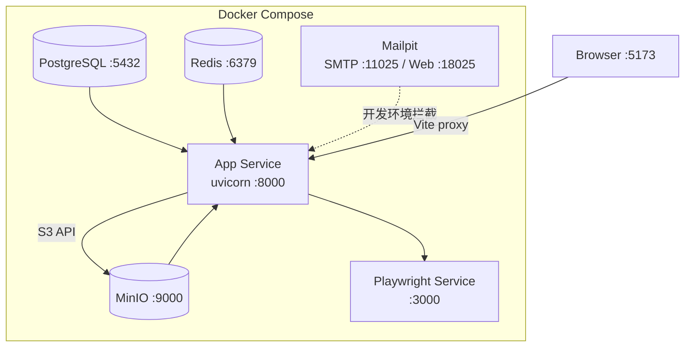
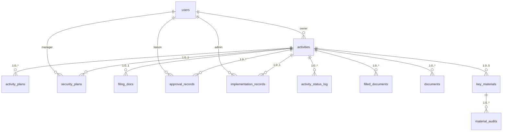

# 五大道景区活动与审批MIS（CAMIS） — 系统分析与设计

> 基于面向服务架构（SOA）的 Web 应用。本章进行系统分析（参与者识别、用例建模、领域类图、状态图），后续章节完成系统设计与实现描述。

## 第 2 章 系统分析

### 2.1 需求分析

#### 2.1.1 参与者识别

系统涉及七类参与者，按职责划分为三个层级：

> 表2-1 系统参与者角色

| 层级 | 角色 | 职责 |
|------|------|------|
| 主办方 | Promoter（宣策部人员） | 立项、编制活动方案 |
| 安保方 | SecurityOfficer（安保部编制人员） | 编制安保方案与备案材料 |
| 安保方 | SecurityManager（安保部负责人） | 签署安保材料、审核方案 |
| 政府方 | GovLiaison（政府对接人员） | 审查备案材料、上传批文、做出审批决策 |
| 行政方 | AdminStaff（行政部人员） | 监控活动进展、标记活动结束、强制变更 |
| 管理方 | AdminManager（行政部负责人） | 管理用户与角色分配 |
| 系统方 | SuperAdmin（超级管理员） | 全局管理 |

各参与者的权限映射详见 `docs/rbac.md`。系统通过 14 项细粒度权限控制各角色对 23 个 API 端点的访问。

#### 2.1.2 用例图

系统包含 6 个核心用例（原 UC6 登记审批结果已移除，审批通过后系统自动流转）。

> **此处插入 StarUML 绘制的用例图（见图 2-1）。**


> 图2-1 用例关系图（StarUML 正式用例图见上文占位符）

> 表2-2 UC1 立项用例规约

#### UC1 立项

| 项 | 内容 |
|---|---|
| 用例名称 | UC1 立项 |
| 用户目标 | 创建活动项目记录，指派方案设计人员 |
| 参与者 | Promoter（宣策部人员） |
| 前置条件 | 用户已登录系统，收到主办方活动请求 |
| 后置条件 | 系统生成活动记录，状态为"待设计方案"，向指定设计人员发送待办提醒 |
| 主事件流 | 1. Promoter 点击"新建活动立项"<br>2. 填写活动基础信息（名称、类型、预计时间、地点、主办方、主办方联系人及电话、截止时间）<br>3. 指定负责方案设计的成员<br>4. 点击"保存立项"<br>5. 系统校验场地与时段冲突，通过后生成唯一活动编号并持久化，向设计人员发送通知 |
| 备选事件流 | 1a. 场地/时间冲突：系统检测到同场地同时段已存在"审批通过-待举办"或"举办中"的活动，弹出阻断提示，用户需修改时间或地点后重新提交<br>1b. 必填字段缺失：未填写截止时间或未指定设计人员，系统高亮提示，阻断保存 |

#### UC2 编制活动方案


> 表2-3 UC2 编制活动方案用例规约

| 项 | 内容 |
|---|---|
| 用例名称 | UC2 编制活动方案 |
| 用户目标 | 编制并最终确定活动方案 |
| 参与者 | Promoter（宣策部人员，被指定的设计成员） |
| 前置条件 | 活动已立项，状态为"待设计方案" |
| 后置条件 | 方案最终确定，状态变更为"待安保方案设计"，通知安保部 |
| 主事件流 | 1. Promoter 进入活动详情页 → 活动方案 tab<br>2. 系统展示 schema 驱动的动态表单（日期、人数、内容、搭建方案等字段），含 autofill 和条件显隐<br>3. 用户填写表单，可多次保存草稿或提交生成 DOCX 版本<br>4. 用户点击"最终确定方案"<br>5. 系统校验字段完整性，通过后锁定方案（不可再编辑），流转状态至"待安保方案设计" |
| 备选事件流 | 2a. 逾期预警：当前时间超过截止时间但方案未确定，系统向 Promoter 发送逾期提醒<br>3a. 最终确定校验失败：必填字段缺失，弹窗列出缺失项，用户修正后重试 |

#### UC3 编制安保方案（含签署）

> 表2-4 UC3 编制安保方案用例规约

| 项 | 内容 |
|---|---|
| 用例名称 | UC3 编制安保方案 |
| 用户目标 | 编制安保方案及备案材料，完成安保负责人签署 |
| 参与者 | SecurityOfficer（编制）、SecurityManager（签署审核） |
| 前置条件 | 活动方案已最终确定，状态为"待安保方案设计" |
| 后置条件 | 全部材料签署完毕，状态变更为"待备案申请" |
| 主事件流 | 1. SecurityOfficer 进入安保方案 tab，系统根据活动风险等级展示条件字段<br>2. Officer 在三个子 tab（安保方案、风险评估报备表、责任确认书）中填写表单<br>3. 各子 tab 提交生成：系统保存数据快照（延迟策略，此时不生成 DOCX）<br>4. Officer 点击"提交审核"，系统校验三表字段完整性，通过后通知 SecurityManager<br>5. Manager 进入安保方案 tab，查看方案内容 → 上传签名并"确认签署"（第一步：生成含签名安保方案+双表 DOCX）<br>6. 系统展示备案承诺书签署区，Manager 确认承诺书内容（全字段 autofill），复用已上传签名完成签署（第二步）<br>7. 系统生成承诺书 DOCX，流转状态至"待备案申请" |
| 备选事件流 | 4a. 负责人驳回：Manager 勾选预设驳回原因并填写补充说明，audit_status 回到"待编制"，通知 Officer 修改。驳回后必须先创建新版本方可重新提交<br>4b. 提交审核校验失败：必填字段缺失，弹窗列出缺失项并支持点击跳转<br>5a. 签名缺失：Manager 未上传签名图片即点击签署，系统提示"请先上传签名" |

#### UC4 备案打包与交接

> 表2-5 UC4 备案打包与交接用例规约

| 项 | 内容 |
|---|---|
| 用例名称 | UC4 备案打包与交接 |
| 用户目标 | 将已签署材料打包为 ZIP 归档，完成线下纸质交接 |
| 参与者 | SecurityOfficer（安保部编制人员） |
| 前置条件 | 全部 5 类关键材料（活动方案、安保方案、风险评估报备表、责任确认书、备案承诺书）均已签署 |
| 后置条件 | ZIP 包生成并上传至 MinIO，状态变更为"备案材料已交接"，通知 GovLiaison |
| 主事件流 | 1. Officer 进入备案 tab，系统展示 5 类材料的签署状态<br>2. 确认全部材料已签署后，点击"打包备案材料"<br>3. 系统将 5 份 DOCX 文件打包为 ZIP（文件名含活动名称+时间戳），上传至 MinIO<br>4. Officer 打印纸质版，线下递交给政府对接人员<br>5. Officer 在系统中点击"确认纸质交接"，流转状态至"备案材料已交接" |
| 备选事件流 | 2a. 材料未签署：存在未签署材料，系统阻断打包并高亮提示"需全部材料签署后方可打包"<br>3a. 重新打包：如需更新材料，Officer 修改后重新打包，系统删除旧 ZIP 后生成新 ZIP |

#### UC5 审批安保方案（政府对接审查）

> 表2-6 UC5 审批安保方案用例规约

| 项 | 内容 |
|---|---|
| 用例名称 | UC5 审批安保方案 |
| 用户目标 | 逐条审查备案材料，做出审批决策并上传批文 |
| 参与者 | GovLiaison（政府对接人员） |
| 前置条件 | 线下收到纸质备案材料，活动状态为"备案材料已交接" |
| 后置条件 | 审批通过：系统自动流转至"审批通过-待举办"，通知所有经手人。补件：进入待补充备案材料回路。驳回：进入不通过/已终止终态 |
| 主事件流 | 1. GovLiaison 进入活动详情页 → 备案 tab<br>2. 系统展示审查面板：5 类材料列表 + 合格/不合格标记 + 意见输入<br>3. Liaison 逐条审查材料，标记合格或不合格（支持批量操作）<br>4. 全部材料审查完毕后，Liaison 选择"审批通过"<br>5. 上传政府批文电子版（PDF/图片）<br>6. 确认审批决策，系统生成 ApprovalRecord，流转至"审批通过-待举办"，通知所有经手过活动的人员 |
| 备选事件流 | 4a. 要求补充材料：部分材料不合格，Liaison 标记不合格材料并填写整改意见，系统状态变更为"待补充备案材料"，通知 Officer 修正后重新打包交接（支持多轮审查）<br>4b. 政府驳回：Liaison 上传驳回通知书，标注"不通过"，活动进入"不通过/已终止"终态<br>6a. 批文缺失：选择"审批通过"但未上传批文附件，系统阻断并提示"审批通过必须上传政府批文" |

#### UC6 活动实施监控

> 表2-7 UC6 活动实施监控用例规约

| 项 | 内容 |
|---|---|
| 用例名称 | UC6 活动实施监控 |
| 用户目标 | 监控活动整体进展，标记活动结束，处理不可抗力异常 |
| 参与者 | AdminStaff（行政部人员） |
| 前置条件 | 系统数据库存有各阶段活动数据 |
| 后置条件 | 活动正常结束，或被强制取消/延期 |
| 主事件流 | 1. AdminStaff 登录系统，进入工作台面板<br>2. 系统渲染可视化图表（总活动数、审批通过率、本月新增、各状态分布）<br>3. AdminStaff 可点击查看任意活动详情及流转历史<br>4. 活动举办完成后，AdminStaff 在活动详情页点击"标记结束"<br>5. 系统流转状态至"已结束"（终态），通知所有经手人 |
| 备选事件流 | 3a. 不可抗力强制取消：AdminStaff 点击"强制变更状态"→ 选择"已取消"→ 录入原因 → 活动进入终态，所有后续操作锁定<br>3b. 不可抗力强制延期：AdminStaff 选择"已延期"→ 录入原因 → 活动进入终态 |

> 原 UC6（登记审批结果）已移除：GovLiaison 审批通过后系统自动流转至"审批通过-待举办"，不再需要 SecurityManager 手动确认。UC5 的后置条件已包含此自动流转逻辑。

### 2.2 领域类图

系统采用面向服务架构（SOA）[ADR 0001]，实体为纯数据载体，不包含业务方法。Activity 作为聚合根，通过组合关系关联子实体。

**核心实体说明**：

- **Activity**（活动）：聚合根。记录活动基本信息（名称、类型、时间、地点、主办方）和当前状态
- **ActivityPlan**（活动方案）：Promoter 编制，含表单数据与版本管理
- **SecurityPlan**（安保方案）：SecurityOfficer 编制，按风险等级（高/中低/低）条件显隐字段，含驳回追溯
- **FilingDoc**（备案文档包）：打包 5 项材料形成的 ZIP 归档，记录合格状态与交接状态
- **KeyMaterial**（关键备案材料）：supertype/subtype 模型，覆盖 5 种类型（活动方案、安保方案、风险评估报备表、安全消防责任确认书、备案承诺书）
- **ApprovalRecord**（审批记录）：GovLiaison 审批决策的独立记录，含批文附件与整改意见
- **ImplementationRecord**（实施记录）：活动进入举办阶段后的跟踪记录
- **MaterialAudit**（材料审核记录）：逐条材料的审核/签署追踪

以下为 StarUML 兼容的 Mermaid 领域类图（实体为纯数据载体，无业务方法）：


> 图2-2 领域类图

**类间关系说明**：

**Activity 与 ActivityPlan 是 1 对 0..* 的组合关系。** 1 个活动可以对应零到多个方案版本（立项初期尚无方案，编制后可生成多版），方案脱离活动不可独立存在，删除活动时级联删除方案。

**Activity 与 SecurityPlan 是 1 对 0..1 的组合关系。** 1 个活动可以对应零个或一个安保方案。安保方案在活动进入"待安保方案设计"时按需创建，活动删除时级联删除。

**Activity 与 FilingDoc 是 1 对 0..1 的组合关系。** 1 个活动可以对应零个或一个备案文档包。FilingDoc 仅作为当前最新材料的 ZIP 快照，不记录历史版本——各材料的版本追溯由 `FilledDocument` 实体承担（活动方案、安保方案、备案材料各自独立维护版本链）。补件回路中重新打包时更新同一条 FilingDoc 记录，经手人员始终可下载最新 ZIP。

**Activity 与 ApprovalRecord 是 1 对 0..* 的组合关系。** 1 个活动可以对应零到多条审批记录（审查前为零，补件回路中每条审批决策生成一条记录），记录脱离活动不可独立存在。

**Activity 与 ImplementationRecord 是 1 对 0..1 的组合关系。** 1 个活动可以对应零个或一个实施记录。记录在活动进入举办阶段时创建，活动删除时级联删除。

**SecurityPlan 与 KeyMaterial 是 1 对 1..* 的聚合关系。** 1 个安保方案关联至少 1 类备案材料（实际为 5 类：活动方案、安保方案、风险评估报备表、责任确认书、备案承诺书），材料可同时被 FilingDoc 引用，删除方案时材料保留，仅解除关联。

**FilingDoc 与 KeyMaterial 是 1 对 1..* 的聚合关系。** 1 个备案包引用至少 1 类备案材料，同一材料可出现在不同版本的打包中，删除包时材料保留。

**KeyMaterial 与 MaterialAudit 是 1 对 0..* 的组合关系。** 1 条备案材料可以对应零到多条审核/签署记录，记录脱离材料不可独立存在。

**User 与 Activity（owner）是 1 对 1..* 的关联关系。** 1 个用户作为主办方负责人可以创建多个活动。1 个活动必须有且仅有 1 个 owner。

**User 与 ActivityPlan（designer）是 1 对 0..* 的关联关系。** 1 个用户作为方案设计人可以编制零到多个方案。1 个方案必须有 1 个设计人。

**User 与 SecurityPlan（manager）是 1 对 0..* 的关联关系。** 1 个用户作为安保负责人可以管理零到多个安保方案。1 个方案可以有零个或 1 个负责人。

**User 与 ApprovalRecord（liaison）是 1 对 0..* 的关联关系。** 1 个政府对接人可以处理多条审批记录。1 条审批记录有且仅有 1 个对接人。

**User 与 ImplementationRecord（admin）是 1 对 0..* 的关联关系。** 1 个行政人员可以跟踪多条实施记录。1 条实施记录有且仅有 1 个操作人。

**RBAC 关联**：User 与 Role 通过 UserRole 关联表实现多对多关联（1 个用户可有多个角色，1 个角色可分给多个用户）。Role 与 Permission 通过 RolePermission 关联表实现多对多关联（1 个角色可有多个权限，1 个权限可归属多个角色）。

### 2.3 状态图

活动生命周期包含 **11 个状态**，状态变迁由 UC1-UC6 驱动。审批通过状态（v0.29 前为独立中间态）已移除，GovLiaison 审批通过后活动直接进入"审批通过-待举办"。

活动单元的状态变迁遵循 UML 2.0 状态图规范，采用 `event [guard] / action` 格式标注每条转换：event 为触发事件，guard 为前置条件（可选），action 为状态变迁后的系统动作。当前共 11 个状态，4 个终态。整个生命周期由 6 个用例驱动，各用例与状态变迁的对应关系见 §2.1.2 用例规约表。


> 图2-3 活动主状态机图

**各状态说明**：

> 表2-8 活动状态说明

| 状态 | 含义 | 进入条件 |
|------|------|----------|
| 待设计方案 | 立项完成，等待宣策部编制方案 | 保存立项 |
| 待安保方案设计 | 方案最终确定，等待安保部编制预案 | 最终确定方案 |
| 待备案申请 | 安保方案签署完成，等待打包备案 | 电子签名完成 |
| 备案材料已交接 | ZIP 打包完成、纸质材料已提交政府 | 线下交接确认 |
| 审批通过-待举办 | 政府审批通过，等待举办时间到达 | 政府批准（系统自动流转） |
| 举办中 | 活动正在举办 | 到达预计举办时间（系统自动） |
| 已结束 | 活动正常结束 | AdminStaff 标记结束 |
| 待补充备案材料 | 政府要求补充材料，需修改后重新交接 | 政府要求补件 |
| 不通过/已终止 | 政府驳回，活动终止 | 政府驳回 |
| 已取消 | 因不可抗力强制取消 | AdminStaff 强制变更 |
| 已延期 | 因不可抗力强制延期 | AdminStaff 强制变更 |

**安保方案审核子状态机**（`SecurityPlan.audit_status`）——独立于活动主状态机的子状态机，追踪安保方案从编制到政府审核完成的内部流转。1 个活动有 1 个 SecurityPlan，其 `audit_status` 经历 5 个阶段：


> 图2-4 安保方案审核子状态机图

> 表2-9 安保方案审核子状态说明

| 子状态 | 触发事件 | 与主状态的对应 |
|--------|----------|---------------|
| 待编制 | 活动进入「待安保方案设计」，SecurityPlan 创建 | 待安保方案设计 |
| 待审核 | SecurityOfficer 完成三表编制，点击"提交审核" | 待安保方案设计（驳回后回到此状态） |
| 待签署 | SecurityManager 审核通过，等待签署 | 待安保方案设计 |
| 已签署 | SecurityManager 完成两步签署，流转至待备案申请 | 待备案申请 → 备案材料已交接 |
| 已审核 | GovLiaison 审批通过 | 审批通过-待举办 |

子状态机与主状态机的交互：主状态从"待安保方案设计"变迁至"待备案申请"的前提是 `audit_status` 到达"已签署"；主状态变迁至"审批通过-待举办"时，`audit_status` 同步置为"已审核"。
| 已审核 | 政府审批通过 |

**关键设计要点**：

- **终态锁定**：已结束、不通过/已终止、已取消、已延期为终态，进入后禁止所有后续操作。待补充备案材料不是终态，可重新递交
- **自动流转**：审批通过-待举办到达 `estimated_time` 后，路由层查询时自动转为举办中
- **DOCX 延迟生成**：安保方案、风险评估报备表、安全消防责任确认书在 SecurityOfficer 提交时仅保存数据快照（minio_path=NULL），Manager 签署时一次性生成含签名 DOCX
- **活动方案锁定**：进入待安保方案设计后，Promoter 只能查看活动方案，不可编辑或生成新版本
- **补件回路**：待补充备案材料 → 修改材料 → 重新签署 → 重新打包 → 重新交接 → 回到备案材料已交接 → 通知 GovLiaison 重新审查
- **审批后自动流转**：GovLiaison 审批通过后系统直接进入审批通过-待举办，通知所有经手过活动的人员（owner, designer, manager, 历史操作人）

---

> 各章节引用的项目文档与代码源详见 `docs/report-references.md`。
>
## 第 3 章 系统设计

### 3.1 总体设计

#### 3.1.1 应用架构设计

本系统采用**面向服务架构（SOA）——模块化单体**模式。设计方法上，通过**业务能力聚类**策略审视 6 个用例，将紧密相关的用例归组，每组对应一个候选服务；架构结果上，形成 11 个边界清晰的服务，所有服务运行在同一进程内，服务间通过同步方法调用协作。

SOA 的"服务"是逻辑概念（代码层的服务类），不是部署概念（独立进程）。加上所有服务共享进程和数据库。所以完整定性是 SOA模块化单体 + 内部分层。

**为什么是模块化单体而非微服务**：本系统领域复杂度中等，团队规模小，SOA 已实现服务边界清晰的目标。微服务带来的异步事件总线、Saga 分布式事务、最终一致性等复杂度远超当前需求。当前架构预留了平滑演进路径——未来如需拆分，可在已有服务边界上叠加子领域分析，将通用域（如文件存储）抽离为独立基础设施服务。

**与其他架构风格的对比**：

> 表3-1 架构风格对比

| 架构风格 | 核心特征 | 本项目为何不采用 |
|---------|---------|-----------------|
| 三层架构 | 表示层/业务层/数据层物理分离，通过网络通信 | 项目内部是逻辑分层而非物理分层——所有代码运行在同一进程，四层仅作为代码组织手段 |
| MVC | Controller 既管路由又管业务逻辑，Model 含行为 | FastAPI 路由层只做参数提取和响应序列化，业务逻辑在独立 Service 层，实体为贫血模型 |
| 微服务 | 每个服务独立部署、独立数据库、异步通信 | 11 个服务共享进程和数据库，服务间同步方法调用，无分布式基础设施 |
| SOA 模块化单体 | 服务是首要分解单位，实体贫血，边界清晰 | ✅ 代码按业务能力聚类为 11 个 Service，实体无业务方法（ADR 0001），服务间通过接口契约协作，内部辅以四层分层组织 |

本系统架构的核心特征是**服务导向**而非分层导向：服务是业务能力的直接映射，分层是服务内部的代码纪律。实体为纯数据载体（ADR 0001），只保留属性与关联关系，不包含业务方法。业务逻辑归属服务层，工作流状态变更由 `WorkflowService` 显式驱动。

**服务依赖关系**：


> 图3-1 服务依赖关系图

`WorkflowService` 为枢纽：状态变迁后调用 `NotificationService` 发送通知。`TemplateService` 依赖 MinIO（文件存储）和 `WorkflowService`（生成后自动状态变迁）。`AuthService` 和 `AdminService` 为独立服务，无跨服务依赖。

#### 3.1.2 架构内层次设计

系统内部采用四层架构，层间单向依赖（上层可调下层，同层不互调）：

> 表3-2 架构内层次职责

| 层次 | 职责 | 代码包 |
|------|------|--------|
| 接口层 | HTTP 端点定义、请求参数校验、JWT 认证与 RBAC 权限拦截 | `app/routers/`（8 个路由模块，23 个端点） |
| 业务逻辑层 | 领域逻辑、状态机流转、DOCX 渲染、材料打包、通知分发 | `app/services/`（11 个 Service 类） |
| 数据访问层 | ORM 模型定义、数据库会话管理、Alembic 迁移 | `app/models/`（11 个模型文件）+ `alembic/` |
| 基础设施层 | PostgreSQL（元数据）、MinIO（文件对象）、Redis（缓存/会话）、Mailpit（开发邮件） | Docker Compose 容器编排 |

```
接口层    app/routers/     ← 鉴权、参数校验、路由
    ↓
业务层    app/services/    ← 领域逻辑、状态机、工作流
    ↓
数据层    app/models/      ← ORM 实体、数据库会话
    ↓
基础设施  PostgreSQL + MinIO + Redis
```

**关键设计约束**：
- 路由层不包含业务逻辑，仅做参数提取和响应序列化
- 服务层通过构造函数注入 `AsyncSession`，方法内管理事务边界
- 实体为纯数据载体，不引用任何 Service
- PostgreSQL 只存元数据，MinIO 只存文件内容，Redis 只做缓存和队列

#### 3.1.3 技术架构设计

> 表3-3 技术选型与理由

| 层 | 技术选型 | 选型理由 |
|---|---|---|
| 后端框架 | Python FastAPI 0.115+ | 原生 async、自动 OpenAPI 文档、Pydantic 校验 |
| ORM | SQLAlchemy 2.0 (async) | 成熟稳定、支持原生 async、迁移生态完善 |
| 数据库 | PostgreSQL 17 | ACID 事务、JSONB 支持（draft_data/快照）、全文搜索 |
| 对象存储 | MinIO | S3 兼容 API，生产可平滑替换为阿里云 OSS/腾讯云 COS |
| 缓存 | Redis 7.4 | 会话存储、登录限流计数、JWT 黑名单 |
| 前端 | React 19 + TypeScript 5.7 + Vite | 组件化、类型安全、按需构建 |
| UI 库 | Ant Design 6 | 企业级组件库、中文原生支持、表单/表格/时间线覆盖 |
| 模板引擎 | docxtpl (Jinja2) | 保留 DOCX 原始格式、支持 Jinja2 控制流、表格内嵌渲染 |
| PDF 生成 | LibreOffice headless | DOCX→PDF 布局无损转换、串行 Semaphore(1) 防止并发超时 |
| PDF 报告 | Playwright + headless Chromium | 前端图表渲染后截图转 PDF，独立微服务部署 |
| 部署 | Docker Compose 3.8 | 单机多容器编排、环境变量注入、健康检查 |

**部署拓扑**：


> 图3-2 部署拓扑图

`playwright-svc` 为独立微服务容器（FastAPI + headless Chromium），接收主应用 HTTP 请求后渲染 PDF 返回。开发环境 Mailpit 捕获所有外发邮件。生产环境 SMTP 替换为企业邮件服务，凭据通过 `.env` 注入。

### 3.2 详细设计

本节从界面、接口、业务逻辑、数据四个层次展开系统的详细设计。四层自上而下构成完整的技术实现视图：界面层定义用户交互，接口层定义前后端契约，业务逻辑层实现领域规则，数据层提供持久化支撑。

#### 3.2.1 界面设计

前端为 React 19 单页应用（SPA），TypeScript 5.7 + Vite 构建，Ant Design 6 组件库。Vite proxy 将 `/api/*` 转发至后端 `:8000`，生产环境由 Nginx 反向代理替代。界面设计遵循**从身份到页面、从结构到行为**的自顶向下逻辑：首先确定用户身份与权限，随后定义页面结构与表单渲染机制，最后约束跨页面的交互行为。

**用户角色与使用场景**：

> 表3-4 用户角色画像

| 角色 | 身份 | 核心任务 | 使用频率 | 同时处理量 |
|------|------|---------|---------|-----------|
| Promoter（宣策部） | 活动立项发起人 | 创建立项 → 编制方案 → 提交安保审核 | 持续进行 | 2-3 个活动 |
| SecurityOfficer（安保部） | 安保方案编制者 | 查阅方案 → 编制安保预案 → 签署材料 → 打包备案 | 活动提交后 | 按待办量 |
| SecurityManager（安保部负责人） | 安保方案审批者 | 签署双表+确认方案（驳回罕见） | 编制完成后 | 按待办量 |
| GovLiaison（政府对接） | 企业内政府窗口对接人 | 每日集中审查材料 → 上传批文 → 标注结果 | 每天集中一次 | 批量 |
| AdminStaff（行政部） | 活动监控者 | 查看 Dashboard → 向上汇报 → 强制变更 | 按需 | 全局 |
| AdminManager（行政部负责人） | 审批管理者 | 二次确认强制变更 + 审批角色申请 | 按需 | 全局 |
| SuperAdmin（系统管理员） | 系统管理者 | 用户管理、角色分配、系统配置 | 按需 | 全局 |

关键行为特征：生产环境每人单一角色；Promoter 方案提交后不被驳回（单向流程）；驳回仅安全部内部循环（SecurityManager → SecurityOfficer）；Dashboard 用于向上汇报而非问题处理；强制变更为不可抗力紧急场景。这些特征直接决定了界面设计中角色视图分离和操作入口的条件显隐策略。

**全局状态与路由守卫**：

- 认证：Zustand `authStore` 管理 JWT 令牌与用户权限，`AuthInitializer` 在应用启动时静默刷新令牌
- 路由守卫：`ProtectedRoute` 组件双重校验——先验证 `isAuthenticated`，再检查 `permissions.includes(requiredPermission)`
- 数据请求：TanStack Query 管理服务端状态缓存，Axios 拦截器自动附加 Bearer 令牌并在 401 时触发刷新队列

**角色感知导航**：

侧边栏菜单根据用户角色动态渲染——Promoter 看到"我的活动"和"新建立项"，SecurityOfficer 看到"待编制安保方案"和"待打包备案"，GovLiaison 和 AdminStaff 各有专属入口。通知铃铛组件实时展示未读数量 badge，下拉面板按时间排列，点击跳转至关联活动详情或下载报告。

**核心页面**：

> 表3-5 系统核心页面

| 页面 | 功能 | 关键组件 |
|------|------|----------|
| 活动列表页 | 双 Tab（待操作/已完成）、状态筛选、关键词搜索、分页 | ActivityFilters + ActivityTable |
| 创建立项页 | 活动基础信息表单（含场地冲突实时校验） | ActivityForm |
| 活动详情页 | 多 Tab 聚合页（详情/文档/活动方案/安保方案/备案），按角色+状态渲染 | Tabs + 各子面板 |
| 工作台 Dashboard | 统计卡片（总活动数、审批通过率、本月新增）、状态分布进度条、异常活动列表、月报导出 | 图表组件 + ReportExport |
| 通知中心 | 未读/全部 Tab 切换、批量已读 | NotificationsPage |
| 管理页 | 用户列表、角色编辑、禁用/归档、角色申请审批 | UserManagementPage + RoleRequestsPage |

**活动详情页多 Tab 设计**：

活动详情页是系统的操作中枢，通过 5 个 Tab 聚合不同阶段的操作界面：

- **详情 Tab**：活动基础信息只读展示 + 状态流转时间线（StatusTimeline）
- **文档 Tab**：通用文件上传/下载列表（DocumentUpload + DocumentList），按 `activity_id` 过滤
- **活动方案 Tab**：按角色分段——Promoter 看到 TemplateForm + VersionTimeline + "最终确定方案"按钮；AdminStaff 看到版本管理；其他角色看到只读快照（VersionSnapshot）。最终确定后锁定编辑
- **安保方案 Tab**：三子 tab（安保方案/风险评估表/责任确认书），条件字段按风险等级显隐。SecurityOfficer 编辑草稿并提交审核；SecurityManager 两步签署（第一步三文件签名，第二步备案承诺书确认）；驳回后红色横幅+高亮字段+必须先创建新版本方可重新提交
- **备案 Tab**：按状态和角色分段渲染——Officer 阶段显示材料签署状态+打包+交接按钮；GovLiaison 阶段显示审查面板（逐条合格/不合格+意见）+审批决策（通过/补件/驳回）+批文上传；审批通过后所有角色只读查看+ZIP 下载

**Schema 驱动动态表单**（TemplateForm）：

活动方案和安保方案的表单由后端 schema 定义驱动——`GET /schema` 返回字段数组，每个字段声明 `ui_type`（text/textarea/number/date/select/repeater/signature）、`condition`（条件显隐规则）、`autofill_from`（自动填入来源）。前端根据 schema 动态渲染对应组件，无需为每个模板单独编写表单。支持 8 种字段类型，日期控件扩展了 `show_time: true` 支持日期+时刻选择。

**交互模式**：

- 草稿自动保存：表单 2s 防抖自动保存，确保跨 Tab autofill 能读到最新未提交数据
- 条件显隐：字段根据其他字段值实时显隐（如风险等级切换时安保方案专属字段）
- 补件高亮：待补充备案材料阶段，不合格材料行红色高亮，子 Tab 标签红色圆点标记，横幅展示 Liaison 补件说明及不合格原因
- 批量审查：GovLiaison 批量勾选材料后一键标记合格或不合格（不合格需填写原因）
- 审核记录：Timeline 时间线展示，同时间操作合并节点，仅 GovLiaison 可见

**界面设计代表图**（其余操作界面截图见 §4.1 功能实现）：

> **此处插入界面截图（图3-5 角色感知导航）**。左侧为 Promoter 侧边栏（我的活动、新建立项），右侧为 GovLiaison 侧边栏（待审查材料、审批记录）。不同角色看到不同的菜单入口，体现权限驱动的界面设计。

> **此处插入界面截图（图3-6 活动详情页多 Tab 布局）**。顶部展示活动基本信息和当前状态，下方五个 Tab（详情/文档/活动方案/安保方案/备案）按角色和状态分段渲染各自操作界面。

> **此处插入界面截图（图3-7 Schema 驱动动态表单）**。左为活动方案表单（Promoter 编辑），右为安保方案表单（SecurityOfficer 编辑，高风险模式显示全部条件字段）。字段类型包括文本、日期（含时刻）、下拉选择、多行文本、动态列表、签名上传。

> **此处插入界面截图（图3-8 工作台 Dashboard）**。顶部统计卡片（总活动数、审批通过率、本月新增）、状态分布进度条、异常活动列表、月报导出入口。

#### 3.2.2 接口层设计

系统提供 RESTful API，23 个端点按资源分组为 8 个路由模块。所有端点（除 `/auth/*` 和 `/health`）需携带 `Authorization: Bearer <jwt>`，通过 `require_permission` 装饰器实施 RBAC 权限校验。

**路由模块与端点**：

> 表3-6 REST API 路由模块与端点

| 路由模块 | 端点 | 方法 | 权限 |
|---------|------|------|------|
| `auth` | `/auth/register`, `/auth/login`, `/auth/refresh`, `/auth/logout`, `/auth/me`, `/auth/roles`, `/auth/me/role-request` | POST/GET/PATCH | 公开 / 登录用户 |
| `activities` | `/activities`, `/activities/{id}`, `/activities/{id}/history` | GET/POST | 创建活动 / 查看所属活动 |
| `documents` | `/activities/{id}/documents` | GET/POST | 查看所属活动 / 上传文档 |
| `plan` | `/activities/{id}/plan/schema`, `/draft`, `/generate`, `/versions/{vn}`, `/diff`, `/finalize` | GET/PUT/POST | 提交方案 |
| `security-plan` | `/activities/{id}/security-plan/schema`, `/draft`, `/generate`, `/submit-review`, `/sign`, `/reject`, `/versions/{vn}`, `/diff` | GET/PUT/POST | 管理安保方案 / 驳回审批 |
| `materials` | `/activities/{id}/materials`, `/{mid}/schema`, `/{mid}/draft`, `/{mid}/generate`, `/{mid}/versions/{vn}`, `/{mid}/diff` | GET/PUT/POST | 打包备案 |
| `filings` | `/activities/{id}/filings/status`, `/pack`, `/handover`, `/audit`, `/approval`, `/audit-history` | GET/POST | 打包备案 / 审查材料 |
| `workflows` | `/activities/{id}/status`, `/{id}/reject`, `/force-cancel`, `/force-postpone` | PUT/POST | 管理安保方案 / 审查材料 / 查看面板 |
| `dashboard` | `/dashboard/panel`, `/dashboard/reports/{month}` | GET/POST | 查看面板 / 导出报表 |
| `admin` | `/admin/users`, `/admin/role-requests` | GET/PUT | 管理用户 |
| `notifications` | `/notifications`, `/unread-count`, `/{id}/read`, `/read-all` | GET/PUT | 登录用户 |

**权限中英对照**：

> 表3-7 RBAC 权限中英对照

| 权限标识（代码） | 中文含义 | 授予角色 |
|-----------------|---------|---------|
| `create_activity` | 创建活动 | Promoter |
| `view_owned_activity` | 查看所属活动 | 全部角色 |
| `submit_plan` | 提交方案 | Promoter |
| `upload_document` | 上传文档 | Promoter, SecurityOfficer, GovLiaison |
| `manage_security` | 管理安保方案 | SecurityOfficer, SecurityManager |
| `reject_approval` | 驳回审批 | SecurityManager |
| `pack_filing` | 打包备案 | SecurityOfficer |
| `sign_document` | 签署文档 | SecurityManager |
| `audit_material` | 审查材料 | GovLiaison |
| `force_cancel` | 强制取消 | AdminStaff |
| `force_postpone` | 强制延期 | AdminStaff |
| `view_dashboard` | 查看面板 | AdminStaff, AdminManager |
| `export_report` | 导出报表 | AdminStaff, AdminManager |
| `manage_users` | 管理用户 | AdminManager, SuperAdmin |

**关键设计决策**：

- **资源嵌套**：模板和备案端点嵌套在 `/activities/{id}/` 下，隐含"活动范围"语义，同时通过 `activity_id` URL 参数天然防止跨活动越权
- **权限粒度**：`PUT /activities/{id}/status` 为通用状态转移端点，同时接受 `manage_security`、`audit_material`、`submit_plan`、`view_dashboard` 四种权限，按目标状态自动校验调用者权限
- **文件下载**：不直接返回文件流，而是返回 MinIO 预签名 URL（30 分钟有效），前端 `window.open()` 触发浏览器下载
- **Schema 端点**：`GET /schema` 返回模板字段定义 + autofill 预填数据 + 草稿/快照，前端据此动态渲染表单

#### 3.2.3 业务逻辑层设计

服务层是系统的业务逻辑核心，11 个服务按职责分为三组：核心业务（WorkflowService、TemplateService、FilingService、ActivityService）、支撑服务（DocumentService、NotificationService、DashboardService、ReportDataService、ReportRenderer）、独立服务（AuthService、AdminService）。

> 表3-8 服务层设计总览

| 服务 | 关联数据库表 | 服务接口（关键方法） |
|------|-------------|---------------------|
| WorkflowService | `activities`, `activity_status_log` | `transition()`, `reject()`, `force_cancel()`, `force_postpone()` |
| TemplateService | `activity_plans`, `security_plans`, `filled_documents` | `get_schema()`, `generate()`, `sign_and_finalize()`, `sign_manager_commitment()`, `_render_docx()` |
| FilingService | `key_materials`, `filing_docs`, `material_audits`, `approval_records` | `list_materials()`, `pack_materials()`, `confirm_handover()`, `audit_material()`, `create_approval_record()` |
| ActivityService | `activities`, `activity_status_log` | `create()`, `get()`, `list()`, `get_status_history()` |
| DocumentService | `documents` | `upload()`, `get_presigned_url()`, `list_by_activity()` |
| NotificationService | `notifications` | `send_reminder()`, `notify_role()`, `check_overdue()` |
| DashboardService | `activities`（只读） | `get_panel_data()`, `get_activity_detail()` |
| ReportDataService | `activities`（只读） | `query_monthly_data()` |
| ReportRenderer | —（HTTP 客户端） | `POST /render` |
| AuthService | `users`, `refresh_tokens`, `login_attempts` | `register()`, `login()`, `refresh_token()`, `logout()` |
| AdminService | `users`, `role_requests` | `list_users()`, `update_user_role()`, `approve_role_request()` |

所有服务通过构造函数注入 `AsyncSession`，方法内管理事务边界。以下为面向服务架构下的服务类图——服务为实体类的控制者，实体为纯数据载体（§2.2），服务间通过同步方法调用协作。

```mermaid
classDiagram
    class WorkflowService {
        +transition(UUID activityId, String toStatus, User operator, String comment):StatusLogEntry
        +reject(UUID activityId, User operator, String reason):StatusLogEntry
        +forceCancel(UUID activityId, User operator, String reason):StatusLogEntry
        +forcePostpone(UUID activityId, User operator, String reason):StatusLogEntry
    }

    class TemplateService {
        +getSchema(String templateType, UUID activityId):SchemaResponse
        +generate(String templateType, UUID activityId, Map data, UUID userId):GenerateResponse
        +signAndFinalize(UUID activityId, UUID userId):GenerateResponse
        +signManagerCommitment(UUID activityId, UUID userId):GenerateResponse
        +renderDocx(String templateType, Map data, String riskLevel):ByteArray
    }

    class FilingService {
        +listMaterials(UUID activityId):List
        +packMaterials(UUID activityId):FilingPackResult
        +confirmHandover(UUID activityId, User operator):FilingDoc
        +auditMaterial(UUID activityId, UUID materialId, UUID userId, String conclusion, String opinion):MaterialAudit
        +createApprovalRecord(UUID activityId, UUID liaisonId, String approvalStatus, String attachmentUrl, String opinion):ApprovalRecord
    }

    class ActivityService {
        +create(UUID ownerId, ActivityCreate data):ActivityResponse
        +get(UUID activityId):ActivityResponse
        +list(ActivityListParams params):Tuple
        +getStatusHistory(UUID activityId):List
    }

    class DocumentService {
        +upload(UUID activityId, UUID uploaderId, File file, List tags):DocumentResponse
        +getPresignedUrl(UUID docId):String
        +listByActivity(UUID activityId):List
    }

    class NotificationService {
        +sendReminder(UUID userId, String message, String channel):void
        +notifyRole(String roleName, String message):void
        +checkOverdue(UUID activityId):void
    }

    class DashboardService {
        +getPanelData():PanelData
        +getActivityDetail(UUID activityId):ActivityDetail
    }

    class ReportDataService {
        +queryMonthlyData(String month):Map
    }

    class ReportRenderer {
        +render(String month, String dataKey, String token):ByteArray
    }

    class AuthService {
        +register(RegisterRequest data):TokenResponse
        +login(String email, String password):TokenResponse
        +refreshToken(String refreshToken):TokenResponse
        +logout(UUID userId):void
    }

    class AdminService {
        +listUsers():List
        +updateUserRole(UUID userId, UUID roleId):void
        +approveRoleRequest(UUID requestId, UUID reviewerId, String comment):void
    }

    WorkflowService --> NotificationService : 通知
    TemplateService --> WorkflowService : 状态流转
    FilingService --> WorkflowService : 状态流转
    FilingService --> DocumentService : 文件存储
    TemplateService --> DocumentService : 文件存储
    DashboardService --> ActivityService : 数据聚合
    ReportDataService --> ActivityService : 数据查询
    ReportRenderer --> ReportDataService : 数据输入
```


> 图3-3 服务类图

本节重点描述核心业务服务的领域模型与关键方法。

**WorkflowService — 状态机引擎**：

作为服务依赖图的枢纽，统一管理活动状态变迁。核心数据结构 `TRANSITION_MATRIX` 定义了 11 项合法转换（详见 §2.3 状态图），`transition()` 方法执行：校验转换合法性 → UPDATE status WHERE id AND status=old（原子并发保护）→ 写 `activity_status_log` → 查 `NOTIFICATION_RULES` 发通知。驳回（`reject`）自循环于待安保方案设计状态；强制取消/延期（`force_cancel`/`force_postpone`）将活动置入终态并写 `implementation_records` 归档。审批通过-待举办到达 `estimated_time` 后，路由层在查询时自动调用 `transition(SYSTEM)` 转为举办中。

**TemplateService — 文档模板引擎**：

管理 5 类 DOCX 模板（活动方案、安保方案、风险评估报备表、安全消防责任确认书、备案承诺书）的完整生命周期。核心流程：

- **Schema 驱动表单**：`get_schema()` 返回模板字段定义 + autofill 预填数据 + 草稿/快照。autofill 跨三实体（Activity、ActivityPlan、SecurityPlan）自动填入——如 `project_name` 从 `Activity.name` 取，`security_staff_count` 从 `SecurityPlan` 取，`reporting_unit` 从系统配置注入。
- **延迟生成策略**：安保方案及双表（`DEFERRED_TYPES`）在 SecurityOfficer 提交时仅保存数据快照（`minio_path=NULL`），Manager 签署时一次性生成含签名 DOCX。活动方案为非延迟类型，提交即生成。
- **两步签署**：`sign_and_finalize()` 第一步生成安保方案+双表 DOCX 并注入 Manager 签名，第二步 `sign_manager_commitment()` 生成备案承诺书 DOCX（全字段 autofill，复用已上传签名）。
- **跨模板同步**：安保方案的 `security_staff_count` 变更后，自动为风险评估报备表和备案承诺书创建新版本。
- **DOCX 渲染**：`docxtpl` 引擎基于 Jinja2 模板渲染，`_render_docx()` 注入 `activity_name`、`sponsor`、`risk_level` 到渲染上下文，签名字段检测后从 MinIO 拉取图片嵌入。渲染后异步调用 LibreOffice headless 转 PDF（`Semaphore(1)` 串行化防并发超时）。
- **版本管理**：`FilledDocument` 表记录每次生成，`template_hash` 字段（模板文件 SHA-256）用于审计追溯。

**FilingService — 备案材料管理**：

`key_materials` 表作为备案材料超类型（supertype），通过 `material_type` 区分 5 种材料，`UNIQUE(activity_id, material_type)` 保证每种每活动唯一。`activity_plans` 和 `security_plans` 通过 `material_id` FK 共享审计字段（`is_qualified`、`sign_status`、`audit_round`、`opinion`）。

核心方法：
- `pack_materials()`：聚合全部已签署材料的 DOCX 文件 → 生成 ZIP（文件名为 `{活动名}_备案材料包_{时间戳}.zip`）→ 上传 MinIO。重新打包时删除旧 ZIP。打包仅校验 `sign_status`，不检查 `is_qualified`。
- `confirm_handover()`：线下纸质交接确认，流转至"备案材料已交接"并通知 GovLiaison。待补充备案材料阶段复用同一方法，目标状态统一为"备案材料已交接"。
- `audit_material()`：GovLiaison 逐条审查，标记合格/不合格（不合格需填写意见），递增 `audit_round`，写 `material_audits` 留痕。支持批量操作。
- `create_approval_record()`：审批决策入口——"审批通过"→ 流转至"审批通过-待举办"，"要求补充材料"→ 流转至"待补充备案材料"（进入补件回路），"驳回"→ 流转至"不通过/已终止"终态。审批通过必须上传政府批文。

**服务间协作模式**：

服务间通过同步方法调用协作——`WorkflowService` 调用 `NotificationService` 发送通知，`FilingService` 和 `TemplateService` 调用 `WorkflowService` 驱动状态变迁。所有操作在同一 PostgreSQL 事务内完成，保证 ACID。跨服务事务不加分布式协调，单 DB 事务直接保证一致性。

**其余服务**：

- `ActivityService`：活动 CRUD + 场地冲突检测（同场地同时段已存在活跃活动时 409）
- `DocumentService`：通用文件上传/下载，MinIO 预签名 URL 生成，客户端魔数校验文件头
- `NotificationService`：`notify_role()` 向指定角色全员发送系统消息，`send_reminder()` 向单个用户发送提醒。工作流状态变更时自动触发
- `DashboardService` + `ReportDataService`：多维度数据聚合查询（总活动数、审批通过率、状态分布、异常清单）
- `ReportRenderer`：独立微服务（Playwright + headless Chromium），HTTP 接收渲染请求返回 PDF
- `AuthService`：JWT 双令牌（access + refresh）、登录暴力破解防护（5→15min 递增锁定）、角色-权限校验
- `AdminService`：用户管理（列表、角色编辑、禁用/归档）、角色申请审批

#### 3.2.4 数据层设计

数据层采用**三层存储**架构：PostgreSQL 17（业务元数据）、MinIO（文件对象）、Redis 7.4（缓存与会话）。三层职责严格分离——PostgreSQL 不存文件内容，MinIO 不存业务逻辑，Redis 不做持久主存储。系统共 24 张表，分为核心业务域、文件与材料、RBAC 权限体系、基础设施四个分组。

**ER 图（核心业务域）**：


> 图3-4 核心业务域 ER 图

**核心业务域表结构**：


> 活动表（聚合根）

| 属性名 | 数据类型 | 长度 | 约束条件 | 备注 |
|--------|---------|------|---------|------|
| id | UUID | — | PK | 聚合根标识 |
| name | VARCHAR | 255 | NOT NULL | 活动名称 |
| type | VARCHAR | 128 | NOT NULL | 活动类型 |
| estimated_time | TIMESTAMPTZ | — | NOT NULL | 预计举办时间，到达后自动转举办中 |
| location | VARCHAR | 512 | NOT NULL | 活动地点 |
| sponsor | VARCHAR | 255 | NOT NULL | 主办单位 |
| sponsor_contact | VARCHAR | 128 | NOT NULL | 主办方联系人 |
| sponsor_phone | VARCHAR | 64 | NOT NULL | 主办方联系电话 |
| deadline | TIMESTAMPTZ | — | NOT NULL | 方案编制截止时间 |
| status | VARCHAR | 64 | NOT NULL | 当前状态（11 种之一） |
| owner_id | UUID | — | FK → users | 活动创建者 |
| designer_id | UUID | — | FK → users, NULLABLE | 指定方案设计人 |
| created_at | TIMESTAMPTZ | — | NOT NULL, DEFAULT now() | 创建时间 |
| updated_at | TIMESTAMPTZ | — | NOT NULL, DEFAULT now() | 更新时间 |


> 活动方案表

| 属性名 | 数据类型 | 长度 | 约束条件 | 备注 |
|--------|---------|------|---------|------|
| id | UUID | — | PK | — |
| activity_id | UUID | — | FK → activities, CASCADE, UNIQUE | 所属活动 |
| material_id | UUID | — | FK → key_materials, SET NULL | 关联备案材料 |
| designer_id | UUID | — | FK → users | 方案设计人 |
| draft_data | JSONB | — | — | 草稿数据（schema 驱动表单） |
| current_filled_document_id | UUID | — | FK → filled_documents, SET NULL | 当前版本 |
| created_at | TIMESTAMPTZ | — | NOT NULL | — |
| updated_at | TIMESTAMPTZ | — | NOT NULL | — |


> 安保方案表

| 属性名 | 数据类型 | 长度 | 约束条件 | 备注 |
|--------|---------|------|---------|------|
| id | UUID | — | PK | — |
| activity_id | UUID | — | FK → activities, CASCADE, UNIQUE | 所属活动 |
| material_id | UUID | — | FK → key_materials, SET NULL | 关联备案材料 |
| risk_level | VARCHAR | 32 | — | 高风险 / 中低风险 / 低风险 |
| audit_status | VARCHAR | 32 | NOT NULL | 待编制 / 待审核 / 待签署 / 已签署 / 已审核 |
| manager_id | UUID | — | FK → users, NULLABLE | 安保负责人 |
| sign_time | TIMESTAMPTZ | — | — | 签署时间 |
| last_reject_reason | VARCHAR | 1024 | — | 最近驳回原因 |
| rejected_at | TIMESTAMPTZ | — | — | 最近驳回时间 |
| reject_count | INTEGER | — | DEFAULT 0 | 驳回次数 |
| draft_data | JSONB | — | — | 草稿数据 |
| current_filled_document_id | UUID | — | FK → filled_documents, SET NULL | 当前版本 |
| created_at | TIMESTAMPTZ | — | NOT NULL | — |
| updated_at | TIMESTAMPTZ | — | NOT NULL | — |


> 备案材料包表

| 属性名 | 数据类型 | 长度 | 约束条件 | 备注 |
|--------|---------|------|---------|------|
| id | UUID | — | PK | — |
| activity_id | UUID | — | FK → activities, CASCADE, UNIQUE | 1 个活动 1 个备案包 |
| is_qualified | BOOLEAN | — | DEFAULT false | 材料合规状态 |
| handover_status | VARCHAR | 32 | — | 交接状态 |
| pack_url | VARCHAR | 2048 | — | ZIP 包 MinIO 路径 |
| generated_at | TIMESTAMPTZ | — | — | 打包时间 |


> 模板生成版本记录表

| 属性名 | 数据类型 | 长度 | 约束条件 | 备注 |
|--------|---------|------|---------|------|
| id | UUID | — | PK | — |
| activity_id | UUID | — | FK → activities, CASCADE | 所属活动 |
| template_type | VARCHAR | 64 | NOT NULL, UNIQUE 组合 | 模板类型（5 种之一） |
| version_number | INTEGER | — | NOT NULL, UNIQUE 组合 | 版本号 |
| data_snapshot | JSONB | — | NOT NULL | 生成时的数据快照 |
| minio_path | VARCHAR | 2048 | NULLABLE | DOCX 文件路径（延迟生成时为空） |
| pdf_path | VARCHAR | 2048 | NULLABLE | PDF 文件路径 |
| template_hash | VARCHAR | 64 | — | 模板文件 SHA-256（审计追溯） |
| generated_by | UUID | — | FK → users | 生成人 |
| created_at | TIMESTAMPTZ | — | NOT NULL | 生成时间 |


> 政府审批记录表

| 属性名 | 数据类型 | 长度 | 约束条件 | 备注 |
|--------|---------|------|---------|------|
| id | UUID | — | PK | — |
| activity_id | UUID | — | FK → activities, CASCADE | 所属活动 |
| liaison_id | UUID | — | FK → users, NOT NULL | 政府对接人 |
| approval_status | VARCHAR | 32 | NOT NULL | 审批通过 / 待补充备案材料 / 不通过已终止 |
| attachment_url | VARCHAR | 2048 | — | 批文附件 MinIO 路径 |
| approval_date | TIMESTAMPTZ | — | — | 审批日期 |
| rectification_opinion | TEXT | — | — | 补件/驳回整改意见 |


> 活动实施记录表

| 属性名 | 数据类型 | 长度 | 约束条件 | 备注 |
|--------|---------|------|---------|------|
| id | UUID | — | PK | — |
| activity_id | UUID | — | FK → activities, CASCADE | 所属活动 |
| admin_id | UUID | — | FK → users, NOT NULL | 操作行政人员 |
| change_status | VARCHAR | 32 | NOT NULL | 已取消 / 已延期 |
| change_reason | TEXT | — | NOT NULL | 变更原因 |
| archived_at | TIMESTAMPTZ | — | NOT NULL | 归档时间 |


**文件与材料表结构**：


> 状态变更审计日志表

| 属性名 | 数据类型 | 长度 | 约束条件 | 备注 |
|--------|---------|------|---------|------|
| id | UUID | — | PK | — |
| activity_id | UUID | — | FK → activities, CASCADE | 所属活动 |
| from_status | VARCHAR | 64 | NULLABLE | 变更前状态 |
| to_status | VARCHAR | 64 | NOT NULL | 变更后状态 |
| operator_id | UUID | — | FK → users, NOT NULL | 操作人 |
| comment | TEXT | — | — | 操作备注 |
| created_at | TIMESTAMPTZ | — | NOT NULL | 追加式，不更新 |


> 通用文件元数据表

| 属性名 | 数据类型 | 长度 | 约束条件 | 备注 |
|--------|---------|------|---------|------|
| id | UUID | — | PK | — |
| activity_id | UUID | — | FK → activities, SET NULL | 关联活动 |
| uploader_id | UUID | — | FK → users | 上传者 |
| filename | VARCHAR | 1024 | NOT NULL | 原始文件名 |
| minio_path | VARCHAR | 2048 | UNIQUE | MinIO 对象路径 |
| file_size | BIGINT | — | — | 文件大小（bytes） |
| content_type | VARCHAR | 255 | — | MIME 类型 |
| tags | JSONB | — | GIN 索引 | 标签数组 |
| created_at | TIMESTAMPTZ | — | NOT NULL | — |


> 关键备案材料表（超类型）

| 属性名 | 数据类型 | 长度 | 约束条件 | 备注 |
|--------|---------|------|---------|------|
| id | UUID | — | PK | — |
| activity_id | UUID | — | FK → activities, UNIQUE 组合 | 所属活动 |
| material_type | VARCHAR | 64 | NOT NULL, UNIQUE 组合 | 5 种：activity_plan / security_plan / risk_assessment / responsibility_letter / filing_commitment |
| name | VARCHAR | 255 | NOT NULL | 材料名称 |
| is_qualified | BOOLEAN | — | DEFAULT false | 合规状态（material_audits 快照冗余） |
| sign_status | VARCHAR | 32 | DEFAULT 'unsigned' | unsigned / signed |
| audit_round | INTEGER | — | DEFAULT 0 | 审查轮次 |
| opinion | TEXT | — | — | 审查意见（material_audits 快照冗余） |
| draft_data | JSONB | — | — | 草稿数据 |
| current_filled_document_id | UUID | — | FK → filled_documents, SET NULL | 当前版本 |
| upload_time | TIMESTAMPTZ | — | — | 上传时间 |


**RBAC 权限体系表结构**：


> 材料审核/签署记录表

| 属性名 | 数据类型 | 长度 | 约束条件 | 备注 |
|--------|---------|------|---------|------|
| id | UUID | — | PK | — |
| material_id | UUID | — | FK → key_materials, CASCADE | 关联材料 |
| user_id | UUID | — | FK → users | 操作人 |
| action | VARCHAR | 32 | NOT NULL | sign / audit |
| conclusion | VARCHAR | 32 | — | 合格 / 不合格 |
| opinion | TEXT | — | — | 审查意见 |
| created_at | TIMESTAMPTZ | — | NOT NULL | — |


> 用户表

| 属性名 | 数据类型 | 长度 | 约束条件 | 备注 |
|--------|---------|------|---------|------|
| id | UUID | — | PK | — |
| email | VARCHAR | 255 | UNIQUE, NOT NULL | 登录邮箱 |
| display_name | VARCHAR | 128 | NOT NULL | 显示名称 |
| password_hash | VARCHAR | 255 | NOT NULL | bcrypt 哈希 |
| is_active | BOOLEAN | — | DEFAULT true | 是否启用 |
| is_archived | BOOLEAN | — | DEFAULT false | 是否归档 |
| archive_reason | VARCHAR | 1024 | — | 归档原因 |
| archived_at | TIMESTAMPTZ | — | — | 归档时间 |
| contact_phone | VARCHAR | 64 | — | 联系电话 |
| created_at | TIMESTAMPTZ | — | NOT NULL | — |
| updated_at | TIMESTAMPTZ | — | NOT NULL | — |


> 角色表

| 属性名 | 数据类型 | 长度 | 约束条件 | 备注 |
|--------|---------|------|---------|------|
| id | UUID | — | PK | — |
| name | VARCHAR | 64 | UNIQUE, NOT NULL | 7 种角色 |
| description | VARCHAR | 255 | — | 角色说明 |
| created_at | TIMESTAMPTZ | — | NOT NULL | — |
| updated_at | TIMESTAMPTZ | — | NOT NULL | — |


> 权限表

| 属性名 | 数据类型 | 长度 | 约束条件 | 备注 |
|--------|---------|------|---------|------|
| id | UUID | — | PK | — |
| name | VARCHAR | 64 | UNIQUE, NOT NULL | 权限标识 |
| resource | VARCHAR | 64 | — | 资源名 |
| action | VARCHAR | 64 | — | 操作名 |


> 用户-角色关联表

| 属性名 | 数据类型 | 长度 | 约束条件 | 备注 |
|--------|---------|------|---------|------|
| user_id | UUID | — | PK (组合), FK → users | 用户-角色关联 |
| role_id | UUID | — | PK (组合), FK → roles | — |


> 角色-权限关联表

| 属性名 | 数据类型 | 长度 | 约束条件 | 备注 |
|--------|---------|------|---------|------|
| role_id | UUID | — | PK (组合), FK → roles | 角色-权限关联 |
| permission_id | UUID | — | PK (组合), FK → permissions | — |


**基础设施表结构**：


> 角色申请表

| 属性名 | 数据类型 | 长度 | 约束条件 | 备注 |
|--------|---------|------|---------|------|
| id | UUID | — | PK | — |
| user_id | UUID | — | FK → users | 申请人 |
| role_id | UUID | — | FK → roles | 申请角色 |
| reviewer_id | UUID | — | FK → users, NULLABLE | 审批人 |
| status | VARCHAR | 32 | NOT NULL | pending / approved / rejected |
| comment | VARCHAR | 1024 | — | 申请/审批备注 |
| reviewed_at | TIMESTAMPTZ | — | — | 审批时间 |
| created_at | TIMESTAMPTZ | — | NOT NULL | — |


> 系统通知表

| 属性名 | 数据类型 | 长度 | 约束条件 | 备注 |
|--------|---------|------|---------|------|
| id | UUID | — | PK | — |
| user_id | UUID | — | FK → users | 接收用户 |
| message | TEXT | — | NOT NULL | 通知内容 |
| channel | VARCHAR | 32 | DEFAULT 'system' | 通知渠道 |
| is_read | BOOLEAN | — | DEFAULT false, 部分索引 | 已读状态 |
| reference_id | UUID | — | — | 关联实体 ID |
| reference_type | VARCHAR | 64 | — | 关联实体类型 |
| created_at | TIMESTAMPTZ | — | NOT NULL | — |


> JWT刷新令牌表

| 属性名 | 数据类型 | 长度 | 约束条件 | 备注 |
|--------|---------|------|---------|------|
| id | UUID | — | PK | — |
| user_id | UUID | — | FK → users, CASCADE | 关联用户 |
| token_hash | VARCHAR | 255 | UNIQUE, NOT NULL | JWT refresh token 哈希 |
| expires_at | TIMESTAMPTZ | — | NOT NULL | 过期时间 |
| revoked | BOOLEAN | — | DEFAULT false | 是否已撤销 |
| created_at | TIMESTAMPTZ | — | NOT NULL | — |


> 登录尝试记录表

| 属性名 | 数据类型 | 长度 | 约束条件 | 备注 |
|--------|---------|------|---------|------|
| id | UUID | — | PK | 无 ORM 模型，raw SQL 操作 |
| login_id | VARCHAR | 255 | — | 登录标识（邮箱） |
| ip_address | VARCHAR | 45 | — | 客户端 IP |
| success | BOOLEAN | — | NOT NULL | 是否成功 |
| created_at | TIMESTAMPTZ | — | NOT NULL | — |
**核心设计模式**：

- **聚合根 (Activity)**：所有子实体通过 `activity_id` FK 关联，ON DELETE CASCADE 级联删除。活动通过终态锁定而非硬删除，保留完整审计轨迹
- **KeyMaterial 超类型**：`material_type` 区分 5 种材料，`UNIQUE(activity_id, material_type)` 保证每种每活动唯一。采用双路径关联——通过 `security_plan_materials` / `filing_doc_materials` join 表关联到具体上下文，同时通过 `activity_id` FK 直达所属活动（避免"查活动所有材料"UNION 两张 join 表）
- **FilledDocument 版本管理**：`UNIQUE(activity_id, template_type, version_number)`。`minio_path` 可为 NULL——安保方案及双表在 SecurityOfficer 提交时仅保存 `data_snapshot`，Manager 签署时一次性生成含签名 DOCX
- **JSONB 灵活字段**：`draft_data`、`data_snapshot` 使用 PostgreSQL JSONB 类型，支持 schema 驱动动态表单字段的无 DDL 变更存储
- **追加式审计**：`activity_status_log` 只 INSERT 不 UPDATE，每条记录含 from_status、to_status、operator_id、comment

**列级设计规范**：

> 表3-29 列级设计规范

| 规范 | 约定 | 说明 |
|------|------|------|
| 主键 | UUID v4 | 全局唯一，API 暴露不可预测（防枚举），适合 MinIO 路径嵌入 |
| 时间戳 | TIMESTAMPTZ | 统一 UTC 存储，前端按本地时区展示，`created_at` 由 DB 填充 |
| 字符串 | VARCHAR 分级 | 状态码 32-64 / 名称 128-255 / 路径 2048 / 文件名 1024 / 电话 64 |
| 无界文本 | TEXT | 方案内容、审核意见等用户自由输入 |
| 布尔 | Boolean + 显式 DEFAULT | 禁止隐式 NULL 当作 False（`is_active`、`is_qualified` 等均遵循） |
| 精确校验 | Pydantic 层 | DB 层提供上限兜底，精确校验（长度/格式/正则）在应用层完成 |

**范式分析**：

数据库整体满足**第三范式（3NF）**——每个非主属性完全函数依赖于主键，不存在传递依赖。所有 M:N 关系通过 join 表正确拆出，无多值依赖。

存在两处**经过设计权衡的故意反范式化**：

> 表3-30 数据库反范式化（性能权衡）

| 位置 | 冗余字段 | 违反的范式规则 | 原因 | 同步策略 |
|------|---------|---------------|------|---------|
| `key_materials` | `is_qualified`, `opinion` | 3NF——可由 `material_audits` 最新审核记录推导 | 列表展示材料合规状态时无需每次 JOIN audit 表取最新记录，查询性能显著优于每次关联 | 每次 `audit_material()` 写入时同步刷新 |
| `activity_plans` | `is_overdue` | 3NF——可由 `deadline` 与当前时间比较得出 | 支持 `WHERE is_overdue = true` 直接索引过滤逾期方案，避免每次查询计算时间差 | 查询时按 `deadline` 动态判定；无写入同步（值由时间推移自然变化） |

3NF 是 OLTP 系统的基准。以上两处反范式化均有明确的性能收益和同步策略，不导致数据不一致。

**索引策略**：所有 FK 列必建索引（18 个现有索引）；`activities(status)` B-tree 覆盖高频状态筛选；`filled_documents(activity_id, template_type)` 复合索引覆盖版本查询；`notifications(user_id, is_read)` 部分索引覆盖未读计数；`documents(tags)` GIN 索引覆盖标签搜索。复合主键自动为左侧列提供索引覆盖。新索引通过 Alembic migration 管理。

**事务与并发**：`transition()` 使用 `UPDATE WHERE status=old_status` + `rowcount==0` 乐观锁检测并发冲突；跨服务操作共享同一 `AsyncSession`，同一 PostgreSQL 事务内完成；`filing_docs(activity_id)` UNIQUE 约束防重复打包。

---

## 第 4 章 系统实现

### 4.1 功能实现

本节展示系统核心功能的运行界面，对应 §2.1.2 中 UC1-UC6 各用例的实际操作流程。界面设计规范见 §3.2.1。

**UC1 立项 — 创建立项界面**：

> **此处插入界面截图（图4-1 创建立项界面）**。Promoter 填写活动名称、类型、预计时间、地点、主办方信息、截止时间，系统实时校验场地冲突（同场地同时段已存在活跃活动时弹出阻断提示）。

**UC2 编制活动方案 — 活动方案 Tab**：

> **此处插入界面截图（图4-2 活动方案最终确定）**。Promoter 在活动方案 Tab 填写 schema 驱动表单（§3.2.1），可多次生成版本，点击"最终确定方案"后锁定编辑，状态流转至待安保方案设计。

**UC3 编制安保方案 — 三子 Tab 与签署**：

> **此处插入界面截图（图4-3 安保方案三子 Tab）**。安保方案 Tab 内含三个子 Tab（安保方案 / 风险评估报备表 / 责任确认书）。风险等级为高风险时显示全部条件字段（医疗保障方案、消防方案、人群控制方案）。

> **此处插入界面截图（图4-4 Manager 两步签署）**。第一步：Manager 上传签名后确认签署，系统生成含签名的安保方案+双表 DOCX。第二步：备案承诺书签署区出现（全字段 autofill），Manager 复用已上传签名完成签署，状态流转至待备案申请。

**UC4 备案打包与交接 — 备案 Tab（Officer 视角）**：

> **此处插入界面截图（图4-5 备案打包与交接）**。5 项材料签署状态列表，全部签署后"打包备案材料"按钮可用，打包完成显示"下载打包文件"（ZIP 常驻可下载）和"确认纸质交接"，交接后状态流转至备案材料已交接。

**UC5 政府审查 — 备案 Tab（GovLiaison 视角）**：

> **此处插入界面截图（图4-6 政府审查与审批决策）**。材料列表 + 逐条合格/不合格标记 + 意见输入 + 批量操作。全部审查完毕后，审批决策区提供"审批通过"（需上传批文）、"要求补充材料"（进入补件回路）、"驳回"三个选项。审批通过后系统自动流转至审批通过-待举办。

**UC6 活动实施监控 — 工作台与月报**：

> **此处插入界面截图（图4-7 月报导出渲染）**。选择月份后系统异步生成 PDF 月报，通过通知铃铛推送下载链接。月报 PDF 包含活动统计图表、审批概况、异常活动清单。

**系统管理**：

> **此处插入界面截图（图4-8 超级管理员用户管理界面）**。用户列表（含角色、状态），支持角色编辑、启用/禁用、归档操作。右侧角色申请审批面板，管理员可批准或拒绝用户的角色申请。

### 4.2 系统测试

> 将在后续补充。
