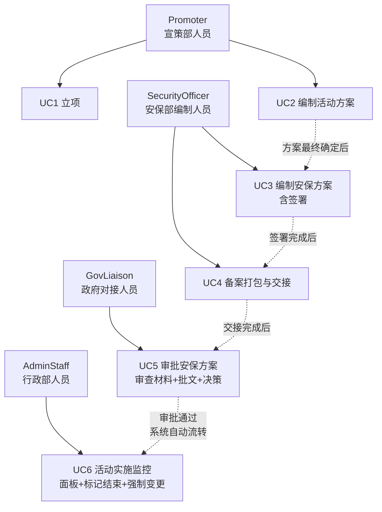
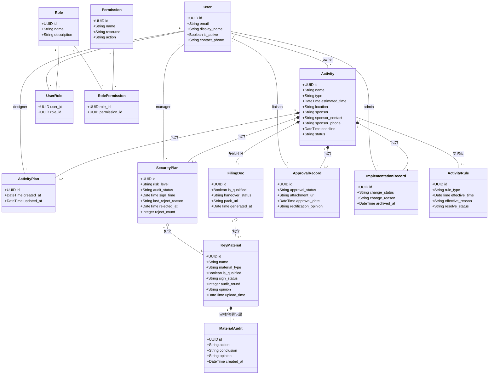
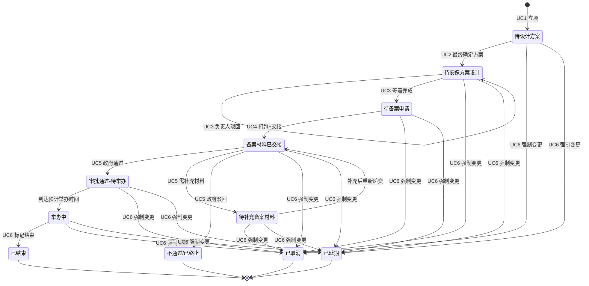
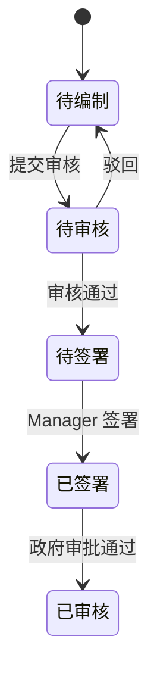

# 五大道景区活动与审批MIS（CAMIS） — 系统分析与设计

> 基于面向服务架构（SOA）的 Web 应用。本章进行系统分析（参与者识别、用例建模、领域类图、状态图），后续章节完成系统设计与实现描述。

## 第 2 章 系统分析

### 2.1 需求分析

#### 2.1.1 参与者识别

系统涉及七类参与者，按职责划分为三个层级：

| 层级 | 角色 | 职责 |
|------|------|------|
| 主办方 | Promoter（宣策部人员） | 立项、编制活动方案 |
| 安保方 | SecurityOfficer（安保部编制人员） | 编制安保方案与备案材料 |
| 安保方 | SecurityManager（安保部负责人） | 签署安保材料、审核方案 |
| 政府方 | GovLiaison（政府对接人员） | 审查备案材料、上传批文、做出审批决策 |
| 行政方 | AdminStaff（行政部人员） | 监控活动进展、标记活动结束、强制变更 |
| 管理方 | AdminManager（行政部负责人） | 管理用户与角色分配 |
| 系统方 | SuperAdmin（超级管理员） | 全局管理 |

各参与者的权限映射详见 `docs/rbac.md`。系统通过 14 项细粒度权限控制各角色对 23 个 API 端点的访问。

#### 2.1.2 用例图

系统包含 6 个核心用例（原 UC6 登记审批结果已移除，审批通过后系统自动流转）。

> **此处插入 StarUML 绘制的用例图（见图 2-1）。**

| 用例 | 参与者 | 前置条件 | 后置条件 |
|------|--------|----------|----------|
| UC1 立项 | Promoter | 无 | 生成活动记录，状态为"待设计方案" |
| UC2 编制活动方案 | Promoter | 活动状态为"待设计方案" | 方案最终确定，状态变更为"待安保方案设计" |
| UC3 编制安保方案 | SecurityOfficer, SecurityManager | 方案已确定 | 签署完成，状态变更为"待备案申请" |
| UC4 备案打包与交接 | SecurityOfficer | 全部材料已签署 | ZIP 包生成，线下交接，状态变更为"备案材料已交接" |
| UC5 审批安保方案 | GovLiaison | 备案材料已交接 | 审批通过后系统自动流转至"审批通过-待举办"；补件则进入"待补充备案材料"回路 |
| UC6 活动实施监控 | AdminStaff | 活动进入举办阶段 | 活动正常结束，或被强制取消/延期 |

> UC5 的备选流程包括"要求补充材料"（进入补件回路）和"驳回"（进入不通过/已终止）。原 UC6（登记审批结果）已移除：GovLiaison 审批通过后系统自动流转至"审批通过-待举办"，不再需要 Manager 手动确认。详见 `docs/camis-UML.md` UC5 用例规约。

### 2.2 领域类图

系统采用面向服务架构（SOA）[ADR 0001]，实体为纯数据载体，不包含业务方法。Activity 作为聚合根，通过组合关系关联子实体。

**核心实体说明**：

- **Activity**（活动）：聚合根。记录活动基本信息（名称、类型、时间、地点、主办方）和当前状态
- **ActivityPlan**（活动方案）：Promoter 编制，含表单数据与版本管理
- **SecurityPlan**（安保方案）：SecurityOfficer 编制，按风险等级（高/中低/低）条件显隐字段，含驳回追溯
- **FilingDoc**（备案文档包）：打包 5 项材料形成的 ZIP 归档，记录合格状态与交接状态
- **KeyMaterial**（关键备案材料）：supertype/subtype 模型，覆盖 5 种类型（活动方案、安保方案、风险评估报备表、安全消防责任确认书、备案承诺书）
- **ApprovalRecord**（审批记录）：GovLiaison 审批决策的独立记录，含批文附件与整改意见
- **ImplementationRecord**（实施记录）：活动进入举办阶段后的跟踪记录
- **MaterialAudit**（材料审核记录）：逐条材料的审核/签署追踪
- **ActivityRule**（活动规则）：场地冲突检测等业务规则

以下为 StarUML 兼容的 Mermaid 领域类图（实体为纯数据载体，无业务方法）：

### 2.3 状态图

活动生命周期包含 **11 个状态**，状态变迁由 UC1-UC6 驱动。审批通过状态（v0.29 前为独立中间态）已移除，GovLiaison 审批通过后活动直接进入"审批通过-待举办"。

**终态**：`已结束`、`不通过/已终止`、`已取消`、`已延期` — 进入后锁定所有后续操作。

**子状态机** — `SecurityPlan.audit_status`：

完整状态说明及通知规则详见 `docs/state-machine.md`。

---

> **第 3 章（系统设计）与第 4 章（系统实现）将在后续补充。**
