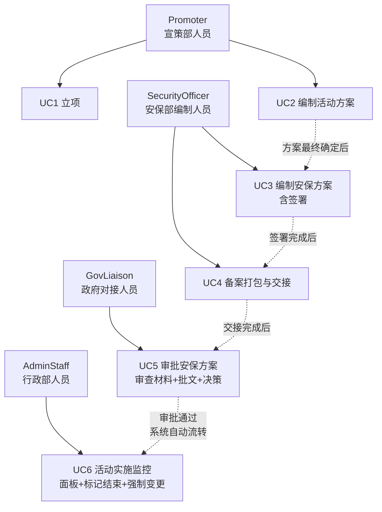
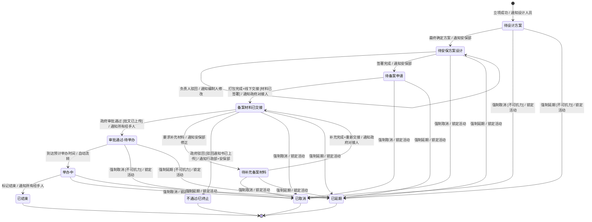
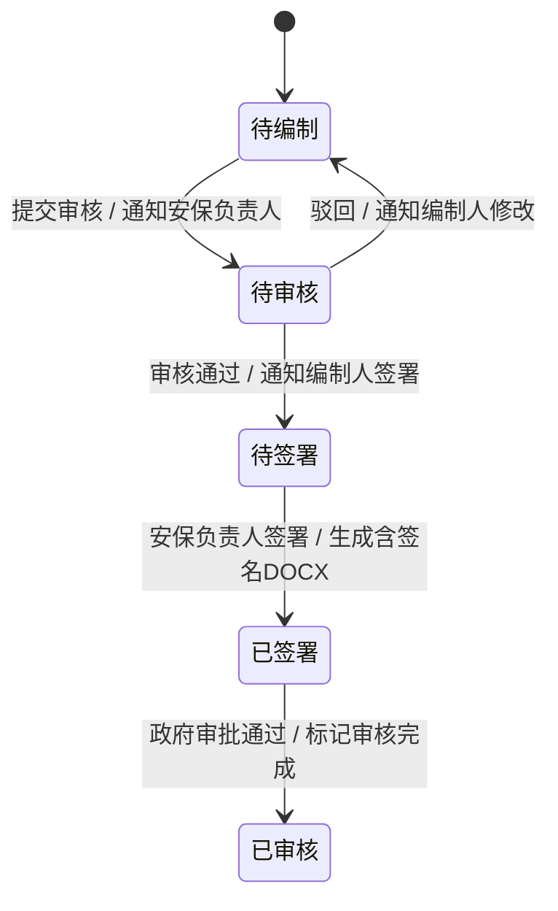

# 五大道景区活动与审批MIS（CAMIS） — 系统分析与设计

> 基于面向服务架构（SOA）的 Web 应用。本章进行系统分析（参与者识别、用例建模、领域类图、状态图），后续章节完成系统设计与实现描述。

## 第 2 章 系统分析

### 2.1 需求分析

#### 2.1.1 参与者识别

系统涉及七类参与者，按职责划分为三个层级：

| 层级 | 角色 | 职责 |
|------|------|------|
| 主办方 | Promoter（宣策部人员） | 立项、编制活动方案 |
| 安保方 | SecurityOfficer（安保部编制人员） | 编制安保方案与备案材料 |
| 安保方 | SecurityManager（安保部负责人） | 签署安保材料、审核方案 |
| 政府方 | GovLiaison（政府对接人员） | 审查备案材料、上传批文、做出审批决策 |
| 行政方 | AdminStaff（行政部人员） | 监控活动进展、标记活动结束、强制变更 |
| 管理方 | AdminManager（行政部负责人） | 管理用户与角色分配 |
| 系统方 | SuperAdmin（超级管理员） | 全局管理 |

各参与者的权限映射详见 `docs/rbac.md`。系统通过 14 项细粒度权限控制各角色对 23 个 API 端点的访问。

#### 2.1.2 用例图

系统包含 6 个核心用例（原 UC6 登记审批结果已移除，审批通过后系统自动流转）。

> **此处插入 StarUML 绘制的用例图（见图 2-1）。**

| 用例 | 参与者 | 前置条件 | 后置条件 |
|------|--------|----------|----------|
| UC1 立项 | Promoter | 无 | 生成活动记录，状态为"待设计方案" |
| UC2 编制活动方案 | Promoter | 活动状态为"待设计方案" | 方案最终确定，状态变更为"待安保方案设计" |
| UC3 编制安保方案 | SecurityOfficer, SecurityManager | 方案已确定 | 签署完成，状态变更为"待备案申请" |
| UC4 备案打包与交接 | SecurityOfficer | 全部材料已签署 | ZIP 包生成，线下交接，状态变更为"备案材料已交接" |
| UC5 审批安保方案 | GovLiaison | 备案材料已交接 | 审批通过后系统自动流转至"审批通过-待举办"；补件则进入"待补充备案材料"回路 |
| UC6 活动实施监控 | AdminStaff | 活动进入举办阶段 | 活动正常结束，或被强制取消/延期 |

> UC5 的备选流程包括"要求补充材料"（进入补件回路）和"驳回"（进入不通过/已终止）。原 UC6（登记审批结果）已移除：GovLiaison 审批通过后系统自动流转至"审批通过-待举办"，不再需要 Manager 手动确认。详见 `docs/camis-UML.md` UC5 用例规约。

### 2.2 领域类图

系统采用面向服务架构（SOA）[ADR 0001]，实体为纯数据载体，不包含业务方法。Activity 作为聚合根，通过组合关系关联子实体。

**核心实体说明**：

- **Activity**（活动）：聚合根。记录活动基本信息（名称、类型、时间、地点、主办方）和当前状态
- **ActivityPlan**（活动方案）：Promoter 编制，含表单数据与版本管理
- **SecurityPlan**（安保方案）：SecurityOfficer 编制，按风险等级（高/中低/低）条件显隐字段，含驳回追溯
- **FilingDoc**（备案文档包）：打包 5 项材料形成的 ZIP 归档，记录合格状态与交接状态
- **KeyMaterial**（关键备案材料）：supertype/subtype 模型，覆盖 5 种类型（活动方案、安保方案、风险评估报备表、安全消防责任确认书、备案承诺书）
- **ApprovalRecord**（审批记录）：GovLiaison 审批决策的独立记录，含批文附件与整改意见
- **ImplementationRecord**（实施记录）：活动进入举办阶段后的跟踪记录
- **MaterialAudit**（材料审核记录）：逐条材料的审核/签署追踪
- **ActivityRule**（活动规则）：场地冲突检测等业务规则

以下为 StarUML 兼容的 Mermaid 领域类图（实体为纯数据载体，无业务方法）：

**类间关系说明**：

**Activity 与 ActivityPlan 是 1 对 0..* 的组合关系。** 1 个活动可以对应零到多个方案版本（立项初期尚无方案，编制后可生成多版），方案脱离活动不可独立存在，删除活动时级联删除方案。

**Activity 与 SecurityPlan 是 1 对 0..1 的组合关系。** 1 个活动可以对应零个或一个安保方案。安保方案在活动进入"待安保方案设计"时按需创建，活动删除时级联删除。

**Activity 与 FilingDoc 是 1 对 0..1 的组合关系。** 1 个活动可以对应零个或一个备案文档包。FilingDoc 仅作为当前最新材料的 ZIP 快照，不记录历史版本——各材料的版本追溯由 `FilledDocument` 实体承担（活动方案、安保方案、备案材料各自独立维护版本链）。补件回路中重新打包时更新同一条 FilingDoc 记录，经手人员始终可下载最新 ZIP。

**Activity 与 ApprovalRecord 是 1 对 0..* 的组合关系。** 1 个活动可以对应零到多条审批记录（审查前为零，补件回路中每条审批决策生成一条记录），记录脱离活动不可独立存在。

**Activity 与 ImplementationRecord 是 1 对 0..1 的组合关系。** 1 个活动可以对应零个或一个实施记录。记录在活动进入举办阶段时创建，活动删除时级联删除。

**Activity 与 ActivityRule 是 0..* 对 0..* 的关联关系。** 一个活动可受多条业务规则约束（如场地冲突检测），一条规则也可约束多个活动。两者独立存在，无拥有语义。

**SecurityPlan 与 KeyMaterial 是 1 对 1..* 的聚合关系。** 1 个安保方案关联至少 1 类备案材料（实际为 5 类：活动方案、安保方案、风险评估报备表、责任确认书、备案承诺书），材料可同时被 FilingDoc 引用，删除方案时材料保留，仅解除关联。

**FilingDoc 与 KeyMaterial 是 1 对 1..* 的聚合关系。** 1 个备案包引用至少 1 类备案材料，同一材料可出现在不同版本的打包中，删除包时材料保留。

**KeyMaterial 与 MaterialAudit 是 1 对 0..* 的组合关系。** 1 条备案材料可以对应零到多条审核/签署记录，记录脱离材料不可独立存在。

**User 与 Activity（owner）是 1 对 1..* 的关联关系。** 1 个用户作为主办方负责人可以创建多个活动。1 个活动必须有且仅有 1 个 owner。

**User 与 ActivityPlan（designer）是 1 对 0..* 的关联关系。** 1 个用户作为方案设计人可以编制零到多个方案。1 个方案必须有 1 个设计人。

**User 与 SecurityPlan（manager）是 1 对 0..* 的关联关系。** 1 个用户作为安保负责人可以管理零到多个安保方案。1 个方案可以有零个或 1 个负责人。

**User 与 ApprovalRecord（liaison）是 1 对 0..* 的关联关系。** 1 个政府对接人可以处理多条审批记录。1 条审批记录有且仅有 1 个对接人。

**User 与 ImplementationRecord（admin）是 1 对 0..* 的关联关系。** 1 个行政人员可以跟踪多条实施记录。1 条实施记录有且仅有 1 个操作人。

**RBAC 关联**：User 与 Role 通过 UserRole 关联表实现多对多关联（1 个用户可有多个角色，1 个角色可分给多个用户）。Role 与 Permission 通过 RolePermission 关联表实现多对多关联（1 个角色可有多个权限，1 个权限可归属多个角色）。

### 2.3 状态图

活动生命周期包含 **11 个状态**，状态变迁由 UC1-UC6 驱动。审批通过状态（v0.29 前为独立中间态）已移除，GovLiaison 审批通过后活动直接进入"审批通过-待举办"。

活动单元的状态变迁遵循 UML 2.0 状态图规范，采用 `event [guard] / action` 格式标注每条转换：event 为触发事件，guard 为前置条件（可选），action 为状态变迁后的系统动作。当前共 11 个状态，4 个终态。整个生命周期由 6 个用例驱动，各用例与状态变迁的对应关系见 §2.1.2 用例规约表。

**各状态说明**：

| 状态 | 含义 | 进入条件 |
|------|------|----------|
| 待设计方案 | 立项完成，等待宣策部编制方案 | 保存立项 |
| 待安保方案设计 | 方案最终确定，等待安保部编制预案 | 最终确定方案 |
| 待备案申请 | 安保方案签署完成，等待打包备案 | 电子签名完成 |
| 备案材料已交接 | ZIP 打包完成、纸质材料已提交政府 | 线下交接确认 |
| 审批通过-待举办 | 政府审批通过，等待举办时间到达 | 政府批准（系统自动流转） |
| 举办中 | 活动正在举办 | 到达预计举办时间（系统自动） |
| 已结束 | 活动正常结束 | AdminStaff 标记结束 |
| 待补充备案材料 | 政府要求补充材料，需修改后重新交接 | 政府要求补件 |
| 不通过/已终止 | 政府驳回，活动终止 | 政府驳回 |
| 已取消 | 因不可抗力强制取消 | AdminStaff 强制变更 |
| 已延期 | 因不可抗力强制延期 | AdminStaff 强制变更 |

**安保方案审核子状态机**（`SecurityPlan.audit_status`）：

| 子状态 | 触发 |
|--------|------|
| 待编制 | 活动进入「待安保方案设计」，SecurityPlan 创建 |
| 待审核 | SecurityOfficer 完成编制，提交审核 |
| 待签署 | SecurityManager 审核通过 |
| 已签署 | SecurityManager 签署确认 |
| 已审核 | 政府审批通过 |

**关键设计要点**：

- **终态锁定**：已结束、不通过/已终止、已取消、已延期为终态，进入后禁止所有后续操作。待补充备案材料不是终态，可重新递交
- **自动流转**：审批通过-待举办到达 `estimated_time` 后，路由层查询时自动转为举办中
- **DOCX 延迟生成**：安保方案、风险评估报备表、安全消防责任确认书在 SecurityOfficer 提交时仅保存数据快照（minio_path=NULL），Manager 签署时一次性生成含签名 DOCX
- **活动方案锁定**：进入待安保方案设计后，Promoter 只能查看活动方案，不可编辑或生成新版本
- **补件回路**：待补充备案材料 → 修改材料 → 重新签署 → 重新打包 → 重新交接 → 回到备案材料已交接 → 通知 GovLiaison 重新审查
- **审批后自动流转**：GovLiaison 审批通过后系统直接进入审批通过-待举办，通知所有经手过活动的人员（owner, designer, manager, 历史操作人）

---

> **第 3 章（系统设计）与第 4 章（系统实现）将在后续补充。**
