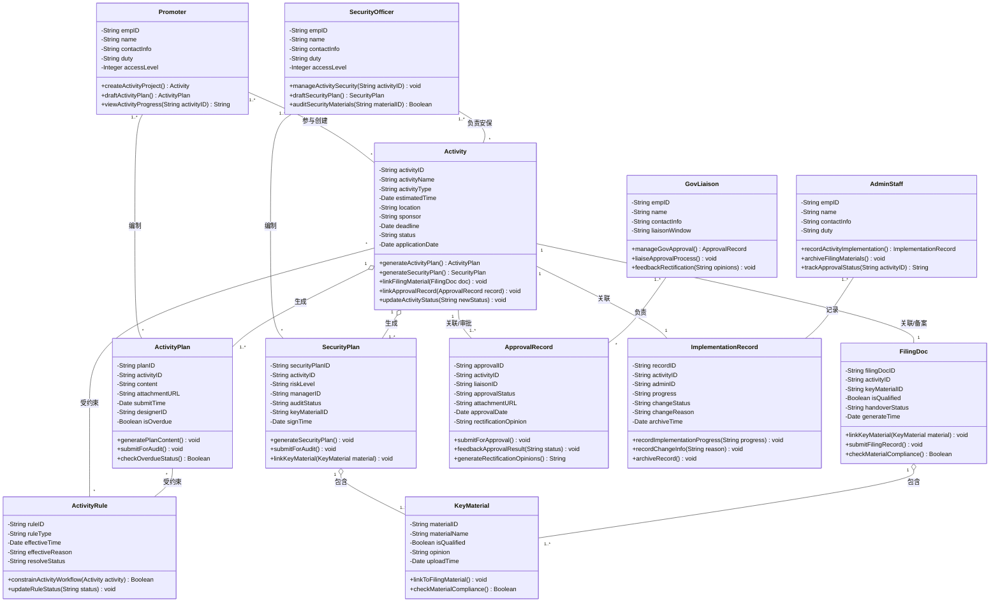
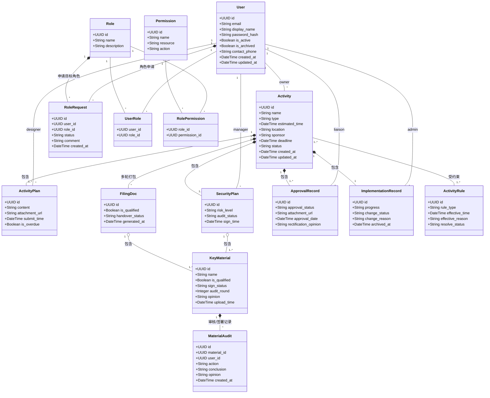
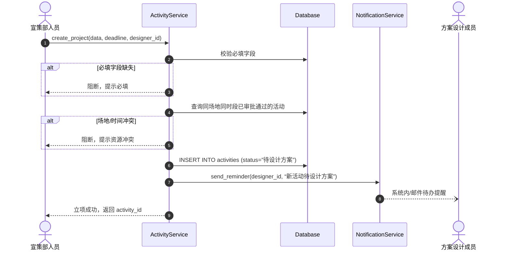
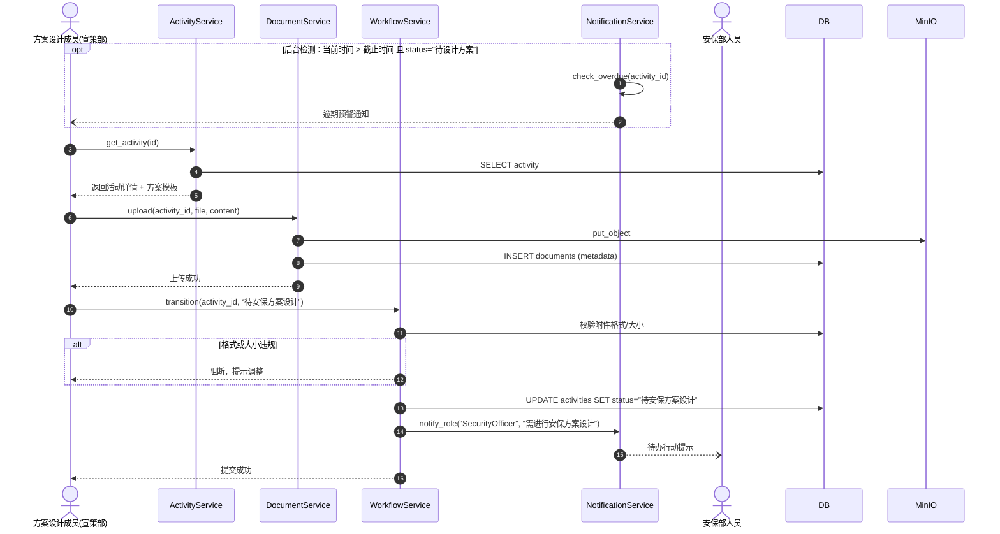
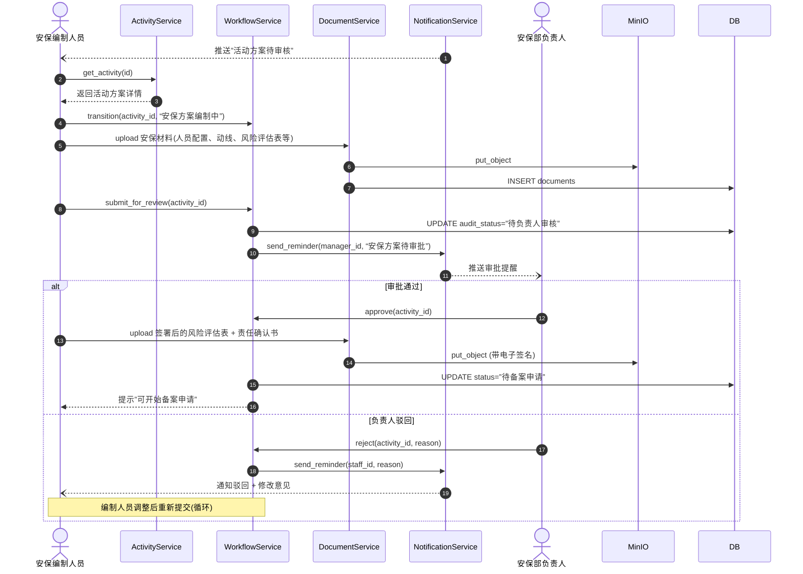
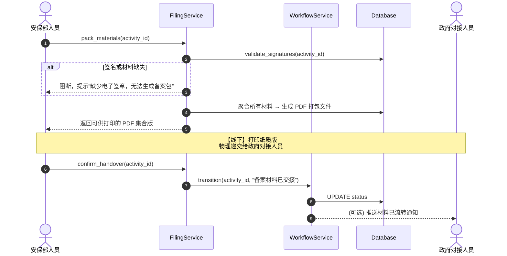
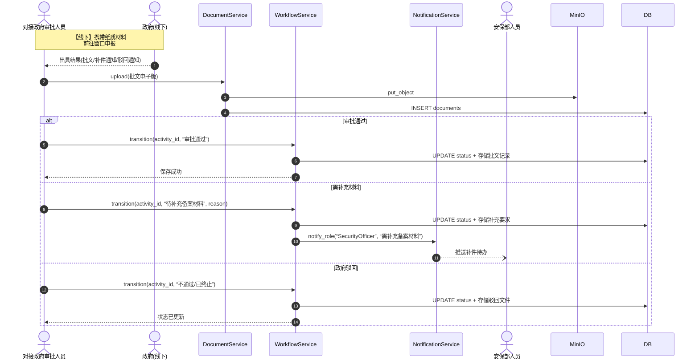
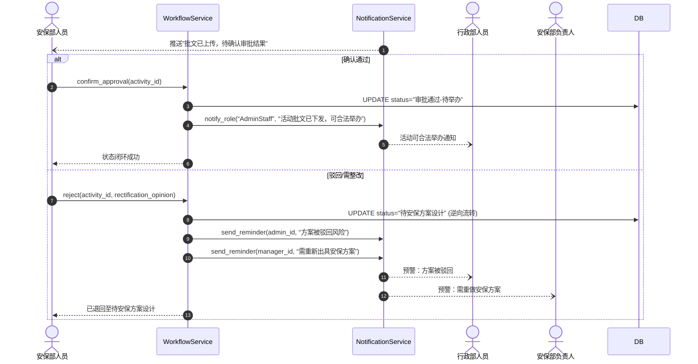
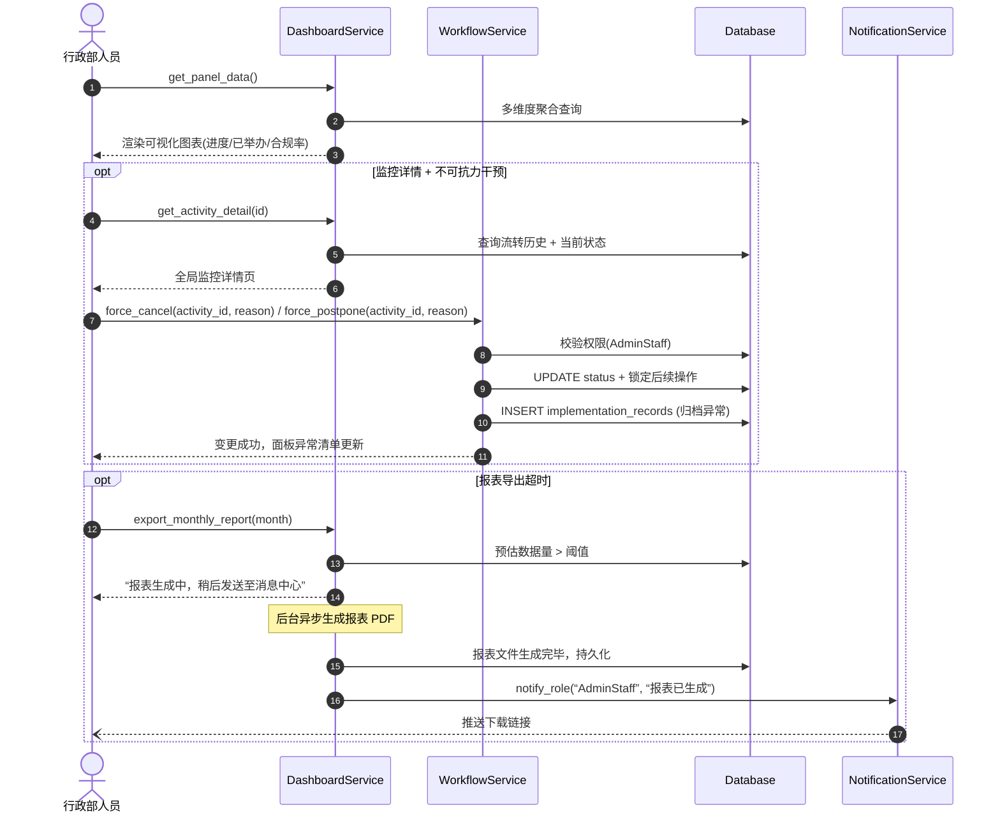

# 用例规约 (Use Case Specification)

## UC 1：立项

​ 参与者：宣策部人员
​ 前置条件：宣策部人员收到政府文旅部门、活动供应商等主办方的活动请求与大纲；用户已登录系统。
​ 后置条件：系统生成活动项目记录，状态为“待设计方案”，并向指定设计人员发送待办提醒。
​ 主事件流：
​ 宣策部人员在系统中点击“新建活动立项”。
​ 用户根据外部需求大纲，填写活动基础信息（名称、类型、预计时间、地点、主办方等）以及任务截止时间。
​ 用户在系统中指定“负责方案设计的成员”。
​ 用户点击“保存立项”。
​ 系统生成唯一活动编号，持久化至数据库，并向被指定的方案设计成员发送系统内/邮件提示。
​ 备选事件流：
​ 1a. 场地/时间冲突预警： 在步骤 4 提交时，系统检测到该时间段该场地已有审批通过的活动。系统弹出阻断提示：“资源冲突：该场地涉及时段已被占用”，用户需修改时间或地点后重新提交。
​ 1b. 必填字段校验失败： 用户未填写截止时间或未指定设计人员，系统高亮红框提示“此项为必填”，阻断保存。
​ 4a. 必填项（如截止时间）缺失：系统阻断保存，高亮提示必填。

## UC 2：活动方案设计

​ 参与者：宣策部人员（被指定的方案设计成员）
​ 前置条件：活动已立项，成员收到系统提示。
​ 后置条件：活动方案上传成功，状态变更为“待安保方案设计”，安保部收到行动提示。
​ 主事件流：
​ 设计成员点击系统提示，进入该活动的详细页面。
​ 用户在系统中点击“调取方案模板”，系统自动生成标准化的设计文档框架。
​ 用户在线填写主要活动内容，并上传详细的图文方案附件（限制格式为 PDF、JPG/PNG 等）。
​ 用户确认无误后点击“提交”。
​ 系统将文档存入数据库，更新活动状态，并自动向安保部发送“需进行安保方案设计”的待办行动提示。
​ 备选事件流：
​ 2a. 附件格式或大小违规： 用户上传了非规定格式（如 .exe）或超过 50MB 的文件。系统提示“文件格式错误或超大，请上传 50M 以内的 PDF/Word/JPG”，阻断提交。
​ 2b. 逾期未提交预警： 若当前时间已超过 UC1 中设定的“任务截止时间”但状态仍未变更，系统自动向该成员及宣策部主管发送“项目方案逾期预警”消息。

## UC 3：安保方案设计

​ 参与者：安保部人员 (SecurityOfficer) + 安保部负责人 (SecurityManager)
​ 前置条件：宣策部已提交活动详细方案，安保部收到系统提示。
​ 后置条件：安保材料签署完毕，状态变更为“待备案申请”。
​ 主事件流：
​ 安保部人员查阅宣策部提交的活动方案，评估活动风险类型（如：大型、中型、高风险等）。
​ 用户根据风险类型，在系统中选择对应的“安保方案模板”。
​ 用户根据实际场地与规模填写安保人员配置、动线等信息，并提交给“安保部负责人”进行内部确认。
​ 负责人在线确认通过后，用户（或负责人）在系统中对《风险评估表》和《安全和消防责任确认书》进行电子签名。
​ 系统保存带签名的电子文档，并提示安保部人员“可以开始备案申请”。
​ 备选事件流：
​ 4a. 负责人驳回：负责人认为安保力量不足或有隐患，在系统中驳回，要求编制人员重新修改安保方案。

## UC 4：提交备案申请

​ 参与者：安保部人员
​ 前置条件：安保方案及风险评估等文件已完成电子签名。
​ 后置条件：线上生成备案数据包，线下完成纸质材料交接。
​ 主事件流：
​ 安保部人员进入“备案申请”节点。
​ 用户确认所有前置审批材料均已填写完毕且带签名。
​ 用户在系统中在线填写《备案承诺书》。
​ 用户点击“打包备案材料”，系统将所有文档打包归档入数据库，并生成可供打印的 PDF 集合版。
​ 安保部人员打印纸质版，系统内点击“已交接”，线下将纸质版递交给对接政府审批的人员。
​ 备选事件流：
​ 4a. 签名或材料缺失： 在步骤 3 中，系统检测到某份关键材料（如安全责任书）缺少有效电子签名，系统阻断打包，并提示“缺少电子签章，无法生成备案包”。

## UC 5：审批安保方案（政府对接）

​ 参与者：对接政府审批人员 (GovLiaison)
​ 前置条件：已线下收到安保部递交的纸质备案材料，活动状态为”备案材料已交接”。
​ 后置条件：政府电子批文存入系统，所有关键材料审核完毕，审核状态已更新。
​ 主事件流：
​ 对接人员登录 MIS 系统，进入对应活动项目 → 备案 tab。
​ 对接人员逐条审查关键材料（消防验收证明、安全责任书等），对每条材料标记”合格”或”不合格”，填写审查意见。
​ 全部合格后，对接人员扫描并上传政府批文电子版（PDF/图片）。
​ 用户在系统中标注审批结果（”通过”），系统更新活动状态为”审批通过”。
​ 备选事件流：
​ 4a. 政府要求补充材料： 部分材料不合格。对接人员标记不合格材料并填写整改意见。系统状态变更为”待补充备案材料”，通知安保部修正后重新打包提交（支持多轮审查）。
​ 4b. 政府直接驳回： 对接人员取得驳回通知书，上传该通知书，标注”不通过”。活动进入”不通过/已终止”终态。

## UC 6：登记审批结果

​ 参与者：安保部人员
​ 前置条件：对接人员已上传批文并标记状态。
​ 后置条件：活动状态闭环（流转至实施阶段或退回重做）。
​ 主事件流（审批通过）：
​ 安保人员收到系统下发的“批文已上传”提示。
​ 安保人员查阅电子批文，确认政府审批意见为“同意”。
​ 用户在系统中点击“确认通过”。
​ 系统将活动状态更新为“审批通过-待举办”。
​ 系统自动向“行政部人员”发送通知（活动可合法举办），安保部后续准备线下实施。
​ 备选事件流（审批驳回）：
​ 2a. 政府审批驳回（逆向流转）：
​ 安保人员查阅电子批文发现政府未予批准。
​ 用户在系统中点击“驳回/需整改”。
​ 用户提取政府批文中的整改意见，填写“方案需修改部分”的说明文字。
​ 系统将活动状态退回至“待安保方案设计”（回滚至 UC3）。
​ 系统向“行政部人员”及“安保部负责人”发送预警提示（方案被驳回风险），要求重新出具方案。

## UC 7：活动实施情况面板

​ 参与者：行政部人员
​ 前置条件：系统数据库中存有各阶段的活动数据。
​ 后置条件：行政人员获取可视化数据，并能对不可抗力异常进行干预处理。
​ 主事件流：
​ 行政部人员登录系统，进入“活动实施情况面板”。
​ 系统从底层数据库中提取信息并渲染可视化图表（展示各节点进度、已举办清单、合规率等）。
​ 行政人员在面板中点击某一个“待举办”或“审批中”的具体活动，进入全局监控详情页。
​ 行政人员查阅该活动的所有流转历史和当前状态。
​ 备选事件流（处理天气等不可抗力）：
​ 3a. 遭遇不可抗力强制终止/延期：
​ 因突发恶劣天气等不可抗力，活动无法继续。
​ 行政人员在活动详情页中点击“强制变更状态”按钮。
​ 用户选择“已取消”或“已延期”，并在弹出的文本框中录入原因（如：红色暴雨预警，接上级通知取消）。
​ 系统锁定该活动的所有后续操作（不再允许提交备案或设计方案）。
​ 系统将该异常状态归档，并在面板的“异常活动清单”中进行单独展示。
2a. 数据导出超时： 用户点击“导出本月合规报表”，由于数据量过大导致系统生成报表超过 30 秒，系统提示“报表生成中，稍后将发送至您的系统消息中心”，避免界面卡死。

# 实体类及其属性

**1. 角色体系（RBAC，详见 docs/rbac.md）**

| 角色 | 权限数 | 核心职责 |
|------|--------|----------|
| SuperAdmin | 2 | 用户 CRUD、角色审批 |
| AdminManager | 5 | 继承 AdminStaff + 角色审批 |
| AdminStaff | 4 | 仪表盘、强制变更 |
| SecurityManager | 7 | 继承 SecurityOfficer + 审核安保方案、状态流转 |
| SecurityOfficer | 4 | 上传材料、签署、打包备案 |
| Promoter | 3 | 创建活动、上传方案 |
| GovLiaison | 4 | 审查材料合规、上传批文、标注审批 |

> OO 阶段原 manual 属性模型（empID/name/duty/accessLevel）已被 RBAC 替代。

**5. Activity (活动项目)**

- `- activityID: String` —— 活动编号 (主键)
- `- activityName: String` —— 活动名称
- `- activityType: String` —— 活动类型
- `- estimatedTime: Date` —— 预计时间
- `- location: String` —— 举办地点
- `- sponsor: String` —— 主办方
- `- deadline: Date` —— 任务截止时间
- `- status: String` —— 当前状态 (待设计/待安保/待备案/审批通过/取消/延期)
- `- applicationDate: Date` —— 申请时间

**6. ActivityPlan (活动方案)**

- `- planID: String` —— 方案编号 (主键)
- `- activityID: String` —— 关联活动编号 (外键)
- `- content: String` —— 方案内容
- `- attachmentURL: String` —— 附件(存放文件服务器地址)
- `- submitTime: Date` —— 提交时间
- `- designerID: String` —— 设计人员工号
- `- isOverdue: Boolean` —— 是否逾期

**7. SecurityPlan (安保方案)**

- `- securityPlanID: String` —— 安保方案编号 (主键)
- `- activityID: String` —— 关联活动编号 (外键)
- `- riskLevel: String` —— 风险等级
- `- managerID: String` —— 负责人工号
- `- auditStatus: String` —— 审核状态
- `- keyMaterialID: String` —— 关联关键材料编号 (外键)
- `- signTime: Date` —— 签署时间

**8. FilingDoc (备案材料)**

- `- filingDocID: String` —— 备案承诺书编号 (主键)
- `- activityID: String` —— 关联活动编号 (外键)
- `- keyMaterialID: String` —— 关联关键材料编号 (外键)
- `- isQualified: Boolean` —— 材料是否合格
- `- handoverStatus: String` —— 纸质交接状态
- `- generateTime: Date` —— 生成时间

**9. ApprovalRecord (政府批文)**

- `- approvalID: String` —— 政府批文编号 (主键)
- `- activityID: String` —— 关联活动编号 (外键)
- `- liaisonID: String` —— 政府对接人员工号 (外键)
- `- approvalStatus: String` —— 审批状态 (通过/驳回/补材料)
- `- attachmentURL: String` —— 批文附件(存放地址)
- `- approvalDate: Date` —— 审批日期
- `- rectificationOpinion: String` —— 整改意见

**10. ImplementationRecord (活动实施记录)**

- `- recordID: String` —— 活动记录编号 (主键)
- `- activityID: String` —— 关联活动编号 (外键)
- `- adminID: String` —— 相关行政人员工号 (外键)
- `- progress: String` —— 实施进度
- `- changeStatus: String` —— 变更状态 (正常/取消/延期)
- `- changeReason: String` —— 变更原因
- `- archiveTime: Date` —— 归档时间

**11. ActivityRule (活动规则)**

- `- ruleID: String` —— 规则编号 (主键)
- `- ruleType: String` —— 规则类型
- `- effectiveTime: Date` —— 生效时间
- `- effectiveReason: String` —— 生效原因
- `- resolveStatus: String` —— 解决状态

**12. KeyMaterial (关键材料)**

- `- materialID: String` —— 关键材料编号 (主键)
- `- materialName: String` —— 关键材料名称
- `- isQualified: Boolean` —— 材料内容是否合格
- `- opinion: String` —— 意见
- `- uploadTime: Date` —— 上传/创建时间

# OO方法

_+_ _方法名**(**参数名\*\*:_ _数据类型\*\*):_ _返回值类型_ _（其中_ _+_ _代表_ _Public_ _公有方法）。_

## 第一部分：人员角色类 (Actor Classes)

**1. 宣策部人员 (Promoter)**

- `+ createActivityProject(): Activity` —— **创建活动项目**：在系统中发起立项，实例化一个新的活动对象。
- `+ draftActivityPlan(): ActivityPlan` —— **编制活动方案**：撰写并上传活动的具体策划内容及图文附件。
- `+ viewActivityProgress(activityID: String): String` —— **查看活动进度**：查询名下所负责活动目前的流转状态节点。

**2. 安保部人员 (SecurityOfficer)**

- `+ manageActivitySecurity(activityID: String): void` —— **负责活动安保**：认领安保任务，开启安保方案的设计工作流。
- `+ draftSecurityPlan(): SecurityPlan` —— **编制安保方案**：根据活动规模撰写安保预案及人员配置。
- `+ auditSecurityMaterials(materialID: String): Boolean` —— **审核安保材料**：对底层的关键材料进行审核，判定是否合格。

**3. 行政部人员 (AdminStaff)**

- `+ recordActivityImplementation(): ImplementationRecord` —— **记录活动实施**：生成并维护该活动的实施及落地情况台账。
- `+ archiveFilingMaterials(): void` —— **归档备案材料**：在活动结束后，对全套合规文件进行封存。
- `+ trackApprovalStatus(activityID: String): String` —— **跟进审批状态**：监控当前活动在政府端的审批进度和结果。

**4. 政府对接人员 (GovLiaison)**

- `+ manageGovApproval(): ApprovalRecord` —— **负责政府批文**：创建并维护系统中的政府批文记录对象。
- `+ liaiseApprovalProcess(): void` —— **对接审批流程**：在线下执行窗口递交，并在线上更新交接状态。
- `+ feedbackRectification(opinions: String): void` —— **反馈整改意见**：将政府退回的修改要求录入系统，驱动方案重做。

---

## 第二部分：核心与业务单据类 (Entity & Document Classes)

**5. 活动项目 (Activity)**

- `+ generateActivityPlan(): ActivityPlan` —— **生成活动方案**：触发生成该项目关联的策划方案对象。
- `+ generateSecurityPlan(): SecurityPlan` —— **生成安保方案**：触发生成该项目关联的安保预案对象。
- `+ linkFilingMaterial(doc: FilingDoc): void` —— **关联备案材料**：建立项目实体与全套备案材料集的逻辑挂载关系。
- `+ linkApprovalRecord(record: ApprovalRecord): void` —— **关联审批批文**：建立项目实体与政府返回批文的绑定关系。
- `+ updateActivityStatus(newStatus: String): void` —— **更新活动状态**：驱动该项目在生命周期（待设计/待安保/审批等）中流转。

**6. 活动方案 (ActivityPlan)**

- `+ generatePlanContent(): void` —— **生成方案**：构建方案的主体内容与附件列表。
- `+ submitForAudit(): void` —— **提交审核**：将方案状态变更为“已提交”，并推给下一个处理人。
- `+ checkOverdueStatus(): Boolean` —— **检查逾期状态**：比对当前时间与截止时间，判定是否违规拖延。

**7. 安保方案 (SecurityPlan)**

- `+ generateSecurityPlan(): void` —— **生成安保方案**：构建安保预案实体并计算初始风险等级。
- `+ submitForAudit(): void` —— **提交审核**：锁定安保方案内容，发起内部负责人的签字审批流程。
- `+ linkKeyMaterial(material: KeyMaterial): void` —— **关联关键材料**：将如“人员资质表”、“疏散图”等碎片材料绑定到此方案。

**8. 备案材料 (FilingDoc)**

- `+ linkKeyMaterial(material: KeyMaterial): void` —— **关联关键材料**：整合各类承诺书及基础方案，构建合规材料包。
- `+ submitFilingRecord(): void` —— **提交备案**：执行打包动作，并生成用于交接的线下打印清单。
- `+ checkMaterialCompliance(): Boolean` —— **检查材料合规性**：在提交前，全局遍历检查内部包含的所有文件是否均已达标。

**9. 政府批文 (ApprovalRecord)**

- `+ submitForApproval(): void` —— **提交审批**：标记批文实体进入“政府审理中”阶段。
- `+ feedbackApprovalResult(status: String): void` —— **反馈审批结果**：录入通过或驳回的最终结论。
- `+ generateRectificationOpinions(): String` —— **生成整改意见**：针对驳回状态，自动提取并分发整改清单。

**10. 活动实施记录 (ImplementationRecord)**

- `+ recordImplementationProgress(progress: String): void` —— **记录实施进度**：更新展出、人流量测算等现场落地数据。
- `+ recordChangeInfo(reason: String): void` —— **记录变更信息**：处理因天气取消或延期的异常数据写入。
- `+ archiveRecord(): void` —— **归档记录**：活动彻底结束后，锁定本台账禁止再次修改。

**11. 活动规则 (ActivityRule)**

- `+ constrainActivityWorkflow(activity: Activity): Boolean` —— **约束活动流程**：拦截并校验某一项目是否触发了合规红线。
- `+ updateRuleStatus(status: String): void` —— **更新规则状态**：变更该规则处于生效中还是已解决的生命周期。

**12. 关键材料 (KeyMaterial)**

- `+ linkToFilingMaterial(): void` —— **关联备案材料**：向上绑定到主体的备案包或安保方案包中。
- `+ checkMaterialCompliance(): Boolean` —— **检查材料合规性**：进行针对单页内容（如电子签名是否完备）的验证。

# 类图mermaid

> staruml的mermaid代码与标准mermaid代码有区别



# 顺序图mermaid

UC1顺序图

```mermaid
sequenceDiagram autonumber actor Promoter as 宣策部人员 participant System as 系统 participant Designer as 宣策部方案设计人员
Promoter->>System: 点击“新建活动立项”
Promoter->>System: 填写活动基础信息、截止时间
Promoter->>System: 指定“负责方案设计成员”
Promoter->>System: 点击“保存立项”

alt 场地/时间资源冲突
    System-->>Promoter: 弹出阻断提示“资源冲突：该场地涉及时段已被占用”
    Note over Promoter: 修改时间/地点后<br/>重新发起提交
else 必填字段缺失
    System-->>Promoter: 高亮红框提示“此项为必填”
    Note over Promoter: 补全必填项后<br/>重新发起提交
else 校验通过 (成功保存)
    System->>System: 生成唯一活动编号，持久化至数据库
    System->>System: 活动状态更新为“待设计方案”
    System-->>Promoter: 提示立项成功
    System-)Designer: 发送待办提醒 (系统内/邮件)
end
```

UC2顺序图

```mermaid
sequenceDiagram autonumber actor Designer as 方案设计成员(宣策部) participant System as 系统 actor Security as 安保部人员
%% 这是一个时间触发的独立逻辑，使用 opt 表示在特定条件下触发
opt 后台定时检测 (当前时间 > 任务截止时间 且未提交)
    System-->>Designer: 自动发送“项目方案逾期预警”
    System->>System: 同步发送预警给宣策部主管
end

%% 下面是用户主动操作的主事件流
Designer->>System: 点击系统提示，进入该活动的详细页面
Designer->>System: 点击“调取方案模板”
System-->>Designer: 返回并自动生成标准化的设计文档框架

Designer->>System: 填写主要活动内容，上传图文方案附件
Designer->>System: 确认无误后点击“提交”

alt 附件格式或大小违规
    System-->>Designer: 提示“文件格式错误或超大，请上传50M以内的PDF/Word/JPG”
    Note over Designer: 调整文件格式/大小后<br/>重新点击提交
else 校验通过 (成功提交)
    System->>System: 方案文档存入数据库
    System->>System: 活动状态更新为“待安保方案设计”
    System-->>Designer: 页面提示提交成功
    System-)Security: 自动发送“需进行安保方案设计”待办行动提示
end
```

UC3顺序图

```mermaid
sequenceDiagram autonumber actor Staff as 安保编制人员 participant System as 系统 actor Manager as 安保部负责人
%% 前置条件：系统推送提示
System-->>Staff: 自动推送“活动方案待审核”提示

Staff->>System: 查阅宣策部提交的活动方案详情
System-->>Staff: 展示活动方案及相关参数

Staff->>System: 评估并提交活动风险类型 (大型/高风险等)
System-->>Staff: 根据风险等级返回对应“安保方案模板”

Staff->>System: 录入安保人员配置、动线等详细信息
Staff->>System: 将安保方案提交给负责人审核
System-)Manager: 自动推送“安保方案待审批”提醒

alt 审批通过 (主事件流)
    Manager->>System: 在线确认方案并审批通过
    System-->>Staff: 通知审批通过，提示进行责任书签署

    Staff->>System: 签署《风险评估表》及《责任确认书》
    System->>System: 生成并保存带签名的电子文档
    System->>System: 活动状态更新为“待备案申请”

    System-->>Staff: 提示“材料齐备，可以开始备案申请”

else 负责人驳回 (备选事件流 4a)
    Manager->>System: 录入隐患/意见并执行驳回操作
    System-->>Staff: 通知方案被驳回，并展示修改意见

    Note over Staff, System: 编制人员根据修改意见<br/>重新调整人员配置后再次提交(循环)
end
```

UC4顺序图

```
sequenceDiagram autonumber actor Security as 安保部人员 participant System as 系统 actor GovLiaison as 政府对接人员
Security->>System: 进入“备案申请”节点，确认前置材料
Security->>System: 在线填写《备案承诺书》
Security->>System: 点击“打包备案材料”发起请求

alt 签名材料齐全且合规 (主事件流)
    System->>System: 将所有文档打包归档入数据库
    System-->>Security: 校验通过，生成可供打印的 PDF 集合版

    %% 线下物理流转使用 Note 标明，连接两个人员
    Note over Security, GovLiaison: 【线下流程】安保人员打印纸质版<br/>并物理递交给政府对接人员

    Security->>System: 在系统内点击确认“已交接”
    System->>System: 更新活动状态为“备案材料已交接”
    System-->>GovLiaison: (可选) 推送材料已流转的系统通知

else 签名或材料缺失 (备选事件流 4a)
    System-->>Security: 阻断打包，提示“缺少电子签章，无法生成备案包”

    Note over Security: 补全相关签名与材料后<br/>重新发起打包提交
end
```

UC5顺序图

```
sequenceDiagram autonumber actor Liaison as 对接政府审批人员 actor Gov as 政府相关部门(线下) participant System as MIS系统 actor Security as 安保部人员
Note over Liaison, Gov: 【线下物理流转阶段】
Liaison->>Gov: 携带纸质材料，前往窗口线下申报
Gov-->>Liaison: 审核并出具结果（正式批文/补件通知/驳回通知）

Note over Liaison, System: 【线上系统操作阶段】
Liaison->>System: 登录MIS系统，进入对应活动项目
Liaison->>System: 扫描并上传政府出具结果的电子版(PDF/图片)

alt 政府审批通过 (主事件流)
    Liaison->>System: 标注审核状态为“通过”并保存
    System->>System: 存储电子批文，更新项目状态为“审批通过”
    System-->>Liaison: 提示保存成功，流程完结

else 需补充材料 (备选事件流 4a)
    Liaison->>System: 勾选“需补充材料”，填写具体要求并保存
    System->>System: 存储补件信息，更新状态为“待补充备案材料”
    System-)Security: 自动推送“需补充备案材料”待办任务给安保部

else 政府驳回 (备选事件流 4b)
    Liaison->>System: 勾选“政府审核结果：不通过”并保存
    System->>System: 存储驳回文件，更新项目状态为“不通过/已终止”
    System-->>Liaison: 提示状态已更新
end
```

UC6顺序图

```
sequenceDiagram autonumber actor Security as 安保部人员 participant System as 系统 actor Admin as 行政部人员 actor Manager as 安保部负责人
%% 前置触发：收到政府对接人员上传后的系统通知
System-->>Security: 自动推送“批文已上传，待确认审批结果”提示

alt 政府审批通过 (主事件流)
    Security->>System: 查阅电子批文，确认同意并点击“确认通过”
    System->>System: 更新活动状态为“审批通过-待举办”
    System-->>Security: 页面提示状态闭环成功

    %% 异步通知相关人员
    System-)Admin: 自动发送通知：活动批文已下发，可合法举办

else 政府审批驳回 (备选事件流 2a)
    Security->>System: 查阅发现未批准，点击“驳回/需整改”
    Security->>System: 提取批文意见，填写“方案需修改部分”说明

    System->>System: 状态逆向流转，回滚至“待安保方案设计”
    System-->>Security: 页面提示已成功退回

    %% 异步发送预警与重做通知
    System-)Admin: 发送预警提示：方案存在被驳回风险
    System-)Manager: 发送预警提示：要求接收意见并重新出具安保方案
end
```

# 面向服务架构（SO）设计

> 以下为 ADR 0001/0002 决策后的更新版类图。实体只保留属性，业务方法剥离到服务层。四个 Actor 类合并为 User + Role + Permission。

## 实体模型（纯数据载体）



> **与 OO 类图的关键差异**：
>
> - 四个 Actor 类 → User + Role + Permission（RBAC）
> - 所有实体方法移除，实体只保留属性
> - Actor→实体关系 → User 外键（owner_id / designer_id / manager_id / liaison_id / admin_id）
> - Activity 为聚合根，子实体通过 activity_id 外键关联（组合 `*--`）
> - 新增 UserRole、RolePermission 关联表

## 服务层

```mermaid
classDiagram
    class ActivityService {
        +create_project(owner_id, data) Activity
        +get_activity(id) Activity
        +list_activities(filters) List~Activity~
        +get_status_history(id) List~StatusChange~
    }

    class WorkflowService {
        +transition(activity_id, to_status) void
        +can_transition(from_status, to_status) bool
        +reject(activity_id, reason) void
        +force_cancel(activity_id, reason) void
        +force_postpone(activity_id, reason) void
    }

    class DocumentService {
        +upload(activity_id, file) Document
        +get_presigned_url(object_path) str
        +list_by_activity(activity_id) List~Document~
    }

    class FilingService {
        +pack_materials(activity_id) FilingDoc
        +sign_material(activity_id, material_id, user_id) dict
        +audit_material(activity_id, material_id, user_id, conclusion, opinion) dict
        +validate_signatures(activity_id) bool
        +confirm_handover(activity_id) void
    }

    class NotificationService {
        +send_reminder(user_id, message, channel) void
        +notify_role(role_name, message) void
        +check_overdue(activity_id) void
    }

    class DashboardService {
        +get_panel_data() PanelData
        +get_activity_detail(id) ActivityDetail
        +export_monthly_report(month) bytes
    }
```



> **方法来源映射**：
>
> - `ActivityService.create_project()` ← 原 `Promoter.createActivityProject()`
> - `WorkflowService.transition()` ← 原 `Activity.updateActivityStatus()` + `submitForAudit()` 等
> - `DocumentService.upload()` ← 原实体方法中涉及文件上传的逻辑
> - `FilingService.pack_materials()` ← 原 `FilingDoc.submitFilingRecord()` + `checkMaterialCompliance()`
> - `NotificationService.send_reminder()` ← 原散布各 UC 的通知逻辑
> - `DashboardService.get_panel_data()` ← 原 `AdminStaff.trackApprovalStatus()`

## 实体-表映射

| 实体                 | 表名                     | 状态                         |
| -------------------- | ------------------------ | ---------------------------- |
| Activity             | `activities`             | ❌                           |
| ActivityPlan         | `activity_plans`         | ❌                           |
| SecurityPlan         | `security_plans`         | ❌                           |
| FilingDoc            | `filing_docs`            | ❌                           |
| ApprovalRecord       | `approval_records`       | ❌                           |
| ImplementationRecord | `implementation_records` | ❌                           |
| KeyMaterial          | `key_materials`          | ❌                           |
| ActivityRule         | `activity_rules`         | ❌                           |
| User                 | `users`                  | ✅                           |
| Document             | `documents`              | ✅                           |
| Project              | `projects`               | ✅ 骨架，待改造为 activities |
| Role                 | `roles`                  | ❌                           |
| Permission           | `permissions`            | ❌                           |
| UserRole             | `user_roles`             | ❌                           |
| RolePermission       | `role_permissions`       | ❌                           |

---

UC7顺序图

```
sequenceDiagram autonumber actor Admin as 行政部人员 participant System as 统合MIS系统
%% 主事件流：进入面板并渲染图表
Admin->>System: 登录系统，进入“活动实施情况面板”
System->>System: 从底层数据库提取多维度活动数据
System-->>Admin: 渲染可视化图表 (进度节点/已举办清单/合规率等)

%% 分支 1：详情查看与异常干预
opt 监控详情与不可抗力干预 (备选流 3a)
    Admin->>System: 点击某“待举办/审批中”活动
    System->>System: 查询该活动流转历史及当前状态
    System-->>Admin: 渲染并展示全局监控详情页

    Admin->>System: 点击“强制变更状态”按钮
    Admin->>System: 选择“已取消/已延期”，录入不可抗力原因并提交

    System->>System: 锁定活动后续流转，更新状态并归档异常
    System-->>Admin: 提示变更成功，并在面板“异常活动清单”中单独展示
end

%% 分支 2：大数据量报表异步导出
opt 报表导出与超时处理 (备选流 2a)
    Admin->>System: 点击“导出本月合规报表”
    System->>System: 预估数据提取量大，生成将耗时超 30s
    System-->>Admin: 界面提示：“报表生成中，稍后将发送至您的系统消息中心”

    %% 后台异步处理过程 (此时前端不阻塞，用户可继续其他操作)
    Note over System: 【后台异步任务】<br/>Go协程持续汇聚报表数据并生成PDF
    System->>System: 报表文件生成完毕，持久化入库
    System-)Admin: 推送异步通知：”本月合规报表已生成，请点击下载”
end
```

# 面向服务顺序图

> 以下为新版顺序图，`System` 黑盒拆分为具体服务。用例流程不变，仅 lifeline 从单 `System` 变为服务层各组件。

## UC1 SO顺序图 — 立项



## UC2 SO顺序图 — 活动方案设计



## UC3 SO顺序图 — 安保方案设计



## UC4 SO顺序图 — 提交备案申请



## UC5 SO顺序图 — 审批安保方案



## UC6 SO顺序图 — 登记审批结果



## UC7 SO顺序图 — 活动实施情况面板


