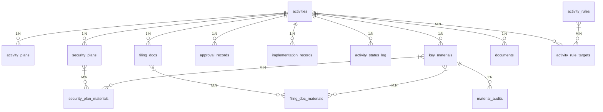
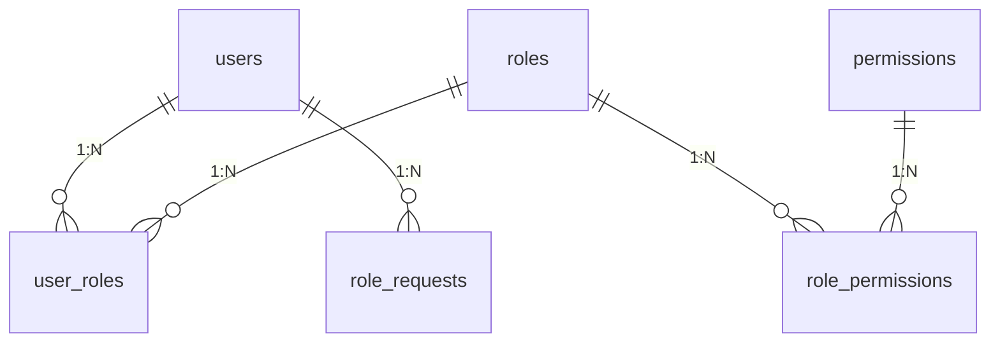
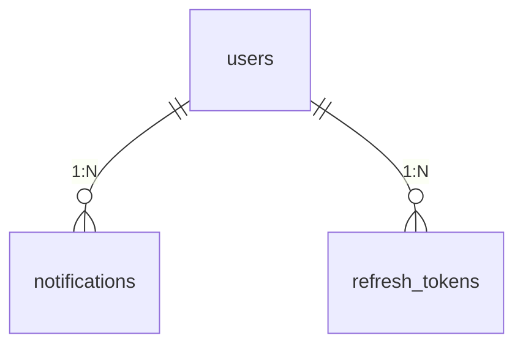

# CAMIS 数据层设计报告

活动合规审批 MIS 的数据层：数据库表结构设计与数据访问接口设计。

## 一、概述

CAMIS 是一个活动合规审批管理系统，覆盖活动立项、方案设计、安保审批、备案管理、政府批文的全流程。

数据层采用**三层存储 + 模块化单体**架构：

| 组件 | 用途 | 选型 |
|------|------|------|
| PostgreSQL 17 | 业务元数据存储 | 关系型，支持 ACID 事务 |
| MinIO | 文件对象存储 | 兼容 S3 协议 |
| Redis 7.4 | 缓存与会话 | 内存数据库 |

三层职责严格分离：PostgreSQL 不存文件内容，MinIO 不存业务逻辑，Redis 不做持久主存储。

## 二、数据库表结构设计

### 2.1 概念模型

核心业务域的实体关系：



RBAC 权限体系：



基础设施：



### 2.2 表清单

系统共有 **23 张表**，按领域分为四组。

#### 核心业务域（Activity 聚合根）

| 表 | 说明 | 关键字段 |
|---|------|---------|
| `activities` | 活动聚合根 | id(PK), name, type, estimated_time, location, sponsor, deadline, status, owner_id(FK), designer_id(FK) |
| `activity_plans` | 活动方案 | id(PK), activity_id(FK), content, attachment_url, designer_id(FK), is_overdue |
| `security_plans` | 安保方案 | id(PK), activity_id(FK), risk_level, audit_status, manager_id(FK), sign_time |
| `filing_docs` | 备案材料包 | id(PK), activity_id(FK), is_qualified, handover_status, generated_at |
| `approval_records` | 政府批文 | id(PK), activity_id(FK), liaison_id(FK), approval_status, rectification_opinion |
| `implementation_records` | 实施记录 | id(PK), activity_id(FK), admin_id(FK), progress, change_status, change_reason |
| `activity_status_log` | 状态流转日志 | id(PK), activity_id(FK), from_status, to_status, operator_id(FK), comment |
| `activity_rules` | 业务规则 | id(PK), rule_type, effective_time, resolve_status |
| `security_plan_materials` | 安保方案-材料关联 | (security_plan_id, material_id) 复合 PK |
| `filing_doc_materials` | 备案包-材料关联 | (filing_doc_id, material_id) 复合 PK |
| `activity_rule_targets` | 活动-规则关联 | (activity_id, rule_id) 复合 PK |

Activity 为聚合根，其子实体（ActivityPlan、SecurityPlan、FilingDoc、ApprovalRecord、ImplementationRecord、ActivityStatusLog）通过 `activity_id` 外键关联，级联删除。活动通过终态（`已结束`/`已取消`/`已延期`/`不通过已终止`）锁定而非硬删除，保留完整审计轨迹。

#### 文件与材料

| 表 | 说明 | 关键字段 |
|---|------|---------|
| `documents` | 文件元数据 | id(PK), activity_id(FK SET NULL), uploader_id(FK), filename, minio_path(UNIQUE), file_size, content_type, tags(GIN 索引) |
| `key_materials` | 关键材料 | id(PK), activity_id(FK), name, is_qualified, sign_status, audit_round, opinion |
| `material_audits` | 材料审核记录 | id(PK), material_id(FK), user_id(FK), action∈{sign,audit}, conclusion, opinion |

KeyMaterial 采用**双路径关联**设计：通过 `security_plan_materials` / `filing_doc_materials` join 表关联到具体上下文（安保方案或备案包），同时通过 `activity_id` FK 直达所属活动，避免"查活动的所有材料"需要 UNION 两张 join 表的高频查询开销。

#### RBAC 权限体系

| 表 | 说明 | 关键字段 |
|---|------|---------|
| `users` | 用户 | id(PK), email(UNIQUE), display_name, password_hash, is_active, is_archived |
| `roles` | 角色（7 个） | id(PK), name(UNIQUE), description |
| `permissions` | 权限（18 项） | id(PK), name(UNIQUE), resource, action |
| `user_roles` | 用户-角色关联 | (user_id, role_id) 复合 PK |
| `role_permissions` | 角色-权限关联 | (role_id, permission_id) 复合 PK |
| `role_requests` | 角色申请 | id(PK), user_id(FK), role_id(FK), status, reviewer_id(FK) |

采用标准 RBAC 模型：一个用户拥有多个角色，一个角色关联多项权限。角色申请通过管理员审批流程生效，每个用户同时只能有一个待审批申请（部分唯一索引约束）。

#### 基础设施

| 表 | 说明 | 关键字段 |
|---|------|---------|
| `notifications` | 系统通知 | id(PK), user_id(FK), message, channel, is_read(部分索引), reference_id, reference_type |
| `refresh_tokens` | JWT 刷新令牌 | id(PK), user_id(FK), token_hash(UNIQUE), expires_at, revoked |
| `login_attempts` | 登录尝试记录 | id(PK), login_id, ip_address, success |

### 2.3 列级设计规范

| 规范 | 约定 | 说明 |
|------|------|------|
| 主键 | UUID v4 | 全局唯一，API 暴露不可预测（防枚举） |
| 时间戳 | TIMESTAMPTZ | 统一 UTC 存储，前端按本地时区展示 |
| 字符串 | VARCHAR 分级（32/64/128/255/1024/2048） | 精确校验在应用层，DB 层兜底上限 |
| 无界文本 | TEXT | 用户自由输入（方案内容、审核意见等） |
| 布尔 | Boolean + 显式 DEFAULT | 禁止隐式 NULL 当作 False |
| 编码 | UTF-8 | PostgreSQL 与 asyncpg 客户端默认一致 |

### 2.4 范式水平

整体满足 **第三范式（3NF）**。存在两处经过设计的反范式化：

| 表 | 字段 | 违反 | 理由 |
|----|------|------|------|
| `key_materials` | `is_qualified`, `opinion` | 可由 `material_audits` 最新审核记录推导 | 列表展示材料合规状态无需每次 JOIN，写入时同步刷新 |
| `activity_plans` | `is_overdue` | 可由 `deadline` 与当前时间计算得出 | 支持直接索引过滤逾期方案 |

3NF 是 OLTP 系统的基准。以上两处为**文档化的性能权衡**，均有明确的同步策略。

### 2.5 索引

现有 **18 个索引**，覆盖全部外键列和高频查询条件。关键索引：

- `idx_activities_status` — 按状态筛选活动列表
- `idx_activities_location_time` — 场地冲突检测
- `idx_documents_tags` (GIN) — 文件标签搜索
- `idx_notifications_unread` (部分索引) — 未读通知计数
- `idx_one_pending_per_user` (部分唯一索引) — 角色申请约束

复合主键 `user_roles(user_id, role_id)` 和 `role_permissions(role_id, permission_id)` 自动为左侧列提供索引覆盖。

索引决策原则：所有 FK 列必建索引；高并发查询的 WHERE + ORDER BY 组合考虑复合索引；新索引通过数据库迁移工具（Alembic）管理。

## 三、数据访问接口设计

### 3.1 分层架构

```
Route Layer     →  HTTP 请求解析、参数校验、响应序列化
    │
RBAC Middleware →  JWT 验证 → 获取用户 → 查询权限集 → require_permission("perm")
    │
Service Layer   →  业务逻辑编排、事务管理、跨服务协调
    │
ORM / SQL       →  SQLAlchemy 参数化查询（95%）+ raw SQL text()（5%）
    │
PostgreSQL      →  READ COMMITTED 隔离级别
```

- 权限校验在**路由层**完成，服务层不做角色判断
- 路由层通过 FastAPI `Depends()` 获取 `AsyncSession`，注入 Service
- 不存在独立的 Repository 抽象层——Service 直接使用 SQLAlchemy ORM

### 3.2 服务层接口

系统包含 **6 个已实现服务** + **2 个待补充服务**。

#### ActivityService（活动管理）

| 方法 | 说明 | 对应表 |
|------|------|--------|
| `create(owner_id, data)` | 创建立项，校验必填字段 + 场地冲突 | `activities` |
| `get(activity_id)` | 获取活动详情 | `activities` |
| `list(params, user_id, allowed_statuses)` | 分页查询，支持按角色可见性过滤 | `activities` |
| `get_status_history(activity_id)` | 获取状态流转历史 | `activity_status_log` |

#### WorkflowService（审批工作流引擎）

| 方法 | 说明 | 对应表 |
|------|------|--------|
| `transition(activity_id, to_status, operator)` | 核心状态变迁，含乐观锁（`rowcount==0` 检测） | `activities`, `activity_status_log` |
| `reject(activity_id, operator, reason)` | 驳回操作（内部循环或逆向流转） | `activities`, `activity_status_log` |
| `force_cancel(activity_id, operator, reason)` | 强制取消（不可抗力） | `activities`, `implementation_records` |
| `force_postpone(activity_id, operator, reason)` | 强制延期（不可抗力） | `activities`, `implementation_records` |

所有状态变更必须经过此服务。状态转换矩阵定义了 12 项合法转换（如 `待设计方案→待安保方案设计`、`备案材料已交接→审批通过`、`待补充备案材料→备案材料已交接`）。终态（`已结束`/`已取消`/`已延期`/`不通过已终止`）禁止任何后续变更。

#### DocumentService（文件存储）

| 方法 | 说明 | 对应组件 |
|------|------|---------|
| `validate(filename, content_type, size, content)` | 校验文件格式（PDF/JPG/PNG/DOC/DOCX）与大小（≤50MB） | — |
| `upload(activity_id, uploader_id, ...)` | 上传到 MinIO + 写 `documents` 元数据 | MinIO, `documents` |
| `get_presigned_download_url(doc_id)` | 生成 MinIO 30 分钟预签名 URL | MinIO, `documents` |
| `list_by_activity(activity_id)` | 获取活动关联的所有文档 | `documents` |

#### FilingService（备案材料管理）

| 方法 | 说明 | 对应表 |
|------|------|--------|
| `validate_materials(activity_id)` | 校验所有关联材料的合规性和签名状态 | `key_materials`, join 表 |
| `pack_materials(activity_id)` | 聚合已签署材料 → 生成打包 PDF | `filing_docs`, MinIO |
| `sign_material(activity_id, material_id, user_id)` | 对材料执行电子签署 | `key_materials`, `material_audits` |
| `audit_material(activity_id, material_id, ...)` | 审查材料合规性（合格/不合格） | `key_materials`, `material_audits` |
| `confirm_handover(activity_id, operator)` | 确认纸质交接，触发 WorkflowService 状态变更 | `filing_docs`, `activities` |

FilingService 在 `confirm_handover` 中与 WorkflowService 共享同一数据库会话（`AsyncSession`），实现跨服务同一事务。

#### NotificationService（通知）

| 方法 | 说明 | 对应表 |
|------|------|--------|
| `send_reminder(user_id, message, channel)` | 向指定用户发送通知 | `notifications` |
| `notify_role(role_name, message)` | 向拥有指定角色的所有用户发送通知 | `notifications`, `user_roles` |
| `check_overdue(activity_id)` | 检查活动是否逾期并发送预警 | `activities`, `notifications` |

通知由 WorkflowService 在状态变更时触发，NotificationService 为纯内部服务，无 REST 端点。

#### DashboardService（活动面板）

| 方法 | 说明 | 对应表 |
|------|------|--------|
| `get_panel_data()` | 多维度聚合（各状态数量、合规率、近期异常） | `activities`, `activity_status_log` |
| `get_activity_detail(activity_id)` | 单个活动全量数据 | 跨表 JOIN |
| `export_monthly_report(month)` | 生成月报 PDF（数据量大时异步处理） | 跨表聚合 |

### 3.3 事务与并发控制

| 机制 | 说明 |
|------|------|
| 隔离级别 | PostgreSQL 默认 `READ COMMITTED` |
| 乐观锁 | `WorkflowService.transition` 采用 `UPDATE ... WHERE status=from_status` + `rowcount==0` 检测并发冲突 |
| 并发保护 | `filing_docs(activity_id)` UNIQUE 约束防重；`user_roles` / `role_permissions` 复合 PK 兜底 |
| 异常回滚 | FastAPI 上下文管理器保证事务自动回滚 |
| 跨服务同一事务 | FilingService 传入自身 `AsyncSession` 给 WorkflowService，共享同一 PostgreSQL 事务 |

### 3.4 缓存策略

采用 **Cache-Aside** 模式。Redis 缓存点：

| 缓存键 | TTL | 失效机制 | 依赖类型 |
|--------|-----|---------|---------|
| `activity:{id}:docs` | 5 分钟 | 文件上传时主动 DEL | 软（cache miss 回源 DB） |
| `doc:{id}` | 30 分钟 | 无（文档元数据不可变） | 软 |
| `login_lockout:{email}` | 15 分钟 | 登录成功后 DEL | 硬 |

软依赖 fail-open：Redis 不可用时自动降级为查 DB。硬依赖同样 fail-open：登录锁不可用时跳过锁检查，记录告警日志，不阻断登录流程。

### 3.5 安全防护

**SQL 注入**：全部 5 处原生 SQL 采用参数化查询（`:param` 语法），零字符串拼接。其余 95% 的查询走 SQLAlchemy ORM，参数化由框架保证。结论：当前无 SQL 注入风险。

**权限控制**：21 项 RBAC 权限在路由层通过 `Depends(require_permission(...))` 强制校验，服务层不重复检查。路由-权限映射覆盖全部 23 个 API 端点。

---

> 本文基于 v0.19.0 代码状态。深度设计细节及后续改进计划见 `docs/data-layer.md`。
