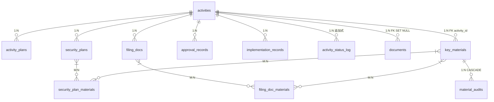
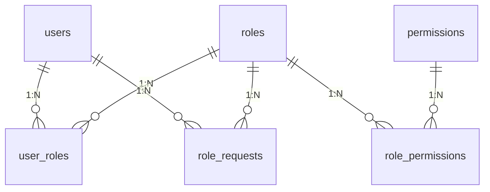
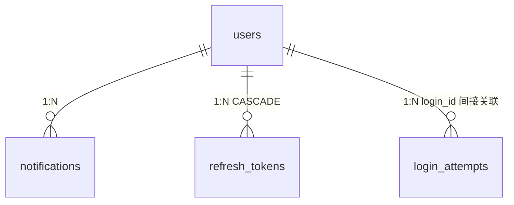

# 数据层设计

模块化单体的数据访问层：表结构、索引策略、事务与一致性、缓存、数据生命周期、连接管理。

> 本文假设读者已读过 `CONTEXT.md`、`docs/service-design.md` 和 `docs/rbac.md`。
> 不重复 UML 类图（见 `docs/camis-UML.md`），只记录类图之外的运维与设计决策。

## 1. 表清单（24 张）

### 1.1 核心业务域（Activity 聚合根，CASCADE 删除子实体）

| 表 | 模型 | 说明 |
|---|------|------|
| `activities` | Activity | 聚合根，FK owner_id + designer_id → users |
| `activity_plans` | ActivityPlan | 活动方案，CASCADE activity，**UNIQUE(activity_id)**，含 draft_data + current_filled_document_id |
| `security_plans` | SecurityPlan | 安保方案，CASCADE activity，**UNIQUE(activity_id)**，FK manager_id → users，含 draft_data + current_filled_document_id + sign_time + last_reject_reason + rejected_at + reject_count |
| `filing_docs` | FilingDoc | 备案材料包，CASCADE activity，**UNIQUE(activity_id)** |
| `filled_documents` | FilledDocument | 模板生成版本记录，CASCADE activity，**UNIQUE(activity_id, template_type, version_number)**。minio_path 可为 NULL（安保方案+双表延迟生成） |
| `approval_records` | ApprovalRecord | 政府批文，CASCADE activity，FK liaison_id → users |
| `implementation_records` | ImplementationRecord | 实施记录，CASCADE activity，FK admin_id → users |
| `activity_status_log` | ActivityStatusLog | 追加式审计日志，CASCADE activity |
| `security_plan_materials` | **无模型→待补** | M:N security_plans ↔ key_materials |
| `filing_doc_materials` | **无模型→待补** | M:N filing_docs ↔ key_materials |

### 1.2 文件与材料

| 表 | 模型 | 说明 |
|---|------|------|
| `documents` | Document | 文件元数据，FK activity_id SET NULL，FK filled_document_id SET NULL，GIN 索引 tags |
| `key_materials` | KeyMaterial | 关键材料，**FK activity_id → activities**，**UNIQUE(activity_id, material_type)**，sign_status + audit_round + material_type + draft_data + current_filled_document_id |
| `material_audits` | MaterialAudit | 材料审核/签署记录，CASCADE key_material，action ∈ {sign, audit} |

### 1.3 RBAC 权限体系

| 表 | 模型 | 说明 |
|---|------|------|
| `users` | User | 统一身份，email UNIQUE，is_active/is_archived |
| `roles` | Role | 7 角色，name UNIQUE |
| `permissions` | Permission | 18 权限（原 21，已合并 4 个文件上传权限为 upload_document） |
| `user_roles` | UserRole | M:N PK (user_id, role_id) |
| `role_permissions` | RolePermission | M:N PK (role_id, permission_id) |
| `role_requests` | RoleRequest | 角色申请，部分 UNIQUE (user_id WHERE status='pending') |

### 1.4 基础设施

| 表 | 模型 | 说明 |
|---|------|------|
| `notifications` | Notification | 通知，部分索引 unread，FK user_id RESTRICT¹ |
| `refresh_tokens` | RefreshToken | JWT refresh，token_hash UNIQUE，FK user_id CASCADE |
| `login_attempts` | **无模型** | 登录尝试，login_id + ip_address + success |

> ¹ notifications FK 当前为 CASCADE，应改为 RESTRICT——通知一旦创建即是独立审计记录，不受 user 生命周期影响。user 只归档不硬删，此 CASCADE 实际不会触发，但仍应在 DDL 中写对（使用 Alembic 时修正）。

### 1.5 4 张无模型表的状态

| 表 | 决策 | 说明 |
|---|------|------|
| `security_plan_materials` | 待补模型 | M:N join，SQLAlchemy Table() 二级关联即可 |
| `filing_doc_materials` | 待补模型 | 同上 |
| `login_attempts` | **不补** | 审计/安全日志，无 relationship、无 FK 到 users（用 login_id），raw SQL 直接操作 |

## 2. 列级设计规范

### 2.1 主键

全部使用 UUID v4（`uuid_generate_v4()`），通过 SQLAlchemy `UUID(as_uuid=True)` 映射为 Python `uuid.UUID`。

选型理由：API 暴露的主键不可预测（防枚举攻击），适合 MinIO 路径中嵌入（全局唯一，无碰撞）。

### 2.2 时间戳

全部使用 `TIMESTAMPTZ`（`DateTime(timezone=True)`），统一存储 UTC，前端按用户时区展示。`created_at` 使用 `server_default=func.now()`，由 DB 填充，不依赖应用时钟。

### 2.3 字符串长度分级

| 级别 | 长度 | 用途 | 列示例 |
|------|------|------|--------|
| 状态码 | VARCHAR(32-64) | 枚举值 | `status`, `sign_status`, `action`, `channel` |
| 名称/标识 | VARCHAR(128-255) | 实体名称、邮箱 | `name`, `email`, `display_name` |
| 路径/URL | VARCHAR(2048) | MinIO object path | `minio_path`, `attachment_url` |
| 文件名 | VARCHAR(1024) | 含路径的文件名 | `filename` |
| 电话 | VARCHAR(64) | 含国际前缀 | `contact_phone`, `sponsor_phone` |
| 中间文本 | VARCHAR(1024) | 有界自由文本 | `archive_reason`, `role_request.comment` |
| 无界文本 | TEXT | 用户自由输入 | `content`, `opinion`, `message`, `change_reason` |

**长度不收紧**：PostgreSQL 的 VARCHAR(N) 不预分配空间，存多长占多长。当前长度值偏宽松是刻意为之——优先保证不因字符数限制阻断合法业务输入，DB 层提供的是上限兜底而非精确校验。精确校验归属 Pydantic schema 层。

### 2.4 布尔列

所有布尔列使用 `Boolean` + 显式 `default`，禁止隐式 NULL 当作 False。`is_active`、`is_archived`、`is_qualified`、`is_read` 均遵循此规则。

### 2.5 字符编码

PostgreSQL 默认 UTF-8（postgres:17 镜像），asyncpg 客户端默认 UTF-8。未显式声明但无问题——中文字段值在 VARCHAR(64) 中占 21 bytes（7 个中文字 × 3），远低于 64 字符限制（UTF-8 下 VARCHAR(64) 可存 64 个中文字 = 192 bytes）。

### 2.6 SQL 注入防护

全部 5 处 raw SQL 使用参数化查询（`:param` 语法），零字符串拼接。其余查询走 SQLAlchemy ORM（select/insert/update——参数化由框架保证）。用户输入的 keyword 搜索使用 ORM `ilike()`，参数自动转义。结论：**当前无 SQL 注入风险**。

### 2.7 已知 Model-DDL Drift

| 列 | 模型 | DDL | 影响 |
|----|------|-----|------|
| `key_materials.sign_status` | `String(32), nullable=False`，无 default | `VARCHAR(32) NOT NULL DEFAULT 'unsigned'` | 模型缺 `server_default='unsigned'`。当前代码创建 KeyMaterial 时显式设值，未触发 bug。Alembic 引入后 autogenerate 会检测到此差异 |

---

## 3. 概念模型（ER 图）

### 3.1 核心业务域



### 3.2 RBAC 权限体系



### 3.3 基础设施



### 3.4 实体关系表

```
activities ──< activity_plans              (1:N, CASCADE)
activities ──< security_plans              (1:N, CASCADE)
activities ──< filing_docs                 (1:N, CASCADE, UNIQUE)
activities ──< approval_records            (1:N, CASCADE)
activities ──< implementation_records      (1:N, CASCADE)
activities ──< activity_status_log         (1:N, CASCADE, 追加式)
activities ──< key_materials               (1:N, FK activity_id)
activities ──< documents                   (1:N, FK SET NULL)
security_plans ──< security_plan_materials (M:N)
filing_docs    ──< filing_doc_materials    (M:N)
key_materials  ── security_plan_materials  (归属安保方案)
key_materials  ── filing_doc_materials     (归属备案包)
key_materials  ──< material_audits         (1:N, CASCADE, 审计记录)
```

**KeyMaterial 的双路径关联**（设计权衡）：
- 通过 `security_plan_materials` / `filing_doc_materials` join 表关联到具体上下文
- 通过 `activity_id` FK 直达所属活动（高频查询"活动的所有材料"无需 UNION join 表）
- 两条路径各有用途：join 表保留引用语义，FK 提供查询便利

### 3.5 范式分析

整体满足 **第三范式（3NF）**。存在两处**故意的反范式化**：

| 位置 | 字段 | 范式违反 | 原因 |
|------|------|---------|------|
| `key_materials` | `is_qualified`, `opinion` | 3NF — 可从 `material_audits`（最新审核记录）推导 | 查询性能：列表展示材料的合规状态无需每次 JOIN audit 表取最新记录 |
| `activity_plans` | `is_overdue` | 3NF — 可由 `deadline` 与当前时间比较得出 | 索引/过滤便利：允许 `WHERE is_overdue = true` 直接筛选逾期方案 |

**其余表结构**：单 UUID 主键、非主属性完全函数依赖主键、所有 M:N 关系通过 join 表正确拆出、无多值依赖（满足 4NF 隐含条件）——全部满足 3NF。

> **原则**：3NF 是 OLTP 系统的基准。在此基础上的反范式化必须有文档记录、有性能收益，并且对应的数据冗余有明确的更新/同步策略（KeyMaterial 冗余在每次 audit_material 写入时同步刷新）。

## 4. 索引策略

### 4.1 现有索引（18 个）

| 索引 | 覆盖查询 |
|------|---------|
| `idx_activities_status` | 按状态筛选、/counts 统计 |
| `idx_activities_owner` | Promoter 自建活动列表 |
| `idx_activities_location_time` | 场地冲突检测 |
| `idx_plans_activity` | 按活动查方案 |
| `idx_security_activity` | 按活动查安保方案 |
| `idx_filing_activity` | 按活动查备案 |
| `idx_approval_activity` | 按活动查批文 |
| `idx_impl_activity` | 按活动查实施记录 |
| `idx_status_log_activity` | 按活动查状态历史 |
| `idx_status_log_time` | 月报按时间范围查 |
| `idx_documents_uploader_id` | 按上传者查文件 |
| `idx_documents_activity` | 按活动查文件 |
| `idx_documents_tags` (GIN) | 按标签搜索文件 |
| `idx_refresh_user` | revoke 用户全部 token |
| `idx_notifications_user` | 按用户查通知 |
| `idx_notifications_unread` (partial) | 未读通知计数 |
| `idx_login_attempts_login` | 登录历史查询 |
| `idx_one_pending_per_user` (partial UNIQUE) | 角色申请约束 |

复合主键（自动索引覆盖）：`user_roles(user_id, role_id)` → `WHERE user_id=...` 走主键扫描；`role_permissions(role_id, permission_id)` 同理。

### 4.2 待新增索引

| 索引 | 覆盖查询 | 优先级 |
|------|---------|--------|
| `idx_status_log_operator_time` (operator_id, created_at) | `/counts` GovLiaison `registered_today` 统计 | **高** |
| `idx_key_materials_activity` (activity_id) | 备案流程按活动查材料（配合 KeyMaterial FK 新增） | **高** |
| `uq_filing_docs_activity` UNIQUE(activity_id) | 防止并发打包产生重复 FilingDoc | **中** |
| `idx_material_audits_user_time` (user_id, created_at) | admin 查看用户活跃记录 | 低（低频页面） |
| `idx_notifications_user_time` (user_id, created_at) | 消息列表排序 | 低（数据量小） |

### 4.3 索引决策原则

- 所有 FK 列必建索引（已满足）
- 高频 WHERE + ORDER BY 组合考虑复合索引
- 低基数列（status, boolean）单独建 B-tree 收益有限——但 `activities(status)` 已建，因为几乎所有列表都按状态筛选
- 新加索引通过 Alembic migration 脚本管理，不在 init-scripts 重复

## 5. 数据访问模式

### 5.1 依赖注入链

```
Route → get_current_user (JWT → User ORM)
      → get_db (AsyncSession)
      → require_permission("perm") → RBAC 权限校验
      → _service(db) → ServiceClass(db: AsyncSession)
```

权限校验在路由层完成，服务层不做角色判断。

### 5.2 查询模式分布

| 模式 | 使用场景 |
|------|---------|
| ORM select + scalar | ActivityService, DashboardService, DocumentService |
| ORM insert + commit + refresh | ActivityService.create, DocumentService.upload |
| ORM update + commit | WorkflowService.transition（乐观锁） |
| raw SQL (`text()`) | FilingService.validate_materials（UNION join 表），admin login_attempts 查询 |

### 5.3 事务规则

- **隔离级别**: PostgreSQL 默认 `READ COMMITTED`
- **跨服务同一事务**: FilingService 传 `self.db` 给 WorkflowService，共享同一 AsyncSession（同一 PostgreSQL 事务）
- **异常自动回滚**: 上下文管理器保证
- **乐观锁**: `WorkflowService.transition` 使用 `UPDATE ... WHERE status=?` → `rowcount==0` 检测并发冲突
- **无需乐观锁的路径**: sign_material、audit_material、_force_terminal —— 单人操作、低并发、幂等结果
- **并发保护**: `filing_docs(activity_id)` UNIQUE 防重；`user_roles` / `role_permissions` 复合 PK 兜底
- **已知 TOCTOU**: 场地冲突检测（SELECT → INSERT）无 DB 级保护。两个 Promoter 同时在同一场地立项可能都通过。概率极低，可接受

### 5.4 服务-路由对应关系

| Service | 对应 Router | 状态 |
|---------|-----------|------|
| ActivityService | activities.py（create/get/list） | ✅ 已连接 |
| WorkflowService | workflows.py（status 变更） | ✅ 已连接 |
| DocumentService | documents.py | ⚠ 部分 router 绕过 |
| FilingService | filings.py | ⚠ 部分 router 绕过 |
| NotificationService | notifications.py | ⚠ 部分 router 绕过 |
| DashboardService | dashboard.py | ✅ 已连接 |
| **AuthService**（待建） | auth.py | ❌ Router 直操 DB |
| **AdminService**（待建） | admin.py | ❌ Router 直操 DB |

### 5.5 Service 层设计规则

- 不引入 Repository 层：Service 直接使用 SQLAlchemy ORM。模块化单体 + SOA 下，Repository 只增加转发层，不承载业务逻辑
- Service 方法签名对应 `docs/service-design.md` 中已声明的契约；存在旁路的 router 端点应逐步收敛到 Service

## 6. Pydantic Schema 组织规则

| 位置 | 放什么 | 示例 |
|------|--------|------|
| `app/schemas/` | 被 **Service 层引用** 的 schema | `ActivityCreate`, `PanelData`, `StatusTransition` |
| Router 文件内联 | **单一 router 专用** 的展示/输入 schema | `UserResponse`(auth), `DocumentResponse`(documents) |

**规则**: 谁使用，谁定义。service 用的放在 schemas/，router 专用的内联。同一实体在不同模块的不同视图（如 `UserResponse` vs `UserDetail`）不由单一 schema 强行统一，避免耦合。

## 7. 缓存策略（Redis）

### 7.1 缓存点

| 缓存键 | TTL | 写入 | 失效 | 依赖类型 |
|--------|-----|------|------|---------|
| `activity:{id}:docs` | 5min | `activities.py` GET | `documents.py` upload → DEL | 软 |
| `doc:{id}` | 30min | `documents.py` GET miss | 无（文档元数据不可变） | 软 |
| `login_lockout:{email}` | 15min | `auth.py` login 失败 | 登录成功 → DEL | **硬** |

### 7.2 缓存规则

- **Cache-Aside**: 读时回源 SET，写时主动 DEL
- **TTL**: 按数据变更频率设定（活动文档 5min，文档元数据 30min）
- **Fail-open**: 缓存层不可用时退化为查 DB + 跳过登录锁，记录 WARNING
- **可观测**: Redis 操作失败 MUST 写 log（`logging.warning`），配合告警规则
- **健康检查**: `get_redis()` 加入 `PING`，连接中断时自动重连
- **新增缓存点 MUST 同时实装失效逻辑**: DEL 必须在所有 mutation 端点中调用

## 8. 数据生命周期（软删除策略）

三级分类：

| 级别 | 含义 | 实体 | 策略 |
|------|------|------|------|
| L1 — 永久保留 | 业务合规/审计核心记录 | activities + 子实体, key_materials, material_audits, activity_status_log, documents, filing_docs | 业务终态锁定，永不硬删 |
| L2 — 软删除 | 操作主体，可归档不可硬删 | users | `is_archived` 标记 |
| L3 — 定期清理 | 临时/辅助数据，过期无价值 | notifications, login_attempts, refresh_tokens | 定时 DELETE |

### 8.1 L1 规则

- 通过业务终态表达"不再活跃"（`已取消`/`已延期`/`不通过已终止`）
- FK 从 L2/L3 → L1 用 `ON DELETE RESTRICT`，防止误删
- 已取消/已延期的活动所有后续写操作锁定

### 8.2 L3 清理 TTL

| 表 | TTL | 理由 |
|---|-----|------|
| `notifications` | 12 个月 | 系统消息非法律记录 |
| `login_attempts` | 90 天 | 安全审计窗口内保留 |
| `refresh_tokens` | 7 天（过期/revoked 的） | JWT 过期后无价值 |

执行方式：`scripts/cleanup_orphans.py` 或应用层 cron job，`DELETE FROM ... WHERE created_at < NOW() - INTERVAL`。

## 9. 连接管理

### 9.1 PostgreSQL

```python
create_async_engine(url, pool_pre_ping=True, pool_size=10)
# max_overflow=10（默认）→ 峰值 20 连接
```

| 场景 | 评估 |
|------|------|
| 当前（Docker Compose, ~20 用户） | pool_size=10 足够 |
| 生产环境云数据库（RDS/Supabase） | 加 `pool_recycle=3600` 防止 idle timeout 断连 |

### 9.2 Redis

- 模块级全局单例（`redis_client.py`）
- 连接池由 aioredis 默认管理，无需额外配置
- `get_redis()` 含 `PING` 健康检查，失败自动重连

### 9.3 MinIO

- 通过 `minio_client.py` 操作，每次调用独立连接
- 上传文件与 DB 写入不在同一事务中 → 极低概率产生孤儿对象
- 孤儿对象由 `scripts/cleanup_orphans.py` 定期扫描清理

## 10. 迁移策略

### 10.1 从 init-scripts 迁移到 Alembic

当前 `init-scripts/` 下有 14 个 SQL 脚本（编号 01-12，含两个 `12-*` 重号），历史问题：
- 编号重复（两个 12）
- DDL 与种子数据混杂（如 07 既建表又插入 SuperAdmin）
- 无 downgrade、无版本追踪

迁移步骤：
1. 补齐 3 张 M:N join 表 SQLAlchemy 模型
2. `alembic init migrations`
3. `alembic revision --autogenerate -m "initial: baseline"`
4. `alembic stamp head`（不执行，只打标记——表已存在）
5. `init-scripts/` 已由 Alembic 基线迁移完全替代，不再使用原始 DDL 脚本
6. 后续改 schema 一律通过 `alembic revision --autogenerate -m "description"` + `alembic upgrade head`

### 10.2 迁移命名约定

```
<seq>_<description>.sql → alembic <hash>_<description>.py
```

## 11. 备份与恢复

### 11.1 备份对象

| 数据 | 位置 | 备份方式 | 频率 | 保留 |
|------|------|---------|------|------|
| PostgreSQL 业务数据 | Docker volume `pg_data` | `pg_dump -Fc` 自定义格式压缩 | 每日（cron 凌晨 3 点） | 30 天本地 + 90 天异地 |
| MinIO 文件对象 | Docker volume `minio_data` | MinIO Client `mc mirror` 同步到备份 bucket | 每日 | 30 天 |
| Redis 数据 | Docker volume `redis_data` | **不备份** — 全量缓存/临时数据，重建零成本 | — | — |

### 11.2 备份命令

```bash
# PostgreSQL 逻辑备份（可 PITR，不锁表）
docker exec doc_postgres pg_dump -U docapp -d doc_metadata -Fc \
  -f /tmp/backup_$(date +%Y%m%d).dump
docker cp doc_postgres:/tmp/backup_$(date +%Y%m%d).dump ./backups/

# MinIO 同步（增量）
mc mirror local/doc-company-docs backup/doc-company-docs-$(date +%Y%m%d)
```

### 11.3 恢复验证

每季度从最近一次备份恢复到一个临时 PostgreSQL 实例，验证数据完整性：

```bash
# 1. 启动临时 PG
docker run -d --name pg_restore_test -e POSTGRES_DB=doc_metadata postgres:17
# 2. 恢复
docker exec -i pg_restore_test pg_restore -U postgres -d doc_metadata < backup_XXXX.dump
# 3. 校验
docker exec pg_restore_test psql -U postgres -d doc_metadata -c "
  SELECT 'activities' AS tbl, count(*) FROM activities
  UNION ALL SELECT 'users', count(*) FROM users
  UNION ALL SELECT 'documents', count(*) FROM documents;
"
# 4. 清理
docker rm -f pg_restore_test
```

### 11.4 备份原则

- **不备份可重建数据**：Redis 全量缓存、L3 临时数据（login_attempts, refresh_tokens）
- **备份文件与 DB 元数据的一致性**：MinIO 备份和 PostgreSQL 备份在同一时间窗口内完成（相差 <5 分钟），孤儿对象由 `cleanup_orphans.py` 兜底
- **异地存储**：生产环境备份文件应同步到 S3/MinIO remote bucket，不依赖本地磁盘

---

## 12. 运维监控

### 12.1 健康检查端点

| 端点 | 检查内容 | 用途 |
|------|---------|------|
| `GET /health` | PostgreSQL `SELECT 1` | 负载均衡器存活检测 |
| `GET /health` 扩展 | PostgreSQL + Redis PING + MinIO bucket exists | 运维面板就绪检测 |

当前 `/health` 端点（`app/routers/health.py`）仅检查 PostgreSQL。建议扩展为完整三组件检查。

### 12.2 关键日志告警规则

| 触发条件 | 日志关键字 | 严重级别 | 通知 |
|---------|-----------|---------|------|
| Redis 连接失败 | `redis ... WARNING` | P2 | 5 分钟内 >10 条 → 飞书/邮件 |
| DB 连接池耗尽 | `QueuePool.*timeout` | P1 | 立即 |
| 孤儿文件清理结果 | `orphan.*deleted` | P3 | 每日汇总 |
| 乐观锁冲突 | `已被他人修改` | P3 | 仅记录，不告警（正常业务现象） |
| MinIO 连接失败 | `minio.*error` | P1 | 立即 |

### 12.3 日常巡检

| 检查项 | 频率 | 方式 |
|--------|------|------|
| 连接池状态 | 每周 | `SELECT count(*) FROM pg_stat_activity WHERE datname='doc_metadata'` |
| 磁盘使用率 | 每周 | `df -h` on Docker volumes |
| 孤儿文件数量 | 每月 | `python scripts/cleanup_orphans.py --dry-run` |
| 慢查询 | 每月 | PostgreSQL `pg_stat_statements`（需启用扩展） |
| Tomestone 清理 | 每月 | L3 TTL DELETE 执行 `NOTIFICATIONS` / `login_attempts` / `refresh_tokens` |

### 12.4 L3 清理脚本

```sql
-- 月度 cron job
DELETE FROM notifications WHERE created_at < NOW() - INTERVAL '12 months';
DELETE FROM login_attempts WHERE created_at < NOW() - INTERVAL '90 days';
DELETE FROM refresh_tokens WHERE expires_at < NOW() - INTERVAL '7 days' AND revoked = true;
```

---

## 13. 已知权衡与 Gap

| 项 | 内容 | 状态 |
|----|------|------|
| Orphan MinIO 对象 | 上传先写 MinIO 后写 DB，进程 crash 在 commit 前留孤儿 | 可接受，定期脚本清理 |
| 场地冲突 TOCTOU | SELECT 检查 → INSERT activity，无 DB 级唯一约束 | 可接受，概率极低 |
| notifications FK CASCADE | 当前为 CASCADE，应为 RESTRICT | 引入 Alembic 时修正 |
| KeyMaterial 冗余字段 | is_qualified + opinion 是 material_audits 的快照冗余 | 故意反范式，用于查询性能 |
| `init-scripts/` 归档为历史记录 | 已迁移至 Alembic | 不再作为 schema 变更入口 |

## 14. 后续行动清单

| # | 内容 | 来源 |
|---|------|------|
| 1 | 补 3 张 M:N join 表模型 | 决策 #1 |
| 2 | 引入 Alembic + 归档 init-scripts | 决策 #2 |
| 3 | 新建 AuthService + AdminService 类 | 决策 #6-A |
| 4 | 已有 Service 的 router 旁路收拢 | 决策 #6-B |
| 5 | KeyMaterial 加 activity_id FK | 决策 #5 |
| 6 | 加 3 个索引（status_log operator+time, key_materials activity, filing_docs UNIQUE） | 决策 #9+#12 |
| 7 | 删除 4 个未使用权限，合并为 upload_document，路由挂权限 | 决策 #11 |
| 8 | Redis PING 健康检查 + login_lockout fail-open logging | 决策 #14 |
| 9 | notifications FK CASCADE → RESTRICT | 决策 #10 |
| 10 | 新增 `scripts/cleanup_orphans.py` | ✅ 已完成 |
| 11 | 文档化完整数据层设计 | ✅ 本文 |
| — | — | — |
| 12 | 建立 PostgreSQL + MinIO 备份脚本（cron 每日） | §11 |
| 13 | 扩展 `/health` 端点增加 Redis + MinIO 检查 | §12.1 |
| 14 | 配置日志告警规则（Redis 故障、DB 连接池耗尽） | §12.2 |
| 15 | 建立 L3 数据清理 cron job（notifications/login_attempts/refresh_tokens） | §12.4 |
| 16 | 建立季度恢复验证流程 | §11.3 |
| 17 | Dockerfile 加 entrypoint（`alembic upgrade head` → gunicorn） | Alembic 引入时同步改 |
