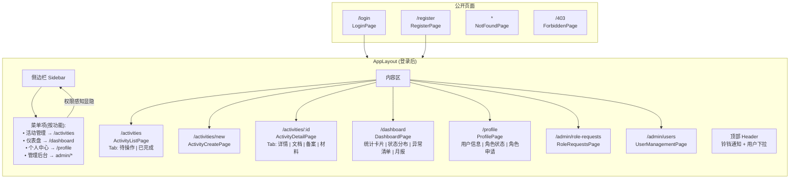
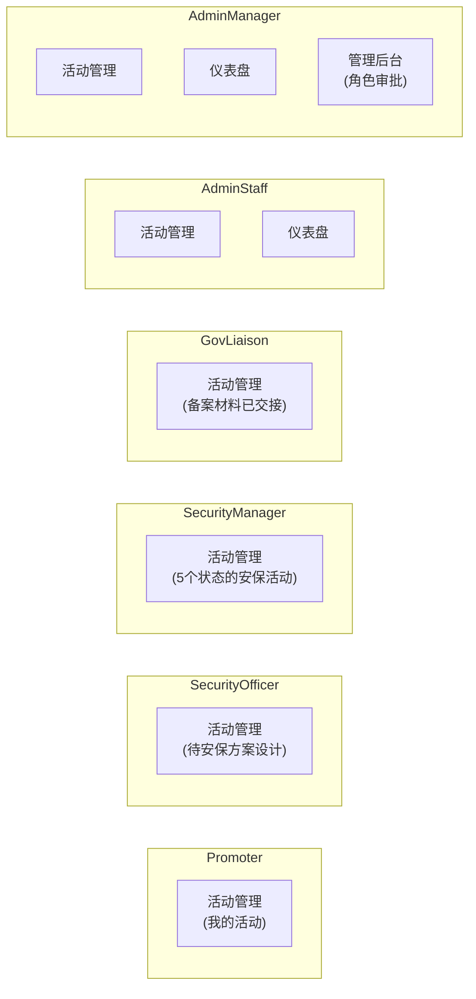
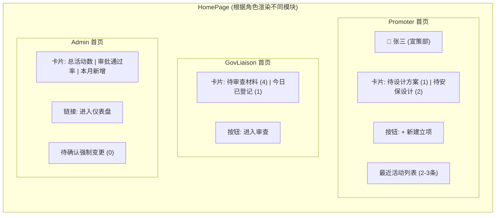
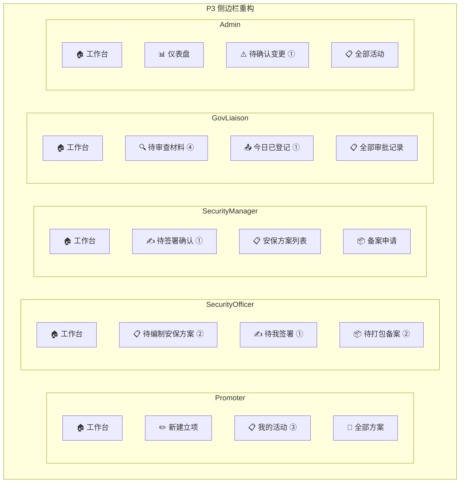
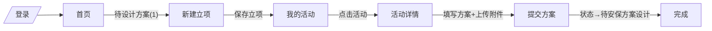
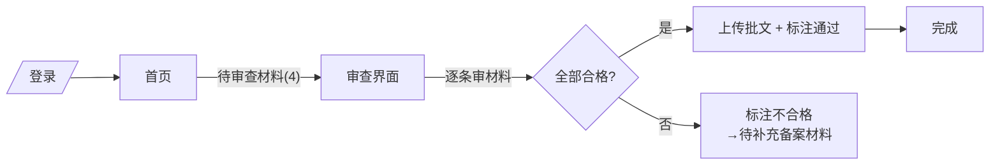
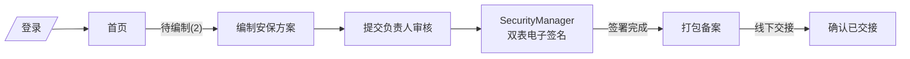

# 前端实现文档

React SPA，技术选型见 [ADR 0003](./adr/0003.md)。

## 快速开始

```bash
cd frontend
pnpm install
pnpm dev          # http://localhost:5173
pnpm build        # 生产构建 → dist/
```

Vite proxy 将 `/api/*` 转发至 `http://localhost:8000`，解决 refresh_token cookie 的 SameSite Lax 跨域问题。生产环境由 Nginx 反向代理替代。

## 目录结构

```
frontend/src/
├── api/                    # Axios 实例 + 各资源 API 函数
│   ├── client.ts           # 拦截器: 自动加 Bearer token, 401 refresh 队列
│   ├── auth.ts             # login, register, me, refresh, logout
│   ├── activities.ts       # CRUD + history + documents
│   ├── documents.ts        # upload (multipart), download (302)
│   ├── workflows.ts        # transition, reject, forceCancel, forcePostpone
│   ├── filings.ts          # validate, pack, handover
│   ├── materials.ts        # list, sign, audit, auditHistory
│   ├── roleRequest.ts      # submit role request
│   ├── notifications.ts    # list, unreadCount, markRead, markAllRead
│   └── dashboard.ts        # panel, activityDetail, monthlyReport
├── stores/
│   └── authStore.ts        # Zustand: user, accessToken, permissions, isAuthenticated
├── hooks/
│   └── useActivityQueries.ts  # TanStack Query: activities, activity, history, documents
├── types/                  # TypeScript 接口（镜像后端 Pydantic schema）
│   ├── api.ts              # ApiErrorResponse { detail, code, fields? }
│   ├── auth.ts             # LoginRequest, RegisterRequest, TokenResponse, UserResponse
│   ├── activity.ts         # ActivityCreate, ActivityResponse, ActivityListParams, StatusLogEntry
│   ├── document.ts         # DocumentResponse
│   ├── workflow.ts         # StatusTransition, RejectRequest, ForceChangeRequest
│   ├── filing.ts           # MaterialValidation, FilingPackResult
│   └── dashboard.ts        # PanelData, AnomalyEntry, ActivityDetail, MonthlyReportRequest
├── pages/
│   ├── LoginPage.tsx
│   ├── RegisterPage.tsx
│   ├── NotFoundPage.tsx
│   ├── ForbiddenPage.tsx
│   ├── activities/
│   │   ├── ActivityListPage.tsx    # 待操作/已完成 Tab + 筛选 + 分页列表
│   │   ├── ActivityCreatePage.tsx  # 新建表单
│   │   └── ActivityDetailPage.tsx  # 详情/历史/文档/备案
│   └── dashboard/
│       └── DashboardPage.tsx       # 统计卡片 + 状态分布 + 异常列表 + 月报
│   ├── profile/
│   │   └── ProfilePage.tsx         # 用户信息、角色状态、角色申请
│   └── admin/
│       ├── RoleRequestsPage.tsx    # 待审批角色申请表格
│       └── UserManagementPage.tsx  # 用户列表、角色编辑、禁用/归档
├── components/
│   ├── auth/
│   │   ├── AuthInitializer.tsx     # App 启动时静默 refresh
│   │   └── ProtectedRoute.tsx      # 路由守卫（认证 + 权限）
│   ├── layout/
│   │   ├── AppLayout.tsx           # Sider + Header(铃铛+用户) + Content
│   │   ├── Sidebar.tsx             # 权限感知菜单
│   │   └── HeaderNotifications.tsx # 通知铃铛(未读badge+下拉)
│   ├── activities/
│   │   ├── ActivityFilters.tsx     # 状态/关键词/日期筛选 → URL searchParams
│   │   ├── ActivityTable.tsx       # 分页表格
│   │   ├── ActivityForm.tsx        # 可复用表单
│   │   └── StatusTimeline.tsx      # 状态流转时间线
│   ├── documents/
│   │   ├── DocumentUpload.tsx      # Ant Upload + multipart + 客户端校验
│   │   └── DocumentList.tsx        # 文件列表 + 下载按钮
│   ├── workflows/
│   │   ├── WorkflowActions.tsx     # 根据 status + permissions 动态渲染按钮
│   │   ├── StatusTransitionModal.tsx
│   │   ├── RejectModal.tsx
│   │   └── ForceChangeModal.tsx    # 强制取消/延期（含确认勾选）
│   ├── filings/
│   │   ├── FilingValidatePanel.tsx # 材料合规性表格
│   │   ├── FilingPackModal.tsx     # 打包确认
│   │   └── HandoverConfirm.tsx     # 交接确认（不可逆）
│   └── dashboard/
│       ├── StatusDistribution.tsx  # 状态分布 Progress 条
│       ├── AnomalyList.tsx         # 异常活动表格
│       └── ReportExport.tsx        # 月报导出
├── utils/
│   └── constants.ts          # 状态常量, 颜色映射, 状态转换矩阵
└── styles/
    └── global.css
```

## 通知系统

- 后端 `notifications` 表含 `reference_id`、`reference_type`，LEFT JOIN activities 取活动名
- 前端 `HeaderNotifications`：铃铛 badge → 下拉面板（活动名加粗 + 消息灰色）→ 点击跳活动详情或下载报告
- 通知由工作流状态变更时 `NotificationService.notify_role()` 自动生成，带 `reference_id` 和 `reference_type`
- 打开下拉自动标记全部已读，已读 30 天自动过滤

## Dashboard 月报

- `ReportExport.tsx`：月份选择器 → POST `/dashboard/reports/monthly`
- 后端 `BackgroundTasks` 异步生成 PDF 上传 MinIO，完成后推送通知（`reference_type="report"`）
- 前端收到 toast "报表生成中…"，用户通过铃铛通知点击下载 PDF
- `GET /dashboard/reports/{month}` 下载端点

## 路由

| 路径 | 页面 | 权限 | 布局 |
| ---- | ---- | ---- | ---- |
| `/login` | LoginPage | 公开 | 无 |
| `/register` | RegisterPage | 公开 | 无 |
| `/403` | ForbiddenPage | 公开 | 无 |
| `/` | → HomeRedirect | — | AppLayout |
| `/activities` | ActivityListPage | `view_owned_activity` or `view_dashboard` | AppLayout |
| `/activities/new` | ActivityCreatePage | `create_activity` | AppLayout |
| `/activities/:id` | ActivityDetailPage | `view_owned_activity` or `view_dashboard` | AppLayout |
| `/dashboard` | DashboardPage | `view_dashboard` | AppLayout |
| `/profile` | ProfilePage | 登录即可 | AppLayout |
| `/admin/role-requests` | RoleRequestsPage | `manage_users` | AppLayout |
| `/admin/users` | UserManagementPage | `administer_users` | AppLayout |
| `*` | NotFoundPage | 公开 | 无 |

## 认证流程

```
登录 POST /api/auth/login
  → access_token 存 Zustand authStore
  → refresh_token 由浏览器自动管理 (httpOnly cookie, path=/, 7 天)

后续请求
  → axios 请求拦截器: Authorization: Bearer <token>
  → 401 响应: 进入 refresh 队列 → POST /api/auth/refresh
    → 成功: 新 token, 重放队列中的请求（用户无感）
    → 失败: 清 auth state, 跳转 /login

App 启动
  → AuthInitializer 静默调 /api/auth/refresh
    → 有效 cookie: 恢复登录态
    → 无效/不存在: 显示登录页

登出
  → POST /api/auth/logout → 清 Zustand → 跳转 /login
```

## 导航设计

ADR: [0005-task-driven-navigation.md](./adr/0005-task-driven-navigation.md)

### 当前模式（v0.18）

侧边栏按功能模块组织：活动管理、仪表盘、个人中心、管理后台。菜单项按权限显隐（见[权限模型](#权限模型)），但所有角色共用同一套菜单结构。用户登录后需先导航到列表页再筛选，缺乏角色感知和任务引导。

### 目标模式：任务驱动导航

生产环境无多角色用户（见 [CONTEXT.md](../CONTEXT.md#角色行为特征ui-设计输入)），每个角色登录后看到的菜单直接对应其工作任务，带实时计数 Badge。

**三阶段增量路线**：

| 阶段 | 交付物 | 改动范围 | 状态 |
|------|--------|---------|------|
| P1 | 菜单项计数 Badge | `Sidebar.tsx` + 后端 `GET /activities/counts` | ✅ 已实现 |
| P2 | 角色感知 HomePage | `HomePage.tsx` + `/index` 路由 | ✅ 已实现 |
| P3 | 任务驱动侧边栏 | `Sidebar.tsx` 重构 | ✅ 已实现 |

**P3 已实现各角色菜单**（与信息架构图的设计一致）：

| 角色 | 菜单项 |
|------|--------|
| Promoter | 工作台、新建立项、我的活动(N) |
| SecurityOfficer | 工作台、待编制安保方案(N)、待打包备案(N) |
| SecurityManager | 工作台、待签署确认(N)、备案申请 |
| GovLiaison | 工作台、待审查材料(N)、审批记录 |
| AdminStaff/Manager | 工作台、活动面板(N)、全部活动 |
| SuperAdmin | 工作台、用户管理、角色审批(N)、全部活动(N) |

**P3 待办：设计 vs 实现差异**

以下菜单项在设计阶段提出，但因系统当前能力限制暂未实现。作为远期增强方向：

| 角色 | 未实现项 | 原因 | 依赖 |
|------|---------|------|------|
| SecurityOfficer | 待我签署(N) | 签署状态在 `key_materials.sign_status`，无对应的 activity 级筛选端点 | 需后端 `GET /activities?needs_sign=true` |
| GovLiaison | 今日已登记(N) | 这是统计数字，不是列表筛选维度；已作为卡片在 P2 HomePage 展示 | 无（已降级为 HomePage 卡片） |
| Admin | 待确认变更(N) | AdminStaff→AdminManager 二次确认流程尚未实现 | 需后端强制变更审批工作流 |

### 信息架构图

#### 当前页面树（v0.18）



#### 当前角色可见菜单映射



#### P1 改动：菜单项计数 Badge

侧边栏菜单项 `label` 加 `<Badge count={n} />`。

新增端点 `GET /api/activities/counts`，按角色返回计数：

```json
// Promoter → { "my_activities": 3, "pending_plan": 1 }
// GovLiaison → { "pending_review": 4, "registered_today": 1 }
// SecurityOfficer → { "pending_security_draft": 2, "pending_signature": 1, "pending_pack": 2 }
```

#### P2 改动：角色感知 HomePage

`/` 路由从直接跳转 `/activities` 改为渲染 HomePage。



#### P3 改动：任务驱动侧边栏（最终态）



#### 关键角色任务流

**Promoter**



**GovLiaison**



**Security（Officer + Manager）**



### 无多角色用户

生产环境不存在一人多角色场景，因此：
- 无需角色切换器（只 `devtest` 账号测试用）
- HomePage 按单一角色渲染，不需模块叠加
- 多角色逻辑仅为开发调试保留

## 状态管理分工

| 数据                    | 方案                 | 原因                               |
| ----------------------- | -------------------- | ---------------------------------- |
| 活动列表/详情/历史/文档 | TanStack Query       | 服务端数据，缓存/失效/后台刷新     |
| 仪表盘、备案校验        | TanStack Query       | 同上                               |
| 用户/token/权限         | Zustand `authStore`  | 客户端会话，axios 拦截器需同步读取 |
| 筛选条件                | URL `searchParams`   | 可分享链接，刷新不丢失             |
| 表单输入                | Ant Design Form 内部 | 提交时才同步到服务端               |

## 权限模型

前端通过 `/auth/me` 响应中的 `permissions: string[]` 和 `roles: string[]` 实现条件渲染：

- **ProtectedRoute**: 路由级守卫，`requiredPermissions` 中满足一个即可
- **Sidebar**: 菜单项按权限显隐
- **WorkflowActions**: 按钮按 `status + permissions` 矩阵显隐
- **页面内按钮**: 新建活动、备案操作等按权限显隐

7 个角色 21+ 个权限的完整映射见 [API 路由设计](./api-routes.md)。

## 状态转换矩阵

工作流按钮由 `getAvailableTransitions(status, permissions)` 函数计算：

| 当前状态       | 可用操作                              | 权限                                  |
| -------------- | ------------------------------------- | ------------------------------------- |
| 待设计方案     | 提交→待安保方案设计                   | `submit_plan`                         |
| 待安保方案设计 | 驳回（内部循环）、签署完成→待备案申请 | `reject_approval`, `manage_security`  |
| 待备案申请     | （备案 tab 中操作）                   | `pack_filing`                         |
| 备案材料已交接 | 通过/补件/驳回                        | `audit_material`                      |
| 待补充备案材料 | 重新递交                              | `manage_security`                     |
| 审批通过       | 确认通过、驳回（逆向流转）            | `confirm_approval`, `reject_approval` |
| 任意非终态     | 强制取消、强制延期                    | `force_cancel`, `force_postpone`      |

终态（审批通过-待举办/不通过/已终止/已取消/已延期）不显示操作按钮。

## 错误处理

后端统一错误格式 `{ detail, code, fields? }`：

- **表单级**：409 场地冲突 → 行内提示 `fields.location`
- **全局**：API 错误 → `message.error(detail)`
- **并发冲突**：409 on status transition → "已被他人修改，请刷新后重试"
- **429 登录锁定**：显示中文本地化文案

## 关键后端依赖

前端开发前，后端需满足：

- [x] `GET /auth/me` 返回 `permissions` 和 `roles` 字段（commit `047c931`）
- [x] 所有 API 端点返回统一 `{ detail, code, fields? }` 格式
- [ ] Docker 服务运行（PostgreSQL + MinIO + Redis）
- [ ] FastAPI 监听 8000 端口

## 已知问题

- [ ] 浏览器测试覆盖不完整（部分角色操作路径未验证）
- [ ] `@ant-design/charts` 图表库（当前用 Progress 条替代饼图）
- [x] F5 刷新 StrictMode 兼容（已修复，详见 `docs/issues/auth-initializer-strictmode.md`）

## 远期 Dashboard 增强指标

以下指标来自 UI 设计讨论（v0.19 规划），当前 Dashboard 尚未实现：

### 效率维度

| 指标 | 计算方式 | 意义 |
|------|---------|------|
| 审批通过率 | 审批通过+已举办+举办中+已结束 / 经历过"备案材料已交接"的活动 | 政府端通过比例 |
| 平均审批周期 | 从"备案材料已交接"到"审批通过"的平均天数 | 政府审批效率 |
| 补件率 | 进入过"待补充备案材料"的活动 / 经历过"备案材料已交接"的活动 | 材料质量问题频率 |

### 合规维度

| 指标 | 计算方式 | 意义 |
|------|---------|------|
| 材料一次合格率 | 首轮 KeyMaterial 全部合格的活动 / 总审查活动 | 安保部材料准备质量 |
| 平均审查轮次 | KeyMaterial 审查轮次平均值 | 材料需要几轮才能过 |

### 异常维度

| 指标 | 计算方式 | 意义 |
|------|---------|------|
| 异常率 | 已取消+已延期 / 全部活动 | 外部因素干扰程度 |
| 逾期率 | 超过 deadline 仍未到终态的活动 / 全部非终态活动 | 流程阻塞情况 |
