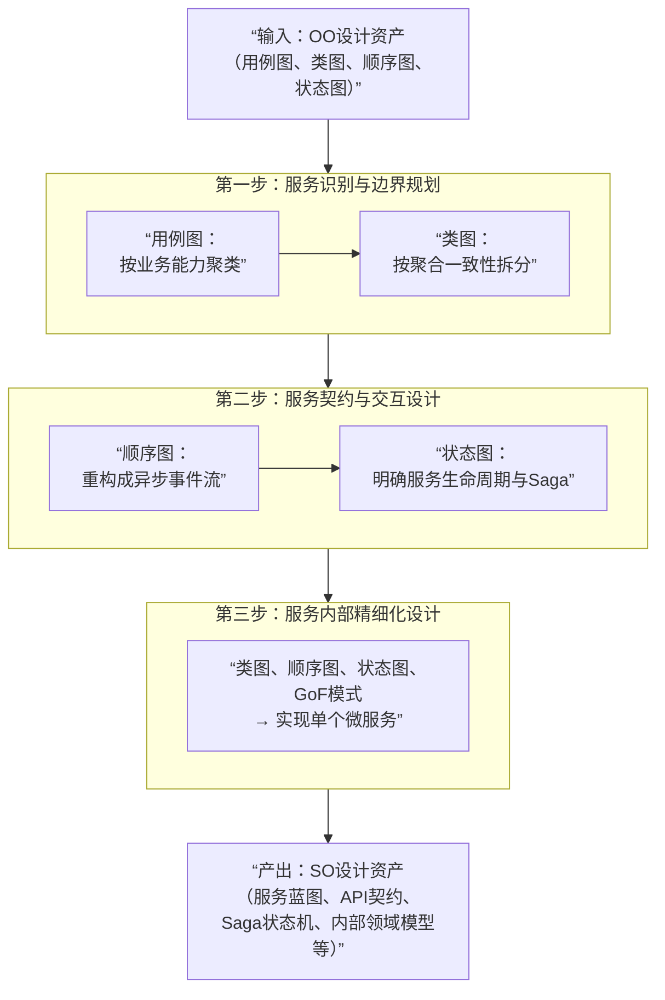

将设计范式从面向对象迁移到面向服务，不是在原有流程上做修补，而是一次**视角和抽象层次的跃升**。

下面这个流程，展示了如何平滑地完成这次跃迁。

### 从面向对象到面向服务的设计流程

---

### 第一步：战略分析——从资产中识别服务

这一步的目标是定义“服务是什么”，输入是你最核心的用例图和类图。

- **用“用例图”进行业务切割**
  不再把系统看作一个整体，而是寻找差异化的**业务能力**。
  - **操作**：审视你的用例图，将紧密相关的用例归为一组。例如，“浏览商品”、“搜索商品”等用例，都指向系统提供“商品管理”的能力。这组能力，就是一个候选的**商品服务**。

- **用“类图”划定逻辑边界**
  引入**领域驱动设计的聚合**概念，为服务划定精准的、不可再拆的内部边界。
  - **操作**：分析你的领域类图。`订单`和`订单项`是一个典型的聚合，它们的生命周期强绑定，必须同生共死、保持数据一致。因此，**整个聚合必须完整地划入同一个“订单服务”中**。聚合根`订单`，就是该服务对外的唯一接口入口。

这一步的产出是**服务蓝图**，它列出了所有候选服务及其核心职责，并明确了哪些类被分配到了哪个服务中。

---

### 第二步：战术设计——从对象协作到服务协作

核心转变发生在这一步。你需要把单进程的对象方法调用，彻底重构为跨进程的服务间异步通信，并处理由此带来的分布式复杂性。

- **用“顺序图”重构交互为异步事件流**
  原来的顺序图，生命线是“对象A”、“对象B”。现在，生命线变为“订单服务”、“库存服务”、“支付服务”。**对象间的直接方法调用，必须重构为基于事件的异步协作**。
  - **示例操作**：将原顺序图中的`库存对象.锁定()`这个同步调用，改造为：订单服务发布一个`OrderPlaced`事件，库存服务订阅此事件并执行锁定逻辑，成功后发布`InventoryLocked`事件。这是一个典型的**事件驱动架构**模式。

- **用“状态图”设计跨服务长流程与补偿**
  此时，状态图的作用就从描述单个对象的状态，升级为描述一个**跨服务的完整业务流程**，即Saga。
  - **操作**：为你的核心业务（如“下单”）绘制一个端到端的状态图，涵盖从“订单已创建”到“支付成功”、“库存已锁定”等所有中间状态。**这个状态图的每一个状态转换，都对应着一次服务间的事件传递。** 更重要的是，你需要为每个非终态定义“失败”时的补偿路径，以保证最终一致性。

这一步的产出是**服务接口契约**（如事件消息格式、API定义）和**Saga状态机设计**。

---

### 第三步：服务内部精细化——回归面向对象

当每个服务的职责和边界都清晰后，在单个服务内部，优秀的面向对象实践依然是最高效的实现手段。

- **所有OO资产回归**：你可以，也应该继续使用类图来设计服务内部的领域模型，用顺序图来设计内部对象间的复杂交互，用状态图来管理服务内部有复杂生命周期的实体，并选择恰当的GoF设计模式来解决技术挑战。

---

### 总结：核心思维的转变

| 设计视角     | 面向对象（OO）               | 面向服务（SO）                           |
| :----------- | :--------------------------- | :--------------------------------------- |
| **核心关注** | 类与对象的结构               | 服务与业务的边界                         |
| **系统构成** | 由对象协作构成整体           | 由服务组合构成整体                       |
| **抽象层次** | 代码层面                     | 业务层面                                 |
| **设计资产** | 用例图、类图、顺序图、状态图 | 服务蓝图、API契约、Saga图、消息格式      |
| **设计原则** | SOLID原则、GoF模式           | 松耦合、高内聚、去中心化数据、最终一致性 |
