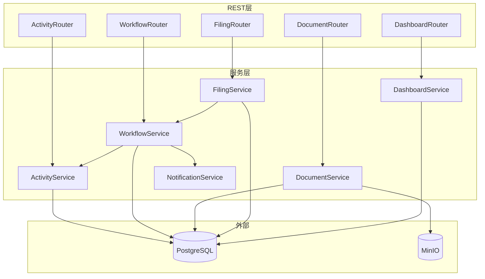

# 服务内部设计

模块化单体中 6 个服务的内部领域模型、方法签名、校验规则与依赖关系。

> 服务蓝图与路由契约见 `docs/design-process.md` 和 `docs/api-routes.md`。

## 1. ActivityService — 活动项目管理

**职责**: 活动的 CRUD、状态历史查询

**关联表**: `activities`, `activity_status_log`

**依赖**: 无（纯数据访问）

### Pydantic Schemas

```python
from datetime import datetime
from uuid import UUID
from pydantic import BaseModel, Field

class ActivityCreate(BaseModel):
    name: str = Field(min_length=1, max_length=255)
    type: str = Field(min_length=1, max_length=128)
    estimated_time: datetime
    location: str = Field(min_length=1, max_length=512)
    sponsor: str = Field(min_length=1, max_length=255)
    deadline: datetime
    designer_id: UUID

class ActivityResponse(BaseModel):
    id: UUID
    name: str
    type: str
    estimated_time: datetime
    location: str
    sponsor: str
    deadline: datetime
    status: str
    owner_id: UUID
    created_at: datetime
    updated_at: datetime

class ActivityListParams(BaseModel):
    status: str | None = None
    keyword: str | None = None
    date_from: datetime | None = None
    date_to: datetime | None = None
    page: int = Field(default=1, ge=1)
    size: int = Field(default=20, ge=1, le=100)

class StatusLogEntry(BaseModel):
    id: UUID
    from_status: str | None
    to_status: str
    operator_id: UUID
    comment: str | None
    created_at: datetime
```

### 方法签名

```python
class ActivityService:
    def __init__(self, db: AsyncSession):
        self.db = db

    async def create(self, owner_id: UUID, data: ActivityCreate) -> ActivityResponse:
        """UC1: 创建立项。校验必填字段 + 场地冲突。"""
        ...

    async def get(self, activity_id: UUID) -> ActivityResponse:
        """获取单个活动详情。"""
        ...

    async def list(self, params: ActivityListParams) -> tuple[list[ActivityResponse], int]:
        """分页查询活动列表，支持 status/keyword/时间范围筛选。"""
        ...

    async def get_status_history(self, activity_id: UUID) -> list[StatusLogEntry]:
        """获取活动的状态流转历史。"""
        ...
```

### 校验规则

| 规则     | 条件                                                                                        | 错误 |
| -------- | ------------------------------------------------------------------------------------------- | ---- |
| 必填字段 | name/type/location/sponsor/deadline/designer_id 为空                                        | 400  |
| 截止时间 | deadline 不能早于当前时间                                                                   | 400  |
| 场地冲突 | 同 location + 同 estimated_time + status IN ('审批通过-待举办','备案材料已交接','审批通过') | 409  |

---

## 2. WorkflowService — 审批工作流引擎

**职责**: 状态变迁校验、驳回流转、强制变更。所有状态写入必须经过此服务。

**关联表**: `activities` (status 列), `activity_status_log`

**依赖**: `NotificationService`

### Pydantic Schemas

```python
class StatusTransition(BaseModel):
    to_status: str
    comment: str | None = None

class RejectRequest(BaseModel):
    reason: str = Field(min_length=1)

class ForceChangeRequest(BaseModel):
    reason: str = Field(min_length=1)
```

### 状态转换矩阵

| from_status      | to_status         | 权限            | 用例                   |
| ---------------- | ----------------- | --------------- | ---------------------- |
| `待设计方案`     | `待安保方案设计`  | Promoter        | UC2 提交方案           |
| `待安保方案设计` | `待备案申请`      | SecurityOfficer | UC3 签署完成           |
| `待安保方案设计` | `待安保方案设计`  | SecurityOfficer | UC3 负责人驳回（循环） |
| `待备案申请`     | `备案材料已交接`  | SecurityOfficer | UC4 交接确认           |
| `备案材料已交接` | `审批通过`        | GovLiaison      | UC5 政府通过           |
| `备案材料已交接` | `待补充备案材料`  | GovLiaison      | UC5 需补充材料         |
| `备案材料已交接` | `不通过/已终止`   | GovLiaison      | UC5 政府驳回           |
| `待补充备案材料` | `备案材料已交接`  | SecurityOfficer | 补充后重新递交         |
| `审批通过`       | `审批通过-待举办` | SecurityManager | UC6 确认通过           |
| `审批通过`       | `待安保方案设计`  | SecurityManager | UC6 驳回/需整改        |
| 任意活跃状态     | `已取消`          | AdminStaff      | UC7 强制取消           |
| 任意活跃状态     | `已延期`          | AdminStaff      | UC7 强制延期           |

### 方法签名

```python
class WorkflowService:
    def __init__(self, db: AsyncSession, notification: NotificationService):
        self.db = db
        self.notification = notification

    async def transition(
        self, activity_id: UUID, to_status: str, operator: User, comment: str | None = None
    ) -> StatusLogEntry:
        """核心状态变迁。校验转换合法性 → UPDATE status → 写日志 → 发通知。"""
        ...

    async def reject(
        self, activity_id: UUID, operator: User, reason: str
    ) -> StatusLogEntry:
        """驳回操作。UC3 内部循环或 UC6 逆向流转至待安保方案设计。"""
        ...

    async def force_cancel(
        self, activity_id: UUID, operator: User, reason: str
    ) -> StatusLogEntry:
        """强制取消 (UC7)。需 AdminStaff 权限。锁定后续操作。"""
        ...

    async def force_postpone(
        self, activity_id: UUID, operator: User, reason: str
    ) -> StatusLogEntry:
        """强制延期 (UC7)。需 AdminStaff 权限。锁定后续操作。"""
        ...

    def can_transition(self, from_status: str, to_status: str) -> bool:
        """检查状态转换是否在合法矩阵中。"""
        ...
```

### 通知触发表

| 转换                      | 通知目标                | 内容                   |
| ------------------------- | ----------------------- | ---------------------- |
| → `待设计方案`            | designer_id             | "新活动待设计方案"     |
| → `待安保方案设计`        | SecurityOfficer 角色    | "需进行安保方案设计"   |
| → `待备案申请`            | SecurityOfficer 角色    | "材料齐备，可开始备案" |
| → `待补充备案材料`        | SecurityOfficer 角色    | "需补充备案材料"       |
| → `审批通过`              | SecurityManager 角色   | "批文已上传，待确认"   |
| → `审批通过-待举办`       | AdminStaff 角色         | "活动可合法举办"       |
| → `待安保方案设计` (驳回) | AdminStaff + 安保负责人 | "方案被驳回，需重做"   |
| → `已取消` / `已延期`     | 活动相关人              | 变更原因               |

---

## 3. DocumentService — 文件存储

**职责**: 文件上传/下载/列表，MinIO 预签名 URL 生成。

**关联表**: `documents`

**外部服务**: MinIO

> 基于已有实现（`app/services/minio_client.py`, `app/routers/documents.py`）。需适配 activity_id。

### 方法签名

```python
class DocumentService:
    def __init__(self, db: AsyncSession, minio: MinioClient):
        self.db = db
        self.minio = minio

    async def upload(
        self, activity_id: UUID, uploader_id: UUID,
        file: UploadFile, tags: list[str] | None = None
    ) -> DocumentResponse:
        """上传文件到 MinIO，写 documents 元数据。"""
        ...

    async def get_presigned_url(self, doc_id: UUID) -> str:
        """查询 minio_path → 生成 30 分钟预签名 URL。"""
        ...

    async def list_by_activity(self, activity_id: UUID) -> list[DocumentResponse]:
        """获取活动关联的所有文档元数据。"""
        ...
```

### 校验规则

| 规则      | 条件                 |
| --------- | -------------------- |
| 文件格式  | PDF/JPG/PNG/DOC/DOCX |
| 文件大小  | ≤ 50MB               |
| MIME 校验 | 禁止 .exe / 脚本文件 |

---

## 4. FilingService — 备案材料管理

**职责**: 材料打包、合规校验、交接确认。

**关联表**: `filing_docs`, `filing_doc_materials`, `key_materials`

**依赖**: `WorkflowService`（交接确认时变更状态）

### Pydantic Schemas

```python
class FilingPackResult(BaseModel):
    filing_doc_id: UUID
    pdf_url: str
    materials_count: int
    missing_signatures: list[str]  # 缺失签名的材料名称

class MaterialValidation(BaseModel):
    material_id: UUID
    name: str
    is_qualified: bool
    has_signature: bool
    issues: list[str]
```

### 方法签名

```python
class FilingService:
    def __init__(self, db: AsyncSession, workflow: WorkflowService):
        self.db = db
        self.workflow = workflow

    async def pack_materials(self, activity_id: UUID) -> FilingPackResult:
        """聚合所有已签署材料 → 生成打包 PDF。缺失签名时返回清单但不断开。"""
        ...

    async def validate_signatures(self, activity_id: UUID) -> list[MaterialValidation]:
        """逐项校验材料合规性和电子签名状态。"""
        ...

    async def confirm_handover(self, activity_id: UUID, operator: User) -> None:
        """确认纸质交接，更新 handover_status + 触发 WorkflowService 状态变更。"""
        ...
```

---

## 5. NotificationService — 通知

**职责**: 系统内消息发送、逾期检测。纯内部服务（无 REST 端点）。

**依赖**: Redis（消息队列，可选）

### 方法签名

```python
class NotificationService:
    async def send_reminder(
        self, user_id: UUID, message: str, channel: str = "system"
    ) -> None:
        """向指定用户发送通知。channel: 'system' | 'email'。"""
        ...

    async def notify_role(self, role_name: str, message: str) -> None:
        """向拥有指定角色的所有用户发送通知。"""
        ...

    async def check_overdue(self, activity_id: UUID) -> None:
        """检查活动是否逾期（deadline < now() 且未提交），若逾期发送预警。"""
        ...
```

---

## 6. DashboardService — 活动实施面板

**职责**: 多维度数据聚合、仪表盘渲染数据、报表导出。

**关联表**: 只读 `activities`, `activity_status_log`, `implementation_records`

**依赖**: 无（纯查询）

### Pydantic Schemas

```python
class PanelData(BaseModel):
    total: int
    by_status: dict[str, int]
    compliance_rate: float
    recent_anomalies: list[AnomalyEntry]

class ActivityDetail(BaseModel):
    activity: ActivityResponse
    status_history: list[StatusLogEntry]
    documents: list[DocumentResponse]
    implementation: ImplementationRecordResponse | None

class MonthlyReportRequest(BaseModel):
    month: str = Field(pattern=r"^\d{4}-\d{2}$")
```

### 方法签名

```python
class DashboardService:
    def __init__(self, db: AsyncSession):
        self.db = db

    async def get_panel_data(self) -> PanelData:
        """聚合查询：各状态数量、合规率、近期异常。"""
        ...

    async def get_activity_detail(self, activity_id: UUID) -> ActivityDetail:
        """单个活动全量数据（详情 + 历史 + 文档 + 实施记录）。"""
        ...

    async def export_monthly_report(self, month: str) -> str:
        """生成月报 PDF，返回下载 URL。数据量大时异步处理。"""
        ...
```

---

## 服务依赖图



> **注**：`WorkflowService` 是枢纽——它依赖 `NotificationService`（发通知）和 `ActivityService`（查状态）。其他服务间无直接依赖。

---

## 服务内部设计进度

| 服务                | Pydantic 模型 | 方法签名 | 业务规则 |             实现状态             |
| ------------------- | :-----------: | :------: | :------: | :------------------------------: |
| ActivityService     |      ✅       |    ✅    |    ✅    |                ✅                |
| WorkflowService     |      ✅       |    ✅    |    ✅    |                ✅                |
| DocumentService     |      ✅       |    ✅    |    ✅    | ⚠ 已有基础（待适配 activity_id） |
| FilingService       |      ✅       |    ✅    |    ✅    |                ✅                |
| NotificationService |      ✅       |    ✅    |    ✅    |         ⚠ 存根（仅日志）         |
| DashboardService    |      ✅       |    ✅    |    ✅    |                ✅                |
