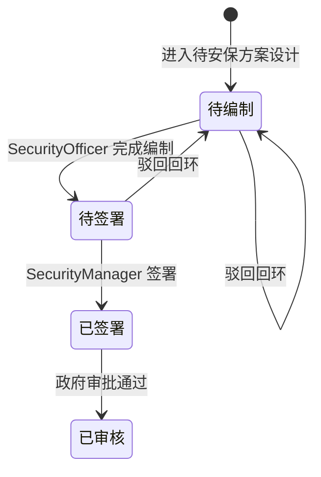

# 活动状态机

活动从立项到审批结束的完整生命周期。状态变迁由 UC1-UC7 驱动，箭头标注了触发用例和条件。

```mermaid
stateDiagram-v2
    [*] --> 待设计方案 : UC1 立项成功\n(场地/时间校验通过)

    待设计方案 --> 待安保方案设计 : UC2 最终确定方案\n(至少一个版本生成后点击最终确定)
    待设计方案 --> 已取消 : UC7 强制变更(不可抗力)
    待设计方案 --> 已延期 : UC7 强制变更(不可抗力)

    待安保方案设计 --> 待安保方案设计 : UC3 负责人驳回\n(编制人员重新修改)
    待安保方案设计 --> 待备案申请 : UC3 签署完成\n(风险评估表+责任书签章)
    待安保方案设计 --> 已取消 : UC7 强制变更
    待安保方案设计 --> 已延期 : UC7 强制变更

    待备案申请 --> 备案材料已交接 : UC4 打包+线下交接\n(签名齐全, 材料合规)
    待备案申请 --> 已取消 : UC7 强制变更
    待备案申请 --> 已延期 : UC7 强制变更

    备案材料已交接 --> 审批通过 : UC5 政府通过\n(上传批文, 标注通过)
    备案材料已交接 --> 待补充备案材料 : UC5 需补充材料\n(政府要求补件)
    备案材料已交接 --> 不通过/已终止 : UC5 政府驳回\n(上传驳回通知书)
    备案材料已交接 --> 已取消 : UC7 强制变更
    备案材料已交接 --> 已延期 : UC7 强制变更

    待补充备案材料 --> 备案材料已交接 : 安保部补充后重新递交
    待补充备案材料 --> 已取消 : UC7 强制变更
    待补充备案材料 --> 已延期 : UC7 强制变更

    审批通过 --> 审批通过-待举办 : UC6 安保部确认通过
    审批通过 --> 待安保方案设计 : UC6 安保部驳回\n(需整改, 逆向流转至 UC3)
    审批通过 --> 已取消 : UC7 强制变更
    审批通过 --> 已延期 : UC7 强制变更

    审批通过-待举办 --> 举办中 : 到达预计举办时间\n(系统自动转换)
    审批通过-待举办 --> 已取消 : UC7 强制变更(不可抗力)
    审批通过-待举办 --> 已延期 : UC7 强制变更(不可抗力)

    举办中 --> 已结束 : AdminStaff 标记活动结束
    举办中 --> 已取消 : UC7 强制变更
    举办中 --> 已延期 : UC7 强制变更

    已结束 --> [*] : 活动正常结束

    不通过/已终止 --> [*] : 流程终止

    已取消 --> [*]
    已延期 --> [*]
```

## 状态说明

| 状态            | 含义                                   | 进入条件           |
| --------------- | -------------------------------------- | ------------------ |
| 待设计方案      | 立项完成，等待宣策部编制方案（可生成多版，点击最终确定进入下一阶段） | UC1 保存立项       |
| 待安保方案设计  | 方案已最终确定，等待安保部编制安保预案 | UC2 最终确定方案   |
| 待备案申请      | 安保方案签署完成，等待打包备案         | UC3 电子签名完成   |
| 备案材料已交接  | 纸质材料已提交给政府对接人员           | UC4 线下交接确认   |
| 审批通过        | 政府已批准，等待安保部最终确认         | UC5 上传批文(通过) |
| 审批通过-待举办 | 全流程闭环，等待预计举办时间到达       | UC6 安保部确认通过 |
| 举办中          | 活动正在举办                           | 系统自动（到达预计时间） |
| 已结束          | 活动正常结束                           | AdminStaff 标记结束 |
| 待补充备案材料  | 政府要求补充材料                       | UC5 政府要求补件   |
| 不通过/已终止   | 政府驳回，活动终止                     | UC5 政府驳回       |
| 已取消          | 因不可抗力等原因强制取消，后续操作锁定 | UC7 行政部强制变更 |
| 已延期          | 因不可抗力等原因强制延期，后续操作锁定 | UC7 行政部强制变更 |

### 安保方案审核状态 (`SecurityPlan.audit_status`)

| 状态   | 触发                                       |
| ------ | ------------------------------------------ |
| 待编制 | 活动进入「待安保方案设计」，SecurityPlan 创建 |
| 待签署 | SecurityOfficer 完成编制，提交备案申请     |
| 已签署 | SecurityManager 签署确认                   |
| 已审核 | 政府审批通过（→ 审批通过）                  |



## 关键规则

- **已结束/已取消/已延期/不通过已终止**是终态，进入后所有后续操作锁定
- 审批通过-待举办到达 estimated_time 后，系统在查询时自动转为举办中
- **待补充备案材料**不是终态，安保部补充后可重新递交
- 逾期检测（UC2 备选流 2b）不改变状态，仅触发预警通知
