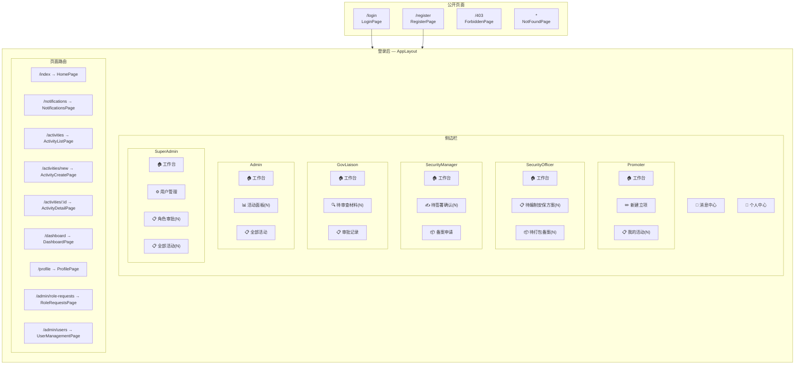
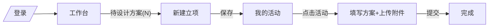
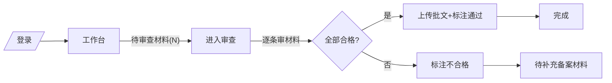
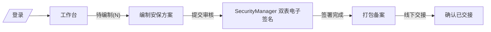
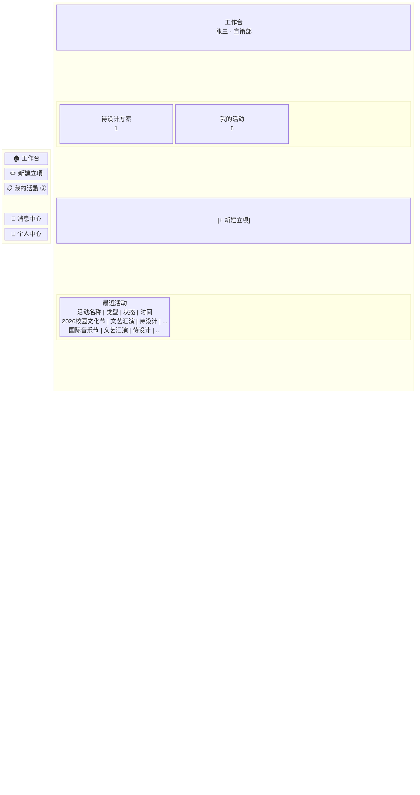
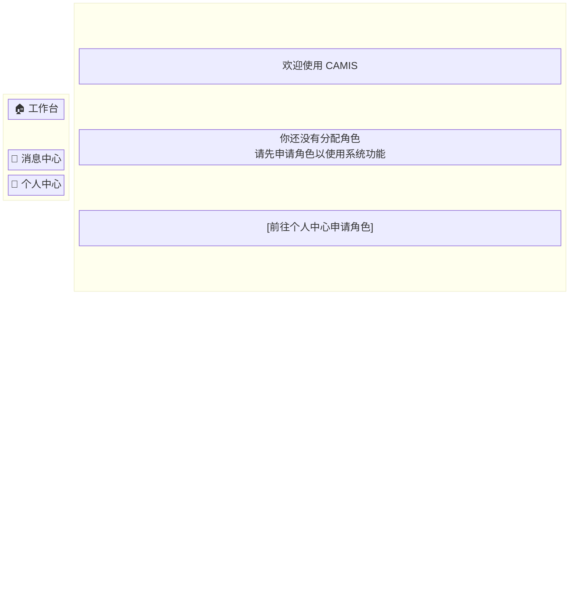
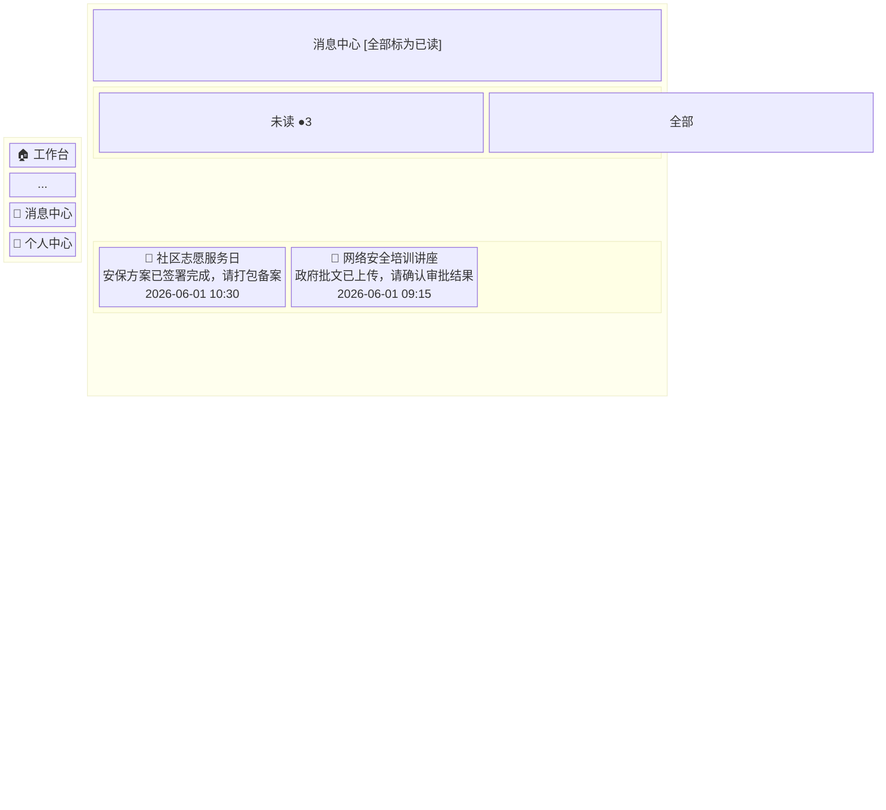

# UI 设计报告 — CAMIS v0.19 任务驱动导航

## 1. 目标用户与使用场景

### 1.1 用户角色画像

| 角色 | 身份 | 核心任务 | 使用频率 | 同时处理量 |
|------|------|---------|---------|-----------|
| **Promoter**（宣策部） | 活动立项发起人 | 创建立项 → 编制方案 → 提交安保审核 | 持续进行 | 2-3 个活动 |
| **SecurityOfficer**（安保部） | 安保方案编制者 | 查阅方案 → 编制安保预案 → 签署材料 → 打包备案 | 活动提交后 | 按待办量 |
| **SecurityManager**（安保部负责人） | 安保方案审批者 | 签署双表（风险评估表+责任确认书）→ 确认方案 → 驳回（罕见） | 编制完成后 | 按待办量 |
| **GovLiaison**（政府对接） | 企业内政府窗口对接人 | 每日集中登记：全量审查材料 → 上传批文 → 标注结果 | 每天集中一次 | 批量 |
| **AdminStaff**（行政部） | 活动监控者 | 查看 Dashboard → 向上汇报 → 强制变更（紧急/不可抗力） | 按需 | 全局 |
| **AdminManager**（行政部负责人） | 审批管理者 | 二次确认强制变更 + 审批角色申请 | 按需 | 全局 |
| **SuperAdmin**（系统管理员） | 系统管理者 | 用户管理、审计日志、系统配置 | 按需 | 全局 |

### 1.2 关键行为特征

- **无多角色用户**：生产环境每人单一角色
- **Promoter 单向流程**：方案提交后不会被驳回，工作流一次性
- **驳回仅安全部内部循环**：SecurityManager → SecurityOfficer，罕见路径
- **Dashboard 用于向上汇报**：汇总可视化，非问题处理
- **强制变更为紧急场景**：不可抗力（天气/意外），需 AdminManager 二次确认

---

## 2. 信息架构与导航流程

### 2.1 页面树（P3 最终态）

### 2.2 关键任务流

**Promoter**

**GovLiaison**

**Security（Officer + Manager）**

### 2.3 导航模式

- **任务驱动侧边栏**：菜单项 = 工作任务，非功能模块
- **计数 Badge**：实时显示待办数量（30s 轮询）
- **预筛选链接**：菜单项带 `?status=xxx` 参数，点击直达筛选列表
- **无角色用户**：工作台引导去个人中心申请角色

---

## 3. 低保真原型（线框图）

### 3.1 Promoter 工作台

### 3.2 GovLiaison 工作台

### 3.3 无角色用户

### 3.4 消息中心

---

## 4. 高保真界面原型

高保真原型直接以可运行的 React 代码实现，位于 `frontend/src/pages/`：

| 页面 | 文件 | 说明 |
|------|------|------|
| 工作台 | `HomePage.tsx` | 角色感知卡片 + 快捷操作 + 最近活动；无角色引导；多角色降级 |
| 消息中心 | `NotificationsPage.tsx` | 未读/全部 Tab + 列表 + 已读/未读标识 + 点击跳转 |
| 侧边栏 | `components/layout/Sidebar.tsx` | 任务驱动扁平菜单 + 实时计数 Badge + 预筛选链接 |

### 4.1 关键 UI 决策

**布局**：沿用 DashboardPage 的 `display: flex; gap: 16px` 模式（非 Row/Col 栅格），卡片 `flex: 1` 等分。

**antd v6 适配**：
- `Statistic` 的 `styles={{ content: { color } }}` 替代已废弃的 `valueStyle`
- 审批通过率使用 `suffix="%"` + `precision={1}`

**任务卡片交互**：可点击的卡片直接导航到预筛选列表。

**计数刷新**：`staleTime: 0`，每次挂载都重新请求；额外 30s 轮询保底。

**颜色语义**：待办数 > 0 时 Statistic 值变红（`#cf1322`），引导用户注意力。

### 4.2 响应式

- 卡片区：`flex` 布局，自然换行
- 侧边栏：Ant Design `breakpoint="lg"`，小屏折叠

### 4.3 状态覆盖

| 状态 | 处理 |
|------|------|
| 加载中 | 居中 `Spin size="large"` |
| 空态（无活动） | 卡片显示 0；最近活动表格为空 |
| 空态（无通知） | `Empty` 组件 + "没有未读消息" |
| 无角色 | 引导页 + 按钮跳转 `/profile` |
| 多角色（devtest） | 降级为旧 HomeRedirect 权限优先级跳转 |
| 计数查询失败 | TanStack Query 静默重试；数据为 null 时卡片不渲染 |

## 相关文档

- 导航设计实现：`docs/frontend.md` 导航设计章节
- 架构决策：`docs/adr/0005-task-driven-navigation.md`
- 领域术语：`CONTEXT.md` 角色行为特征
